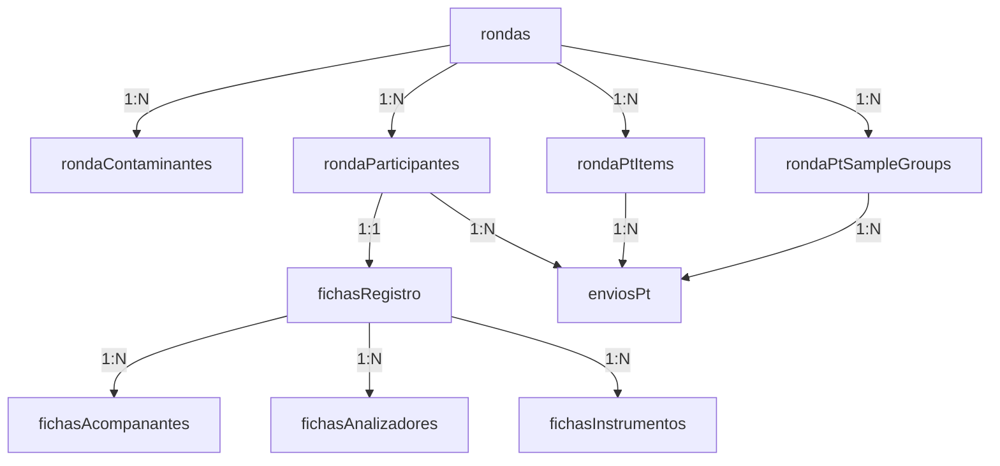

# CALAIRE App: Rundown del Aplicativo

**CALAIRE App** es un portal web transaccional desarrollado para el **Laboratorio CALAIRE (Universidad Nacional de Colombia - Sede Medellín)** en colaboración con el **Instituto Nacional de Metrología (INM)**. Su propósito es la gestión integral de rondas de **Ensayos de Aptitud (EA)** para gases contaminantes criterio (CO, SO2, O3, NO, NO2). 

El sistema actúa como puente transaccional y recolector de datos, permitiendo a los participantes registrar su información logística/metrológica y subir sus mediciones, para luego exportarlas y realizar el análisis estadístico avanzado de forma offline en R (mediante `pt_app` / `ptcalc`).

---

## 1. Stack Tecnológico

El aplicativo utiliza un stack moderno y eficiente para garantizar velocidad de desarrollo, tipado estricto y persistencia reactiva en tiempo real:

| Componente | Tecnología | Detalle |
| :--- | :--- | :--- |
| **Frontend & Rutas** | **Next.js 16 (App Router)** + **React 19** | Rutas dinámicas e híbridas (SSR/CSR) con Server Actions para interactuar con el backend. |
| **Lenguaje** | **TypeScript** | Tipado fuerte de extremo a extremo (compartido entre cliente y servidor). |
| **Backend & Base de Datos** | **Convex Cloud** | Base de datos en la nube no relacional pero reactiva, que maneja la lógica de negocio mediante consultas y mutaciones ACID. |
| **Autenticación** | **WorkOS AuthKit** | Soporte de inicio de sesión sin contraseña mediante enlaces mágicos/OTP de correo electrónico. |
| **Estilos y Diseño** | **Tailwind CSS 4** | Sistema de diseño *"Institutional Gold"* basado en el amarillo institucional de la UNAL (`#FDB913`) combinando sombras sutiles y bordes acentuados. |

---

## 2. Flujo de Trabajo y Roles

El sistema opera bajo una clara separación de responsabilidades:

### A. Coordinador (Rol `admin`)
* **Gestión de Rondas**: Crea y edita el ciclo de vida de cada ronda (`borrador` $\rightarrow$ `activa` $\rightarrow$ `cerrada` $\rightarrow$ `reabierta`).
* **Configuración del Ensayo**: Define contaminantes criterio, niveles de concentración y réplicas.
* **Control de Participantes**: Administra la lista de laboratorios y genera enlaces de invitación con códigos de acceso.
* **Edición Administrativa (Bypass)**: Cuenta con permisos absolutos para corregir o complementar datos cargados por participantes, incluso si la ronda ya cerró o si el formulario ya fue enviado por el laboratorio.
* **Exportación de Datos**: Descarga reportes consolidados en formato CSV compatibles con los scripts de análisis estadístico en R.

### B. Participante (Rol `member` u ordinario / `member_special` de referencia)
* **Reclamación de Cupo**: Accede a través de un enlace de invitación dinámico y reclama su lugar.
* **Anonimización**: Se le asigna de manera automática un código de participante de 6 caracteres aleatorios sin colisiones visuales (`participantCode`).
* **Ficha de Registro Completa (F-PSEA-05A)**: Formulario dinámico con auto-guardado activo (al perder el foco o `onBlur`) estructurado en secciones:
  * Datos del laboratorio y responsable.
  * Registro de acompañantes (personal asistente).
  * Declaración de analizadores (método EPA, fecha de calibración, incertidumbre, etc.).
  * Declaración de instrumentos auxiliares.
  * Logística y transporte.
* **Cargue de Mediciones (PT)**:
  * El participante ordinario digita sus réplicas, promedio e incertidumbre a través de `FormularioRonda`.
  * El laboratorio de referencia cuenta con una interfaz adaptada (`FormularioReferencia`) identificada por un badge violeta especial.
  * Carga manual del Factor de Cobertura `k` e incertidumbre expandida.
* **Envío del Informe**: Una vez enviado, la interfaz se congela en modo de solo lectura para el participante.

---

## 3. Modelo de Datos (Convex)

El esquema de base de datos (`convex/schema.ts`) está optimizado con índices compuestos para lecturas en paralelo ultra-rápidas:



* **`rondas`**: Almacena el código, nombre y estado general del ciclo de vida del ensayo.
* **`rondaParticipantes`**: Rastrea correos, tokens de invitación, perfiles (`member` vs `member_special`), códigos anónimos y marcas de tiempo de aceptación.
* **`fichasRegistro`**: Cabecera principal de la ficha F-PSEA-05A de cada participante. Sus listas secundarias (*acompañantes*, *analizadores*, *instrumentos*) viven en tablas normalizadas con claves foráneas.
* **`enviosPt`**: Almacena las réplicas individuales (`d1`, `d2`, `d3`), promedios, desviaciones estándar, factor `k` e incertidumbres expandidas cargadas por los laboratorios.

---

## 4. Hitos y Cambios Recientes

Durante las últimas iteraciones se han consolidado mejoras críticas en la aplicación:
1. **Migración Completa a Convex**: Se retiró Supabase, trasladando el 100% de la capa de datos a Convex de manera transparente para el frontend mediante adaptadores en `lib/rondas.ts` y `lib/fichas.ts`.
2. **Generación de Identificadores Anónimos**: Implementación de algoritmos para crear códigos alfanuméricos usando un alfabeto restringido (evitando confusiones como `O`/`0` o `I`/`1`).
3. **Corrección Metrológica del Factor `k`**: Se desligó el cálculo automatizado de la incertidumbre expandida, configurándolo como entrada puramente manual a petición de los laboratorios y el INM.
4. **Bypass Administrativo**: Creación de Server Actions especiales que permiten al coordinador corregir valores de fichas o datos de calibración saltándose las protecciones de estado de la ronda.

---

## 5. Cómo levantar el proyecto localmente

Si deseas correr la aplicación en tu entorno local:

1. **Instalar Dependencias**:
   ```bash
   pnpm install
   ```
2. **Variables de Entorno**:
   Copia el archivo `.env.example` a `.env.local` y rellena las claves de WorkOS y Convex correspondientes:
   ```bash
   cp .env.example .env.local
   ```
3. **Ejecutar el Servidor de Convex (para la Base de Datos)**:
   ```bash
   pnpm exec convex dev
   ```
4. **Iniciar el Servidor de Next.js**:
   ```bash
   pnpm dev
   ```
   La aplicación estará disponible en `http://localhost:3000`.
