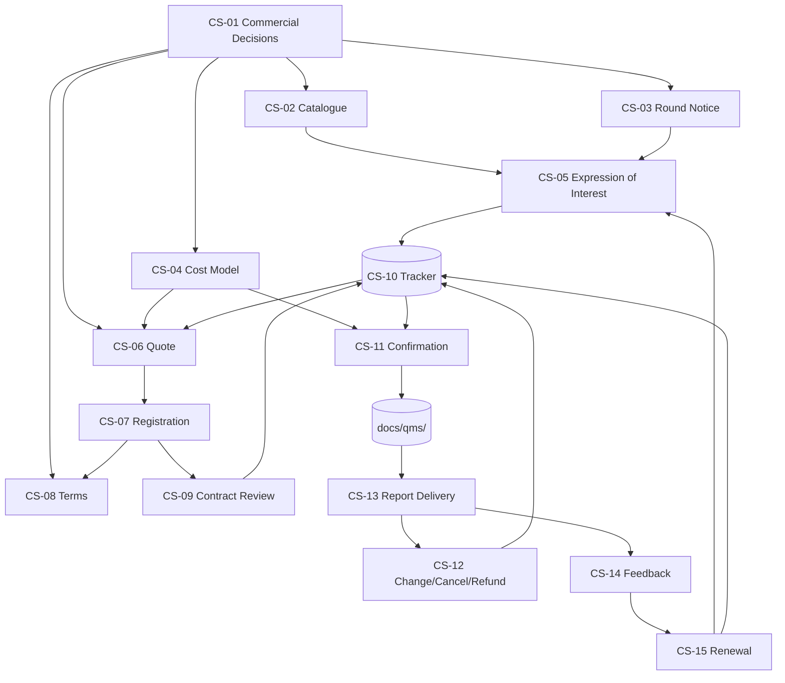

# Journey Map: 15 Commercial Artifacts

**Purpose:** end-to-end visualization of how the 15 CS artifacts connect through the customer journey, from first contact to renewal. Use this to onboard new team members, to find which artifact owns a given step, and to identify gaps.

**Status:** living document. Update whenever an artifact is added, removed or its scope changes.

---

## Customer journey vs. artifact chain

The customer journey (per blueprint section 1) is:

```text
Discover service
      ↓
Understand scope and conditions
      ↓
Select one or more of four gas blocks
      ↓
Receive a controlled quotation
      ↓
Register and accept terms
      ↓
Receive commercial confirmation
      ↓
Receive existing QMS technical instructions
      ↓
Participate in the round
      ↓
Receive report and participation statement
      ↓
Close billing, feedback and renewal
```

The 15 CS artifacts map to this journey as follows:

| Journey step | Owning artifact(s) | What the customer sees | Internal artifact chain |
|---|---|---|---|
| Discover service | CS-02 catalogue, CS-03 round notice | Marketing material, web/PDF | Catalog references CS-01 (decisions) and CS-04 (price list) |
| Understand scope and conditions | CS-02 catalogue (sections 4, 5, 11) | Service description | Same |
| Select one or more of four gas blocks | CS-05 expression-of-interest form | EoI form (no commitment) | CS-10 pipeline stage "Interest" |
| Receive a controlled quotation | CS-06 quotation template | Quote PDF / email | CS-09 (contract review) gates CS-11 (confirmation) |
| Register and accept terms | CS-07 registration form, CS-08 terms | Registration form + signed terms | CS-07 → CS-09 (review) |
| Receive commercial confirmation | CS-11 confirmation message (and wait-list / rejection messages) | Confirmation email | CS-11 → QMS handoff (P-PSEA-04, F-PSEA-04, F-PSEA-03, P-PSEA-05) |
| Receive QMS technical instructions | CS-11 onboarding pack (links to QMS docs) | DG-PSEA-01, I-PSEA-01, I-PSEA-02, calaire-app | CS-11 references QMS, not commercial |
| Participate in the round | (QMS execution, not commercial) | n/a | n/a |
| Receive report and participation statement | CS-13 report delivery | Draft + final report, participation statement | CS-13 → CS-12 if changes needed |
| Close billing, feedback and renewal | CS-12 change/cancel/refund, CS-14 feedback, CS-15 renewal | Feedback form, follow-up email | CS-12 (if changes), CS-14 (feedback), CS-15 (renewal) |

---

## Artifact dependency graph (Mermaid)



---

## Artifact dependency graph (ASCII fallback)

```text
                       CS-01 (decisions)
                       /    |    |    \
                      /     |    |     \
                 CS-02  CS-03 CS-04  CS-06, CS-08
                  |       |    |       |
                  v       v    v       v
                 CS-05 ---> CS-10 <--- (capacity view)
                  |              ^
                  v              |
                 CS-06 ----------+
                  |
                  v
                 CS-07
                  |
                  v
                 CS-08  (terms)
                  |
                  v
                 CS-09  (contract review)
                  |
                  v
                 CS-10  (tracker) ---> Confirmed
                  |
                  v
                 CS-11  (confirmation / wait-list / rejection)
                  |
                  v
                 [QMS handoff: P-PSEA-04, F-PSEA-04, F-PSEA-03, P-PSEA-05]
                  |
                  v
              (QMS round execution)
                  |
                  v
                 CS-13  (report delivery)
                  |       \
                  |        --> CS-12 (if changes needed during draft review)
                  v
                 CS-14  (feedback)
                  |
                  v
                 CS-15  (renewal)
                  |       \
                  |        --> CS-10 (new pipeline entry for next round)
                  |        --> CS-05 (for new prospects, not for renewals)
                  v
              (back to top of journey for next round)
```

---

## Status flow inside CS-10 (the central nervous system)

The tracker CS-10 is the operational core; almost every artifact writes to or reads from it.

```text
[CS-05 EoI]   ──>  status = Interest
                       │
                       v
[CS-06 Quote]  ──>  status = Quoted
                       │
                       v
[CS-07 Registration] ──>  status = Registered
                       │
                       v
[CS-09 Contract Review] ──>  status = Under review
                       │
        ┌──────────────┼──────────────┐
        v              v              v
  Quote-revision   Accepted       Rejected
  in progress      pending        (terminal)
        │          payment/PO          │
        v              │               v
   (back to         status =           (CS-11
    Quoted,         Confirmed          rejection
    new rev)        (terminal          message)
        │              │               │
        v              v               v
   (CS-12)         [CS-11            (CS-10
                    confirmation]     closure)

        On capacity exhaustion (CS-09 check 4 or 6):
        status = Wait-listed
            │
            ├──> Confirmed (if slot opens)  ──> [CS-11 confirmation]
            │
            └──> Withdrawn (customer gives up)

        On customer withdrawal (any time after Registered):
        status = Withdrawn
            │
            └──> CS-12 (refund / credit)
```

---

## Approval gate map (per blueprint section 21)

| Gate | Artifacts required before the gate | Owner of approval |
|---|---|---|
| Market release | CS-01, CS-02, CS-03, CS-04, CS-05 | Service manager + commercial lead |
| Quote release | CS-04 (approved), CS-06, CS-08 | Commercial lead + finance |
| Order acceptance | CS-07, CS-08 (signed), CS-09 (passed), CS-10 (updated) | Commercial lead |
| Technical handoff | CS-11 (sent) + QMS round planning intake | Round coordinator |
| Change / refund | CS-12 (opened, dual-authorized) | Commercial + finance |
| Report delivery | CS-13 + QMS report approval | Round coordinator |
| Commercial closure | CS-14 (received), CS-15 (sent), CS-10 (final) | Service manager |

---

## Cross-cutting concerns (which artifacts care)

| Concern | Affected artifacts |
|---|---|
| QMS code renumbering (2026-06-14) | CS-09, CS-11, CS-13, CS-14 (those that cite PSEA codes) |
| Data protection (Ley 1581/2012) | CS-05 (consent), CS-06 (international cross-border), CS-08 (clause 19), CS-15 (marketing consent) |
| Capacity (4 individual / 3+6 simultaneous) | CS-01, CS-04, CS-09, CS-10, CS-11 |
| Pre-accreditation wording | CS-01, CS-02, CS-03, CS-06, CS-08, CS-13, CS-15 (anywhere customer-facing) |
| No a1–a7 grading | CS-01, CS-02, CS-08, CS-13, participation statement |
| Currency / FX | CS-01, CS-04, CS-06, CS-10, CS-12 |
| Payment / PO evidence | CS-07, CS-09, CS-10, CS-12 |
| Standard report-use reminder | CS-01, CS-08, CS-13 (must match exactly) |

---

## How to use this document

- **Onboarding a new team member:** walk through the customer journey table, then the Mermaid graph. They should be able to locate any artifact by journey step.
- **Auditing a round:** start at CS-13 (delivery), follow arrows back to CS-05 (interest). Verify the chain is intact: every Confirmed participant has CS-09 (review) and CS-11 (confirmation) on file.
- **Identifying gaps:** the Mermaid graph highlights which artifacts have no incoming or outgoing edges. If an artifact is disconnected, it's a candidate for retirement or a sign of missing logic.
- **Updating the map:** when an artifact is added, removed or its role changes, update the customer-journey table, the dependency graph and the cross-cutting table.
