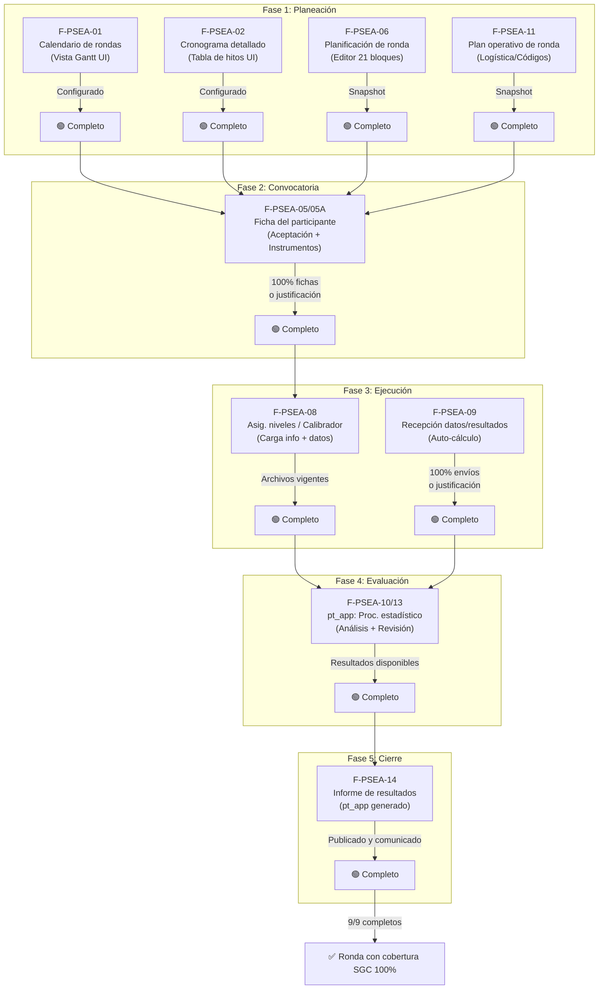
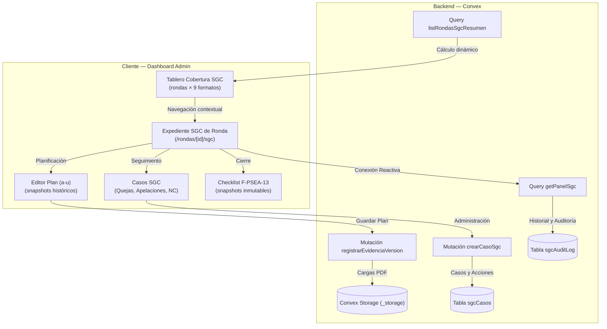

# Funcionamiento de los Registros y Documentos del SGC

**Proyecto:** calaire-app  
**Última actualización:** 2026-06-10  
**Fuentes:** [checklist_sgc.md](file:///home/w182/w421/calaire-app/_workspace/sgc/checklist_sgc.md), [workflow_cobertura_rondas.md](file:///home/w182/w421/calaire-app/_workspace/sgc/workflow_cobertura_rondas.md), [catalog.ts](file:///home/w182/w421/calaire-app/lib/sgc/catalog.ts), [checklist.ts](file:///home/w182/w421/calaire-app/lib/sgc/checklist.ts)

---

## Resumen Ejecutivo

El **Sistema de Gestión de Calidad (SGC)** del aplicativo `calaire-app` es un módulo de control documental que garantiza que cada ronda de ensayo de aptitud cumpla con un estándar de **9 formatos/registros obligatorios**, distribuidos en **5 fases operativas**: Planeación, Convocatoria, Ejecución, Evaluación y Cierre.

CALAIRE-APP ha dejado de ser un mero repositorio transaccional para convertirse en el **brazo operativo y la interfaz de gestión formal del SGC**, implementando directamente el control documental, el seguimiento de cobertura por ronda y la trazabilidad metrológica y operativa exigida por la norma **ISO/IEC 17043**.

Cada documento tiene un **modo de verificación** específico que determina cómo el sistema valida su existencia y completitud: algunos se generan nativamente en la UI (calendario, tablas, planificadores), otros se calculan automáticamente a partir del estado operativo (fichas e inscripciones), otro requiere la carga de archivos físicos de niveles y calibrador, y otros se integran desde la aplicación estadística externa (**pt_app**). El sistema presenta esta información en un **tablero de cobertura cruzada** (rondas × documentos) que permite al coordinador visualizar en tiempo real el estado de cumplimiento, identificar bloqueantes y navegar directamente a los registros pendientes.

---

## 1. Marco Conceptual: El SGC en el Aplicativo

El SGC no es un módulo aislado; es una **capa de control documental** que se superpone al ciclo de vida de cada ronda de ensayo. Su propósito es asegurar que, independientemente del tipo de ronda (plaguicidas, alimentos, etc.), se cumpla con una matriz documental estandarizada exigida por los protocolos de calidad del laboratorio.

### 1.1. Entidades principales

| Entidad | Descripción | Rol en el SGC |
|---|---|---|
| **Ronda** | Ciclo operativo de ensayo (ej. "R-2024-01 — Plaguicidas Q1") | Contenedor sobre el cual se evalúa la cobertura documental |
| **Checklist SGC** | Conjunto de 9 ítems por ronda | Representa los 9 documentos que deben existir y estar completos |
| **Formato / Documento** | Cada uno de los 9 ítems (ej. F-PSEA-01, F-PSEA-05/05A) | Registro específico con un modo de verificación y una fase asignada |
| **Tablero de Cobertura** | Vista cruzada rondas × documentos | Herramienta de supervisión y seguimiento visual del estado de cumplimiento |
| **Expediente SGC de Ronda** | Panel unificado por ronda en `/dashboard/rondas/[id]/sgc` | Agrupa los formatos por fase y permite cargas, justificaciones y edición |
| **Casos SGC** | Tickets de incidencias (Quejas, Apelaciones, NC/CAPA) | Gestión formal de no conformidades y reclamaciones vinculadas a rondas |

### 1.2. Fases del ciclo documental

Cada ronda atraviesa 5 fases documentales, cada una con formatos asignados:

| Fase | Descripción | Formatos asignados | Columnas en tablero |
|---|---|---|:---:|
| **Planeación** | Calendarios, cronogramas, planes y recursos de la ronda | F-PSEA-01, F-PSEA-02, F-PSEA-06, F-PSEA-11 | 4 |
| **Convocatoria** | Registro y confirmación de la aceptación de participantes | F-PSEA-05/05A | 1 |
| **Ejecución** | Carga de calibrador, asignación de niveles y recepción de resultados | F-PSEA-08, F-PSEA-09 | 2 |
| **Evaluación** | Procesamiento estadístico y análisis en pt_app | F-PSEA-10/13 | 1 |
| **Cierre** | Publicación del informe final de resultados en pt_app | F-PSEA-14 | 1 |

> [!IMPORTANT]
> Una ronda no puede considerarse "cerrada" desde la perspectiva del SGC hasta que todos los formatos de sus fases estén completos. El sistema identifica explícitamente los documentos **bloqueantes** que impiden el avance.

### 1.3. Componentes principales del SGC en la aplicación

El núcleo de la integración se compone de tres herramientas:

1. **Tablero de Cobertura SGC** ([TableroCoberturaRondas.tsx](file:///home/w182/w421/calaire-app/app/(protected)/dashboard/sgc/TableroCoberturaRondas.tsx)): Una matriz interactiva que cruza rondas de ensayo contra los 9 formatos del SGC, ofreciendo una vista semántica ("semáforo") de cumplimiento en tiempo real.

2. **Expediente SGC de Ronda** ([ExpedienteSgc.tsx](file:///home/w182/w421/calaire-app/app/(protected)/dashboard/rondas/[id]/sgc/ExpedienteSgc.tsx)): Un panel unificado en la vista detallada de la ronda que agrupa los formatos por fase operativa y permite realizar cargas de evidencias, gestionar justificaciones o navegar a las herramientas de edición nativas.

3. **Gestión Unificada de Casos** ([sgcCasos](file:///home/w182/w421/calaire-app/convex/schema.ts#L514-L538)): Una base de datos integrada y flujos para administrar Quejas, Apelaciones, No Conformidades (NC/CAPA) y Desviaciones de forma## 2. Los 9 Formatos del SGC: Naturaleza, Función y Verificación

Los 9 documentos se clasifican en **4 modos de verificación** que definen cómo el sistema comprueba su existencia y validez. A continuación se detalla cada categoría y cada formato individual.

### 2.1. Documentos Nativos de la UI (4 formatos)

Son registros que el coordinador crea, configura y guarda **directamente dentro de los formularios y flujos nativos** del aplicativo (calendario, tablas, editores). El sistema verifica que la acción de guardado esté completada y que exista al menos una captura histórica (*snapshot*) en la base de datos.

**Característica clave:** El sistema no busca archivos adjuntos; busca registros en tablas de la base de datos con estado `completado` y una traza histórica que demuestre que el flujo fue finalizado.

---

#### `F-PSEA-01` — Calendario de rondas

| Campo | Detalle |
|---|---|
| **Fase** | Planeación |
| **Modo** | Nativo (UI) |
| **Crítico** | Sí |

**Función en el SGC:** Registro maestro de la programación anual o periódica de todas las rondas de ensayo de aptitud. Presenta una **vista tipo calendario/Gantt** que permite visualizar la distribución temporal de las rondas, identificar traslapes y planificar recursos.

**Función en el aplicativo:** El coordinador crea y gestiona el calendario directamente en la interfaz nativa de calaire-app. El sistema valida que el calendario de rondas esté configurado y que las rondas activas tengan fechas asignadas.

---

#### `F-PSEA-02` — Cronograma detallado de la ronda

| Campo | Detalle |
|---|---|
| **Fase** | Planeación |
| **Modo** | Nativo (UI) |
| **Crítico** | Sí |

**Función en el SGC:** Desglose detallado de **hitos, fechas clave y actividades** de una ronda específica, presentado en formato de tabla. Permite al equipo conocer los plazos de cada etapa: convocatoria, distribución de muestras, recepción de resultados, evaluación y cierre.

**Función en el aplicativo:** El coordinador crea el cronograma como una tabla interactiva dentro del aplicativo, vinculada a la ronda. El sistema verifica que los hitos principales estén definidos con fechas.

---

#### `F-PSEA-06` — Planificación de la ronda

| Campo | Detalle |
|---|---|
| **Fase** | Planeación |
| **Modo** | Nativo (UI) |
| **Crítico** | Sí |

**Función en el SGC:** Establece el diseño completo del ensayo de aptitud: objetivos, matrices, analitos, participantes esperados, cronogramas y criterios de evaluación. Es el **documento fundacional** de la ronda. Se estructura en 21 bloques editables (a–u) conforme a la norma ISO/IEC 17043. *(Este formato pasa de ser el antiguo F-PSEA-03 / F-PPSEA-03 al nuevo F-PSEA-06)*.

**Función en el aplicativo:** El coordinador completa un editor nativo de 21 bloques interactivos. El sistema valida que el plan esté marcado como **finalizado** (`planFinalizado === true`) y que exista al menos **una captura snapshot** histórica (`snapshotsPlan > 0`).

**Lógica de verificación** (de [checklist.ts](file:///home/w182/w421/calaire-app/lib/sgc/checklist.ts#L69-L75)):
```
estado = (planFinalizado && snapshotsPlan > 0) ? 'completo' : 'pendiente'
```

---

#### `F-PSEA-11` — Plan operativo de ronda

| Campo | Detalle |
|---|---|
| **Fase** | Planeación |
| **Modo** | Nativo (UI) |
| **Crítico** | Sí |

**Función en el SGC:** Detalla la operativa logística de la ronda: distribución de muestras, instructivos de manejo, asignación de códigos de participante, asignación de recursos y responsabilidades operativas. Complementa a la planificación principal con los detalles de ejecución. *(Este formato se reasigna al código F-PSEA-11, que anteriormente estaba sin uso. El antiguo plan operativo codificado como F-PSEA-06 se traslada aquí, mientras que el antiguo F-PSEA-07 de códigos provisionales se elimina y sus requisitos de anonimización se integran en este plan operativo)*.

**Función en el aplicativo:** Se genera como un registro nativo vinculado directamente a la planificación de la ronda. El sistema verifica que el plan operativo esté finalizado y que exista un snapshot histórico.

**Lógica de verificación:**
```
estado = (planOperativoFinalizado && snapshotsPlanOperativo > 0) ? 'completo' : 'pendiente'
```

---

### 2.2. Documentos Nativos Calculados (2 formatos)

El sistema evalúa su completitud **automáticamente en tiempo real**, analizando el estado operativo de los participantes y los envíos de la ronda. No requieren intervención directa del coordinador para ser marcados como completos, pero sí permiten una **justificación escrita** si la condición operativa no se cumple.

**Característica clave:** La lógica de verificación reside en el backend. El frontend muestra el resultado del cálculo. El coordinador solo interviene si necesita documentar una excepción mediante una justificación escrita en el panel de la ronda. Cuando existe una justificación vigente, el sistema registra automáticamente el responsable y la fecha de la misma.

---

#### `F-PSEA-05/05A` — Ficha del participante

| Campo | Detalle |
|---|---|
| **Fase** | Convocatoria |
| **Modo** | Nativo Calculado |
| **Crítico** | Sí |

**Función en el SGC:** Registro unificado que une a los antiguos F-PSEA-05 y F-PSEA-05A. Su diligenciamiento y envío electrónico constituye la **prueba formal de la aceptación y confirmación de participación** en la ronda por parte del laboratorio participante. Este formato registra de manera integrada tanto a las **personas** delegadas/responsables como a los **instrumentos y métodos** de ensayo que se utilizarán en las mediciones.

**Función en el aplicativo:** El sistema verifica que todos los participantes esperados hayan enviado su ficha electrónica de inscripción. Las condiciones de verificación son:
- `participantesEsperados > 0`
- `fichasEnviadas >= participantesEsperados`
- **O bien** existe una justificación escrita vigente.

**Lógica de verificación** (de [checklist.ts](file:///home/w182/w421/calaire-app/lib/sgc/checklist.ts#L76-L103)):
```
estado = (completo || justificación) ? 'completo' : 'pendiente'
```

---

#### `F-PSEA-09` — Recepción de datos/resultados del participante

| Campo | Detalle |
|---|---|
| **Fase** | Ejecución |
| **Modo** | Nativo Calculado |
| **Crítico** | Sí |

**Función en el SGC:** Este registro de control documental se genera y completa automáticamente cuando el aplicativo recibe formalmente los datos y resultados metrológicos ingresados por cada participante de la ronda dentro de los plazos establecidos.

**Función en el aplicativo:** El sistema calcula automáticamente la cobertura de recepción:
- `enviosEsperados === 0` (se marca completo) **O**
- `enviosRecibidos >= enviosEsperados`
- **O bien** existe una justificación escrita de la recepción incompleta.

**Lógica de verificación** (de [checklist.ts](file:///home/w182/w421/calaire-app/lib/sgc/checklist.ts#L114-L147)):
```
estado = (completo || justificación) ? 'completo' : 'pendiente'
```

---

### 2.3. Documentos de Archivo (1 formato)

Requieren la **carga física de archivos** por parte del coordinador para respaldar la trazabilidad de la ronda en el storage.

---

#### `F-PSEA-08` — Asignación de niveles / Calibrador dinámico

| Campo | Detalle |
|---|---|
| **Fase** | Ejecución |
| **Modo** | Archivo (Carga) |
| **Crítico** | Sí |

**Función en el SGC:** Registra formalmente el momento en que se asignan los niveles de concentración de la ronda. El registro de evidencia para este hito documental consiste en la carga física de dos recursos técnicos: la información de especificaciones del calibrador dinámico y los archivos de datos de calibración asociados.

**Función en el aplicativo:** El coordinador debe completar **dos campos de cargar** (upload fields) en la interfaz: uno para subir el archivo con la información del calibrador dinámico y otro para los datos metrológicos asociados. El sistema verifica la presencia física de ambos archivos vigentes en el storage de Convex (`_storage`).

**Lógica de verificación** (de [checklist.ts](file:///home/w182/w421/calaire-app/lib/sgc/checklist.ts#L137-L142)):
```
estado = evidenciasVigentes['F-PSEA-08'] ? 'completo' : 'pendiente'
```

---

### 2.4. Documentos de pt_app (2 formatos)

#### `F-PSEA-10/13` — pt_app — Procesamiento estadístico de aptitud

| Campo | Detalle |
|---|---|
| **Fase** | Evaluación |
| **Modo** | Externo (pt_app) |
| **Crítico** | Sí |

**Función en el SGC:** Registro unificado que combina el procesamiento estadístico de aptitud (cálculo de z-scores, valores asignados e incertidumbres, antes F-PSEA-10) y la revisión sistemática de los datos de la ronda (antes F-PSEA-13). Ambos procesos se realizan a través del aplicativo externo especializado **pt_app**.

**Función en el aplicativo:** El sistema verifica de forma integrada que pt_app haya completado el procesamiento y la revisión, y que los resultados estadísticos estén disponibles y referenciados desde calaire-app.

**Lógica de verificación:**
```
estado = (ptAppProcesado && resultadosDisponibles) ? 'completo' : 'pendiente'
```

---

#### `F-PSEA-14` — Informe de resultados

| Campo | Detalle |
|---|---|
| **Fase** | Cierre |
| **Modo** | Externo (pt_app) |
| **Crítico** | Sí |

**Función en el SGC:** Informe final de resultados consolidado que sale de pt_app. Contiene las evaluaciones de desempeño individuales, conclusiones y recomendaciones metrológicas, sirviendo como comunicación oficial final para los participantes.

**Función en el aplicativo:** El sistema comprueba que el informe final de resultados haya sido generado y publicado por pt_app para la ronda correspondiente.

**Lógica de verificación:**
```
estado = (informeGenerado && publicado) ? 'completo' : 'pendiente'
```

---

## 3. Estados del Checklist: El Semáforo Documental

Cada uno de los 9 ítems del checklist puede encontrarse en uno de cuatro estados visuales, representados en el tablero como un **sistema semáforo**:

| Estado (`SgcItemEstado`) | Color | CSS Class | Significado | Implicación para la ronda |
|---|---|---|---|---|
| **Completo** | 🟢 Verde | `bg-emerald-500` | Documento presente, validado y sin advertencias | Contribuye al progreso. No genera bloqueos |
| **Pendiente** | 🔴 Rojo | `bg-rose-500` | Documento falta o no cumple con las condiciones de verificación | **Bloqueante** si el formato es crítico. Impide cobertura 100% |
| **No Aplica** | ⚪ Blanco/Gris | `bg-slate-300` / `bg-slate-600` | Formato no aplica a esta ronda y se ha documentado el motivo | No suma ni resta al progreso. Estado válido para cierre |
| **Advertencia** | 🟡 Amarillo | `bg-amber-500` | Documento presente pero con condiciones especiales que requieren atención | Contribuye al progreso pero señala un riesgo |

### 3.1. Cálculo del progreso de una ronda

El progreso de cobertura documental se expresa como un porcentaje (0–100%):

```
Progreso = (Ítems completos + Ítems no_aplica) / 9 × 100
```

### 3.2. Derivación de bloqueantes

El sistema identifica como **bloqueantes** aquellos ítems que simultáneamente:
- Tienen el campo `critico: true` en el catálogo (todos los 9 formatos son críticos).
- Están en estado `pendiente`.

Estos se calculan con la función [derivarBloqueantes](file:///home/w182/w421/calaire-app/lib/sgc/checklist.ts#L44-L48) y se presentan como alertas en las tarjetas de resumen de cada ronda.

---

## 4. Función en el Sistema de Gestión de Calidad

Desde la perspectiva de la gestión de calidad del laboratorio, estos registros cumplen funciones estratégicas y operativas:

### 4.1. Trazabilidad
Cada formato garantiza que un paso del proceso de ensayo de aptitud quede documentado y vinculado a una ronda específica. Esto permite auditorías retrospectivas y demuestra conformidad con estándares (ISO/IEC 17043, etc.). Los formatos nativos generan **snapshots inmutables** que sirven como evidencia de estado en un punto en el tiempo.

### 4.2. Control de riesgos
Los estados `pendiente` y `advertencia` actúan como **indicadores de riesgo tempranos**. El coordinador puede intervenir antes de que una omisión documental se convierta en una no conformidad grave.

### 4.3. Estandarización
Al tener 9 formatos fijos para todas las rondas, el SGC elimina la variabilidad en la documentación. Cada ronda, sin importar su naturaleza, debe cumplir con la misma matriz.

### 4.4. Accountability
Los documentos `nativos calculados` y `nativos UI` incluyen campos de **responsable** y **última actualización**, lo que permite saber quién hizo qué y cuándo. Cuando se registra una justificación, el sistema captura automáticamente el autor y la marca de tiempo.

### 4.5. Cierre operativo
La ronda no se considera formalmente cerrada desde el punto de vista del SGC hasta que:
- Todos los 9 ítems están en estado `completo` o `no_aplica`.
- No hay bloqueantes pendientes.
- El progreso es 100%.

Esto vincula el cierre administrativo de la ronda con el cierre documental de calidad.

---

## 5. Función en el Aplicativo

En el aplicativo `calaire-app`, el SGC se materializa en una interfaz reactiva y automatizada que reduce la carga manual del coordinador y centraliza el control documental.

### 5.1. Vista de Resumen (`/dashboard/sgc`)

Es la entrada principal al módulo SGC. Presenta tres secciones:

1. **Tarjetas de rondas:** Grid que muestra cada ronda con su código, nombre, estado operativo, progreso de cobertura (0–100%) y lista de bloqueantes.
2. **Tablero de Cobertura por Ronda** (tab por defecto): Tabla cruzada donde las filas son rondas y las columnas son los 9 formatos. Cada celda muestra un dot semáforo.
3. **Matriz Documental Maestra** (segundo tab): Vista detallada de la matriz de documentos.

El sistema de tabs permite alternar entre ambas vistas, implementado en [SgcTabs.tsx](file:///home/w182/w421/calaire-app/app/(protected)/dashboard/sgc/SgcTabs.tsx) con accesibilidad (`role="tablist"` y `aria-selected`).

### 5.2. Tablero de Cobertura por Ronda

El componente [TableroCoberturaRondas.tsx](file:///home/w182/w421/calaire-app/app/(protected)/dashboard/sgc/TableroCoberturaRondas.tsx) implementa:

**Estructura visual:**
```
┌──────────────┬────── Planeación ──────┬─ Convoc. ─┬── Ejecución ──┬─ Evaluación ─┬─ Cierre ─┬──────────┐
│ Ronda        │ F-01 │ F-02 │ F-06 │ F-11 │  F-5/A  │ F-08 │  F-09  │   F-10/13   │   F-14   │ Cobertura│
├──────────────┼──────┼──────┼──────┼──────┼─────────┼──────┼────────┼─────────────┼──────────┼──────────┤
│ R-2024-01    │  🟢  │  🟢  │  🟢  │  🟢  │   🟢    │  🟢  │   🟢   │     🟢      │    🟢    │ 100% ███ │
│ activa       │      │      │      │      │         │      │        │             │          │          │
├──────────────┼──────┼──────┼──────┼──────┼─────────┼──────┼────────┼─────────────┼──────────┼──────────┤
│ R-2024-02    │  🟢  │  🟢  │  🟢  │  🟢  │   🟢    │  🔴  │   🔴   │     🔴      │    🔴    │  56% █   │
│ activa       │      │      │      │      │         │      │        │             │          │          │
└──────────────┴──────┴──────┴──────┴──────┴─────────┴──────┴────────┴─────────────┴──────────┴──────────┘
  ← STICKY                    ← SCROLL HORIZONTAL →                              STICKY →
```

**Interacciones:**
- **Hover** sobre cada dot: Muestra tooltip con el nombre del formato y las observaciones.
- **Clic** sobre un dot: Navega a `/dashboard/rondas/[rondaId]/sgc?formato=[CODIGO]`.
- **Columnas sticky:** Primera columna (ronda) fija a la izquierda, última columna (%) fija a la derecha.
- **Cabeceras agrupadas:** Las 9 columnas se agrupan por fase con `colspan` y fondos diferenciados.

**Filtros y controles:**
- **Buscador:** Filtra rondas por código o nombre (case-insensitive).
- **Toggle "Ocultar rondas cerradas":** Checkbox que oculta rondas con `estado === 'cerrada'`.
- **Indicadores de resumen:** Promedio de cobertura, número de rondas completas, total de bloqueantes.

### 5.3. Expediente SGC de Ronda (`/dashboard/rondas/[id]/sgc`)

Para cada ronda individual, el Expediente SGC es un panel detallado que:
- Agrupa los 9 formatos **por fase operativa**.
- Permite **cargar evidencias** (PDF/datos) con control de versiones para el formato de asignación de niveles.
- Permite **registrar justificaciones** para documentos nativos calculados (F-PSEA-05/05A, F-PSEA-09).
- Ofrece **navegación contextual** a las herramientas de edición nativas (planificación de la ronda, calendario, cronograma).
- Muestra el **historial de versiones** y snapshots para trazabilidad.

### 5.4. Backend: Reactividad y Cálculo Automático

El backend (Convex) expone la query [listRondasSgcResumen](file:///home/w182/w421/calaire-app/convex/sgc.ts#L1406-L1430), que es **reactiva**: cualquier cambio en un participante, un envío, un archivo subido o un plan guardado se refleja automáticamente en el progreso de la ronda sin necesidad de refrescar la página.

Por cada ronda, el backend retorna:

```typescript
{
  _id: Id<'rondas'>,
  codigo: string,          // e.g. "R-2024-01"
  nombre: string,          // e.g. "Ronda de Plaguicidas Q1"
  estado: string,          // "activa" | "cerrada" | ...
  progreso: number,        // 0-100
  bloqueantes: string[],   // derivados del checklist
  checklist: SgcChecklistItem[]  // 9 items exactos
}
```

### 5.5. Flujo de verificación por tipo de documento

| Modo | ¿Quién acciona? | ¿Cómo se verifica? | ¿Dónde se refleja? |
|---|---|---|---|
| **Nativo UI** | Coordinador | Guarda un formulario o completa un flujo nativo | Registro/Hitos en BD + checklist en tablero |
| **Nativo Calculado** | Sistema / Coordinador | El sistema calcula; el coordinador puede justificar excepciones | Query reactiva en tablero |
| **Archivo (Carga)** | Coordinador | Subida de archivos (info + datos calibrador) | Verificación de presencia de archivo en tablero |
| **Externo (pt_app)** | pt_app | Procesamiento estadístico en pt_app | Vinculación/resultados en calaire-app |

---

## 6. Flujo de Trabajo del SGC

### 6.1. Ciclo de vida de una ronda desde la perspectiva documental



### 6.2. Flujo de trabajo paso a paso

```
┌─────────────────────────────────────────────────────────────────────────────────────────────┐
│  FASE 1: PLANEACIÓN                                                                        │
│  ├─ El coordinador programa la ronda en el Calendario (F-PSEA-01) (vista Gantt).           │
│  ├─ Se definen los hitos de la ronda en el Cronograma Detallado (F-PSEA-02) (tabla).        │
│  ├─ El coordinador finaliza la Planificación de la Ronda (F-PSEA-06) (bloques a-u).        │
│  └─ Se define el Plan Operativo (F-PSEA-11) con la logística e instructivos.                │
├─────────────────────────────────────────────────────────────────────────────────────────────┤
│  FASE 2: CONVOCATORIA                                                                      │
│  ├─ Los participantes se inscriben diligenciando la Ficha del Participante (F-PSEA-05/05A). │
│  ├─ Se capturan las personas responsables y los métodos/instrumentos de ensayo.            │
│  └─ Si hay cupos sin reclamar, se puede registrar una justificación para avanzar.          │
├─────────────────────────────────────────────────────────────────────────────────────────────┤
│  FASE 3: EJECUCIÓN                                                                         │
│  ├─ El coordinador asigna niveles y carga información/datos del calibrador (F-PSEA-08).     │
│  └─ Los participantes suben resultados; calaire-app calcula recepción en F-PSEA-09.        │
├─────────────────────────────────────────────────────────────────────────────────────────────┤
│  FASE 4: EVALUACIÓN                                                                        │
│  └─ pt_app realiza el procesamiento estadístico y revisión de aptitud (F-PSEA-10/13).      │
├─────────────────────────────────────────────────────────────────────────────────────────────┤
│  FASE 5: CIERRE                                                                            │
│  ├─ pt_app genera el Informe de Resultados (F-PSEA-14) consolidado y lo publica.           │
│  └─ Con los 9 formatos completos, la ronda alcanza 100% de cobertura SGC.                  │
└─────────────────────────────────────────────────────────────────────────────────────────────┘
```

### 6.3. Flujo de trabajo del coordinador en el tablero

1. **Acceso:** El coordinador ingresa a `/dashboard/sgc`.
2. **Diagnóstico:** Observa las tarjetas de resumen. Si una ronda tiene progreso < 100%, revisa los bloqueantes listados.
3. **Detalle:** Entra al tab **"Cobertura por Ronda"** (activo por defecto). Visualiza la tabla cruzada y localiza los dots rojos (pendientes) o amarillos (advertencias).
4. **Acción según tipo de documento:**
    - Si es un **documento nativo UI** → navega a la ronda y completa la configuración o flujo en calaire-app (calendario, cronograma, planificación o plan operativo).
    - Si es un **documento calculado** → verifica si justifica la excepción (F-PSEA-05/05A, F-PSEA-09).
    - Si es un **documento de archivo** → sube la información del calibrador y los datos en F-PSEA-08.
    - Si es de **pt_app** → realiza el procesamiento estadístico y publicación en el aplicativo externo.
5. **Verificación:** El tablero se actualiza en **tiempo real** (Convex reactivo). El dot cambia de color instantáneamente.
6. **Cierre:** Cuando todos los dots son verdes y el progreso es 100%, la ronda está documentalmente lista para cierre.

---

## 7. Gestión de Casos SGC (Quejas, Apelaciones y NC/CAPA)

Más allá de los 9 formatos de cobertura por ronda, el SGC integra un módulo de **gestión de incidencias** que unifica bajo una misma estructura de tickets los distintos tipos de casos que pueden surgir:

### 7.1. Tipos de casos

| Tipo | Formato SGC | Descripción |
|---|---|---|
| **Queja** | F-PSEA-16 | Registrada por participantes u operadores, con trazabilidad de hallazgos y severidad |
| **Apelación** | F-PSEA-17 | Impugnación formal de valoraciones de desempeño por parte de un participante |
| **NC/CAPA** | F-PSEA-15 | Gestión de No Conformidades y Acciones Correctivas/Preventivas con causa raíz, responsable, fecha objetivo y resolución |

### 7.2. Estados del ciclo de vida de un caso

```
Abierto → En revisión → Esperando participante → Resuelto → Cerrado
```

### 7.3. Características de la implementación

- Los casos se almacenan en la tabla [sgcCasos](file:///home/w182/w421/calaire-app/convex/schema.ts#L514-L538) como registros unificados.
- Cada caso se vincula a una ronda y, opcionalmente, a un participante específico.
- El módulo permite registrar hallazgos, asignar responsables, establecer fechas objetivo y documentar la resolución.
- Los casos son visibles **solo para el equipo administrativo**, separados de la vista de participantes.

> [!TIP]
> En lugar de mantener registros separados y offline para quejas, apelaciones y no conformidades, la aplicación gestiona todo como "Casos SGC" con un flujo de trabajo estandarizado.

---

## 8. Comunicaciones y Notificaciones (P-PSEA-20)

La aplicación digitaliza las directrices del procedimiento de comunicaciones del SGC mediante dos herramientas integradas:

### 8.1. Plantillas P-20

Plantillas de correos en formato Markdown con tags contextuales, almacenadas en [public/sgc/templates/p20/](file:///home/w182/w421/calaire-app/public/sgc/templates/p20/):

| Plantilla | Propósito |
|---|---|
| [convocatoria.md](file:///home/w182/w421/calaire-app/public/sgc/templates/p20/convocatoria.md) | Invitación inicial a participar en la ronda |
| [recordatorio-ficha.md](file:///home/w182/w421/calaire-app/public/sgc/templates/p20/recordatorio-ficha.md) | Recordatorio de diligenciamiento de fichas de inscripción |
| [recordatorio-envio-resultados.md](file:///home/w182/w421/calaire-app/public/sgc/templates/p20/recordatorio-envio-resultados.md) | Recordatorio de envío de resultados finales |
| [publicacion-resultados.md](file:///home/w182/w421/calaire-app/public/sgc/templates/p20/publicacion-resultados.md) | Notificación de publicación de resultados finales |
| [cierre-ronda.md](file:///home/w182/w421/calaire-app/public/sgc/templates/p20/cierre-ronda.md) | Comunicación de cierre formal de la ronda |

### 8.2. Sistema de Publicaciones

Formularios administrativos para emitir comunicados oficiales, cronogramas y resultados visibles inmediatamente en el dashboard del participante, con registro de logs de visualización.

---

## 9. Arquitectura del SGC en CALAIRE-APP



### 9.1. Archivos clave del SGC

| Archivo | Tipo | Función |
|---|---|---|
| [catalog.ts](file:///home/w182/w421/calaire-app/lib/sgc/catalog.ts) | Definiciones | Catálogo de los 9 formatos con fases, modos y criticidad |
| [checklist.ts](file:///home/w182/w421/calaire-app/lib/sgc/checklist.ts) | Lógica | Función `calcularChecklistSgc` que evalúa cada formato |
| [sgc.ts](file:///home/w182/w421/calaire-app/convex/sgc.ts) | Backend Convex | Queries y mutations del módulo SGC |
| [TableroCoberturaRondas.tsx](file:///home/w182/w421/calaire-app/app/(protected)/dashboard/sgc/TableroCoberturaRondas.tsx) | Componente UI | Tabla cruzada con semáforos |
| [SgcTabs.tsx](file:///home/w182/w421/calaire-app/app/(protected)/dashboard/sgc/SgcTabs.tsx) | Componente UI | Sistema de pestañas accesible |
| [ExpedienteSgc.tsx](file:///home/w182/w421/calaire-app/app/(protected)/dashboard/rondas/[id]/sgc/ExpedienteSgc.tsx) | Componente UI | Panel detallado por ronda |
| [SgcResumenClient.tsx](file:///home/w182/w421/calaire-app/app/(protected)/dashboard/sgc/SgcResumenClient.tsx) | Componente UI | Wrapper client con tarjetas y tabs |

---

## 10. Documentación Estática (Fuera del Aplicativo)

Se mantienen fuera de la base transaccional de la app aquellos documentos normativos y de gobernanza que no cambian dinámicamente por ronda:

| Documento | Descripción |
|---|---|
| **DG-PSEA-01** (Manual de Calidad) | Políticas de actualización anual |
| **Procedimientos Narrativos** (P-PSEA-01 al 28) | Guías de referencia metodológica (excepto el canal operativo que declara formalmente a CALAIRE-APP) |
| **Instructivos Técnicos** (I-PSEA-01 al 15) | Manuales metrológicos de calibración y análisis |
| **Matrices de Organización** (F-PSEA-21/22/23) | Evaluaciones estáticas de personal, riesgos de imparcialidad y proveedores |

### 11.3. Funciones de utilidad

| Función | Ubicación | Propósito |
|---|---|---|
| `calcularChecklistSgc(input)` | [checklist.ts L60](file:///home/w182/w421/calaire-app/lib/sgc/checklist.ts#L60-L163) | Calcula el estado de los 9 ítems a partir de los inputs de la ronda |
| `derivarBloqueantes(items)` | [checklist.ts L44](file:///home/w182/w421/calaire-app/lib/sgc/checklist.ts#L44-L48) | Extrae la lista de ítems bloqueantes del checklist |
| `agruparChecklistPorFase(items)` | [checklist.ts L50](file:///home/w182/w421/calaire-app/lib/sgc/checklist.ts#L50-L58) | Organiza los ítems en un diccionario indexado por fase |
| `detectarCodigosProvisionales(codigos)` | [checklist.ts L38](file:///home/w182/w421/calaire-app/lib/sgc/checklist.ts#L38-L42) | Filtra códigos que coinciden con patrones provisionales |
| `getSgcFormato(codigo)` | [catalog.ts L156](file:///home/w182/w421/calaire-app/lib/sgc/catalog.ts#L156-L158) | Busca un formato por código en el catálogo |

---

## 12. Conclusión

El SGC del aplicativo `calaire-app` es un **sistema de control documental automatizado y reactivo** que asegura que cada ronda de ensayo de aptitud cumpla con una matriz de 9 formatos estándar.

Su diseño se basa en cuatro principios:

1. **Automatización:** Los documentos calculados se verifican solos, reduciendo la carga del coordinador.
2. **Visibilidad:** El tablero de cobertura cruzada permite detectar problemas en segundos, no en auditorías.
3. **Flexibilidad:** El sistema permite justificaciones escritas para los formatos dinámicos/calculados, evitando rigideces innecesarias pero exigiendo siempre documentación del motivo.
4. **Trazabilidad:** Snapshots inmutables, versionamiento de evidencias y registros de auditoría garantizan que el historial documental sea verificable por auditorías externas.

La integración con Convex garantiza que cualquier cambio en el estado operativo de una ronda se refleje instantáneamente en el progreso documental, convirtiendo al SGC en una herramienta viva de gestión de calidad, no en un mero repositorio de archivos.

---

## Anexos

### Anexo A: Tabla resumen de los 9 formatos

| # | Código | Nombre | Fase | Modo | Crítico | ¿Qué verifica el sistema? |
|---|--------|--------|------|------|:-------:|---------------------------|
| 1 | F-PSEA-01 | Calendario de rondas | Planeación | Nativo UI | Sí | Rondas programadas con fechas en calendario/Gantt |
| 2 | F-PSEA-02 | Cronograma detallado de la ronda | Planeación | Nativo UI | Sí | Hitos y fechas clave definidos en la tabla |
| 3 | F-PSEA-05/05A | Ficha del participante | Convocatoria | Nativo Calculado | Sí | 100% de fichas enviadas (aceptación + instrumentos/personas) |
| 4 | F-PSEA-06 | Planificación de la ronda | Planeación | Nativo UI | Sí | Plan finalizado + snapshot histórico |
| 5 | F-PSEA-08 | Asignación de niveles / Calibrador dinámico | Ejecución | Archivo (Carga) | Sí | Archivos del calibrador y datos vigentes en storage |
| 6 | F-PSEA-09 | Recepción de datos/resultados | Ejecución | Nativo Calculado | Sí | 100% de envíos de resultados de participantes recibidos |
| 7 | F-PSEA-10/13 | pt_app — Procesamiento estadístico | Evaluación | Externo (pt_app) | Sí | Procesamiento ejecutado y resultados disponibles en pt_app |
| 8 | F-PSEA-11 | Plan operativo de ronda | Planeación | Nativo UI | Sí | Plan operativo finalizado + snapshot histórico |
| 9 | F-PSEA-14 | Informe de resultados | Cierre | Externo (pt_app) | Sí | Informe final generado y publicado en pt_app |

### Anexo B: Mapeo de fases a columnas del tablero

| Fase | Formatos | Total columnas |
|------|----------|:--------------:|
| Planeación | F-PSEA-01, F-PSEA-02, F-PSEA-06, F-PSEA-11 | 4 |
| Convocatoria | F-PSEA-05/05A | 1 |
| Ejecución | F-PSEA-08, F-PSEA-09 | 2 |
| Evaluación | F-PSEA-10/13 | 1 |
| Cierre | F-PSEA-14 | 1 |
| **Total** | | **9** |

### Anexo C: Resumen de reglas de justificación

| Formato | ¿Admite justificación escrita? | Efecto de la justificación |
|---------|:------------------------------:|----------------------------|
| F-PSEA-05/05A | ✅ Sí | Marca como `completo` y registra razón, autor y fecha |
| F-PSEA-09 | ✅ Sí | Marca como `completo` y registra razón, autor y fecha |
| Resto | ❌ No aplica | Se verifican por configuración en UI, carga de archivos o pt_app |

### Anexo D: Historial de Transición de Formatos SGC (De 12 a 9 Formatos)

La siguiente tabla detalla la correspondencia y los cambios realizados para migrar del antiguo sistema documental de 12 formatos al nuevo estándar unificado de 9 formatos:

| Formato Antiguo | Nuevo Código / Estado | Tipo de Cambio | Razón / Detalle Operativo |
|---|---|---|---|
| **F-PSEA-01** | `F-PSEA-01` | Sin cambios | Calendario global de rondas (tipo calendario/Gantt, nativo de la UI). |
| **F-PSEA-02** | `F-PSEA-02` | Sin cambios | Cronograma detallado de la ronda (tipo tabla de hitos, nativo de la UI). |
| **F-PSEA-03** | `F-PSEA-06` | Renombrado / Reasignado | La Planificación de la ronda (interfaz nativa por bloques) pasa de su antiguo código F-PSEA-03 (o F-PPSEA-03) al nuevo **F-PSEA-06**. |
| **F-PSEA-05** y **F-PSEA-05A** | `F-PSEA-05/05A` | Unificados | Se integran en un único registro calculado. Su diligenciamiento es la prueba de aceptación y confirmación de participación, registrando de forma unificada personas e instrumentos/métodos. |
| **F-PSEA-06** (old) | `F-PSEA-11` | Reasignado | El Plan operativo de la ronda (antes F-PSEA-06) pasa a usar el código **F-PSEA-11**, que anteriormente estaba sin uso. |
| **F-PSEA-07** | **Eliminado** | Integración | Se elimina como formato independiente y sus requisitos (asignación de códigos únicos anonimizados y control de provisionales) se integran dentro del Plan operativo (**F-PSEA-11**). |
| **F-PSEA-08** | `F-PSEA-08` | Modificado (Carga) | Asignación de niveles. Requiere cargar dos evidencias físicas en los campos específicos de la UI: la información del calibrador dinámico y los archivos de datos asociados. |
| **F-PSEA-09** | `F-PSEA-09` | Redefinido | Se completa automáticamente en el momento en que el aplicativo recibe formalmente los datos y resultados ingresados por el participante. |
| **F-PSEA-10** y **F-PSEA-13** | `F-PSEA-10/13` | Unificados | El procesamiento estadístico (antes F-PSEA-10) y la revisión sistemática de datos (antes F-PSEA-13) se unifican bajo el procesamiento del aplicativo externo **pt_app**. |
| **F-PSEA-11** (old) | **Eliminado** | Reasignado | Se elimina el "Registro no aplicable inicial" que ocupaba esta posición para liberar el código F-PSEA-11 para el Plan operativo de la ronda. |
| **F-PSEA-12** | **Eliminado** | No se necesita | Se elimina por completo del ciclo operativo al no ser necesario para el flujo documental. |
| **F-PSEA-14** | `F-PSEA-14` | Sin cambios | Informe final de resultados consolidado generado por el aplicativo externo **pt_app**. |
