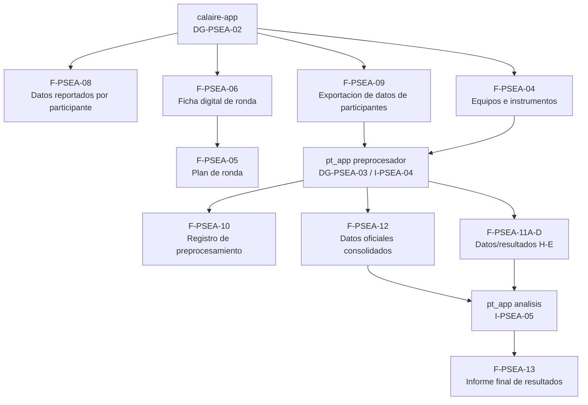

# Mapa de Decisiones Documentales del PEA

**Estado:** documento de trabajo  
**Fecha de consolidacion:** 2026-06-13  
**Alcance:** arquitectura documental del sistema PEA para ensayos de aptitud en gases contaminantes criterio.

## Criterios de lectura

Este mapa consolida las decisiones tomadas durante la revision del SGC PEA. No reemplaza aun el resumen general `sgc_res.md`; sirve como base para la actualizacion posterior de matrices, procedimientos, formatos e instructivos.

Estados usados:

- **Mantener:** el documento sigue vigente conceptualmente.
- **Actualizar:** el documento existe o se requiere, pero debe ajustarse al flujo real.
- **Elaborar:** documento requerido que aun debe construirse.
- **Reservar:** codigo disponible o no aplicable por ahora.
- **Retirar:** sale del alcance documental propio del PEA.
- **Absorber:** su contenido queda dentro de otro documento.

## Documentos generales

| Codigo | Nombre / rol | Estado | Accion requerida | Notas |
|---|---|---:|---|---|
| `DG-PSEA-01` | Protocolo general de participacion EA | Mantener | No intervenir ahora | Debe revisarse al final para citar flujo de datos e instructivos, sin tocarlo en esta fase. |
| `DG-PSEA-02` | Aplicativo `calaire-app` | Actualizar / documentar | Consolidar como documento general del aplicativo | Soporta gestion de rondas, participantes, captura de datos, cronogramas, ficha de ronda, exportaciones y casos SGC de quejas. |
| `DG-PSEA-03` | Aplicativo `pt_app` | Elaborar / documentar | Consolidar como documento general del aplicativo | Soporta preprocesamiento, analisis estadistico, H/E e informe final. No debe codificarse como formato `F-PSEA`. |

## Procedimientos P-PSEA

| Codigo | Nombre / rol decidido | Estado | Accion requerida | Integraciones clave |
|---|---|---:|---|---|
| `P-PSEA-01` | Protocolo general EA | Mantener | No tocar por ahora | Al cierre debe citar flujo digital, aplicativos e instructivos. |
| `P-PSEA-10` | Procedimiento tecnico NO/NO2 | Actualizar | Aligerar como procedimiento especifico por analito | Cita `P-PSEA-07`, `F-PSEA-11`, `P-PSEA-09`, `P-PSEA-08`, `pt_app`. |
| `P-PSEA-11` | Procedimiento tecnico CO | Actualizar | Aligerar como procedimiento especifico por analito | Cita los documentos transversales; evita duplicar estadistica, H/E e informe. |
| `P-PSEA-12` | Procedimiento tecnico O3 | Actualizar | Aligerar como procedimiento especifico por analito | Corregir referencias internas antiguas y duplicaciones. |
| `P-PSEA-13` | Procedimiento tecnico SO2 | Actualizar | Aligerar como procedimiento especifico por analito | Mantiene particularidades tecnicas del gas. |
| `P-PSEA-07` | Procedimiento de diseno estadistico | Mantener / actualizar | Convertir en procedimiento tecnico central | Gobierna valor asignado, `sigma_pt`, incertidumbre, outliers, H/E como insumo, criterios de desempeno y reglas de decision. No es instructivo de `pt_app`. |
| `P-PSEA-09` | Procedimiento de generacion/emision del informe de resultados | Elaborar / actualizar | Absorber rol de `P-PSEA-22` | Se conecta con `F-PSEA-13`, `DG-PSEA-03` e `I-PSEA-05`. No definir aun contenido detallado del informe. |
| `P-PSEA-14` | Procedimiento de colusion y falsificacion | Mantener / actualizar | Mantener independiente | Conecta con `P-PSEA-15`, `P-PSEA-16`, `P-PSEA-19` y medidas preventivas en ronda. |
| `P-PSEA-04` | Procedimiento de planificacion de ronda EA | Actualizar | Reflejar planificacion soportada en `calaire-app` | Usa `F-PSEA-01`, `F-PSEA-02`, `F-PSEA-05`, `F-PSEA-06`, `F-PSEA-07` y nota/matriz A-U de ISO/IEC 17043:2023 7.2.1.3. |
| `P-PSEA-06` | Preparacion y control del item de ensayo gaseoso | Elaborar / actualizar | Reemplazar enfoque de envio/recepcion por generacion de concentraciones | Usa niveles de `calaire-app`, calibrador dinamico y cilindro; registra en `F-PSEA-07`; conecta con H/E. |
| `P-PSEA-11` | No aplicable por ahora | Reservar | No usar | El antiguo enfoque de envio de items no aplica. |
| `P-PSEA-02` | Matriz documental del PEA | Elaborar | Crear matriz basica de todo lo numerado | Lista `DG`, `P`, `I`, `F` y subformatos con estado. Sin aprobacion, retencion ni obsolescencia macro. |
| `P-PSEA-03` | Matriz de registros y evidencias del PEA | Elaborar | Crear matriz operativa de evidencias | Lista registros generados por ronda/evento. No lista todos los archivos tecnicos internos del preprocesador. |
| `P-PSEA-22` | Riesgos generales del PEA | Por elaborar | No intervenir ahora | Mantener idea en el mapa, sin desarrollar contenido por ahora. |
| `P-PSEA-23` | Mejora continua del PEA | Por elaborar | No intervenir ahora | Mantener idea en el mapa, sin desarrollar contenido por ahora. |
| `P-PSEA-15` | Trabajo no conforme, no conformidades y acciones correctivas | Mantener / actualizar | Conectar con casos y flujo real | Conecta con `P-PSEA-14`, `P-PSEA-08`, quejas, apelaciones e informes afectados. |
| `P-PSEA-17` | Auditorias internas/externas | Retirar | Sacar del alcance PEA | Pertenece al sistema macro, no al sistema documental propio del PEA. |
| `P-PSEA-18` | Revision por la direccion | Retirar | Sacar del alcance PEA | Pertenece al sistema macro, no al sistema documental propio del PEA. |
| `P-PSEA-19` | Imparcialidad | Retirar | Sacar del alcance PEA | Se maneja por fuera del sistema documental propio del PEA. |
| `P-PSEA-05` | Comunicaciones del PEA | Mantener / actualizar | Reflejar canales reales | Comunicaciones por `calaire-app` y por correo segun aplique; conecta con `I-PSEA-02`, `P-PSEA-16`, `P-PSEA-17`, `P-PSEA-18` y `P-PSEA-09`. |
| `P-PSEA-16` | Divulgacion y control de valores sensibles | Mantener / actualizar | Mantener como procedimiento especifico del EA | Controla divulgacion de niveles, `x_pt`, `sigma_pt`, valores de referencia y resultados agregados. |
| `P-PSEA-22` | Reportes PT | Absorber / reservar | No mantener independiente | Su rol queda dentro de `P-PSEA-09`. |
| `P-PSEA-08` | Flujo tecnico de datos digitales del PEA | Elaborar / actualizar | Documento clave de datos | Mapea `calaire-app`, `pt_app`, preprocesador, archivos tecnicos, `F-PSEA-10`, `F-PSEA-11A-D`, `F-PSEA-12` e informe. |
| `P-PSEA-17` | Quejas del PEA | Mantener / actualizar | Gestionar como casos SGC en `calaire-app` | Conecta con comunicaciones y `P-PSEA-15` si deriva en NC/CAPA. |
| `P-PSEA-18` | Apelaciones del PEA | Mantener / actualizar | Mantener aparte de `calaire-app` | Se reciben por correo formal al correo institucional del grupo. Conecta con comunicaciones y `P-PSEA-15` si aplica. |
| `P-PSEA-19` | Confidencialidad operativa interna del PEA | Mantener / actualizar | Acotar a datos, participantes y resultados | No es politica institucional general. |
| `P-PSEA-20` | Competencia y autorizacion operativa del PEA | Mantener / actualizar | Acotar a roles tecnicos/operativos | No cubre talento humano general. |
| `P-PSEA-21` | Proveedores criticos del PEA | Mantener / actualizar | Acotar a proveedores/servicios criticos | Debe respetar limites de tercerizacion permitidos por ISO/IEC 17043; no cubre compras generales. |

## Formatos F-PSEA

| Codigo | Nombre / rol decidido | Estado | Origen / soporte | Notas |
|---|---|---:|---|---|
| `F-PSEA-01` | Calendario global de ronda | Actualizar | `calaire-app` | Exportable; alimenta Gantt/Mermaid. |
| `F-PSEA-02` | Cronograma detallado de ronda | Actualizar | `calaire-app` | Diligenciable/exportable; basado en el formato de cronograma de ronda. |
| `F-PSEA-03` | No aplicable | Retirar / reservar | N/A | Sustituido por `F-PSEA-05`. |
| `F-PSEA-13` | Informe final de resultados | Mantener / actualizar | `pt_app` | No definir contenido ahora; asociado a `P-PSEA-09`. |
| `F-PSEA-03` | Registro de participacion | Mantener / actualizar | `calaire-app` | Registro principal de participacion. |
| `F-PSEA-04` | Anexo tecnico de equipos e instrumentos del participante | Mantener / actualizar | `calaire-app` | Equivalente a `ronda_1_equipos.csv`; alimenta `pt_app`. |
| `F-PSEA-05` | Plan de ronda EA | Mantener / actualizar | `calaire-app` / documento de plan | Debe integrar `F-PSEA-01`, `F-PSEA-02`, `F-PSEA-06` y nota/matriz A-U. |
| `F-PSEA-06` | Ficha digital de ronda EA | Elaborar / actualizar | `calaire-app` | Exportable; insumo de `F-PSEA-05`; incluye puntos A-U requeridos por ISO/IEC 17043:2023 7.2.1.3. |
| `F-PSEA-07` | Dossier/registro de preparacion y control del item | Mantener / actualizar | Operacion tecnica / `P-PSEA-06` | Evidencia preparacion, niveles y control del item gaseoso. |
| `F-PSEA-08` | Registro de datos reportados por participante | Mantener / actualizar | `calaire-app` | Donde el participante registra sus datos. |
| `F-PSEA-10` | Registro de preprocesamiento de datos | Elaborar | `pt_app` preprocesador | Lista archivos de entrada/salida, fecha, version, responsable/ruta y observaciones; referencia `preprocesamiento_log.csv`. |
| `F-PSEA-11` | No aplicable por ahora | Reservar | N/A | Antiguo envio/recepcion no aplica. |
| `F-PSEA-09` | Datos de participantes exportados para analisis PT | Mantener / actualizar | `calaire-app` | Exportacion oficial hacia `pt_app`; no es `ronda_<n>_completa.csv`. |
| `F-PSEA-11` | Registro de homogeneidad y estabilidad del item | Mantener / actualizar | `pt_app` / operacion tecnica | Integra soporte de H/E. |
| `F-PSEA-11A` | Datos preprocesados de homogeneidad | Elaborar | `pt_app` preprocesador | Subformato H/E. |
| `F-PSEA-11B` | Datos preprocesados de estabilidad | Elaborar | `pt_app` preprocesador | Subformato H/E. |
| `F-PSEA-11C` | Resultados de homogeneidad | Elaborar | `pt_app` | Salida de resultados H/E. |
| `F-PSEA-11D` | Resultados de estabilidad | Elaborar | `pt_app` | Salida de resultados H/E. |
| `F-PSEA-12` | Datos oficiales consolidados para evaluacion de aptitud | Elaborar | `pt_app` preprocesador | Equivalente a `ronda_<n>_completa.csv`; dataset oficial para analisis PT. |
| `F-PSEA-14` | Registro/caso de quejas o NC segun aplique | Revisar | `calaire-app` / casos SGC | Debe alinearse con `P-PSEA-15` y `P-PSEA-17`. |
| `F-PSEA-15` | Registro de apelaciones | Revisar | Correo institucional / registro documental | No se gestiona como caso en `calaire-app` por ahora. |
| `F-PSEA-16` | Matriz de competencia/autorizacion | Mantener / actualizar | Gestion operativa PEA | Asociado a `P-PSEA-20`. |
| `F-PSEA-17` | Evaluacion de proveedores criticos | Mantener / actualizar | Gestion operativa PEA | Asociado a `P-PSEA-21`. |

## Instructivos I-PSEA

| Codigo | Nombre / rol decidido | Estado | Accion requerida | Notas |
|---|---|---:|---|---|
| `I-PSEA-02` | Instructivo para participante en `calaire-app` | Mantener / actualizar | Integrar con `DG-PSEA-02` y `P-PSEA-05` | Ya existe esquema documental de `calaire-app`. |
| `I-PSEA-03` | Instructivo de administracion de rondas en `calaire-app` | Mantener / actualizar | Integrar con `DG-PSEA-02`, `P-PSEA-04` y formatos exportables | Cubre administracion interna de rondas. |
| `I-PSEA-04` | Instructivo de uso del preprocesador de datos de `pt_app` | Elaborar | Documentar operacion del preprocesador | Debe explicar uso operativo; `P-PSEA-08` explica el flujo y `F-PSEA-10` registra la ejecucion. |
| `I-PSEA-05` | Instructivo de uso del modulo de analisis PT de `pt_app` | Elaborar | Documentar operacion de analisis | No reemplaza `P-PSEA-07`; solo explica uso del aplicativo. |

## Flujo minimo de datos oficiales

## Notas abiertas

- `sgc_res.md` se actualizara solo al final, cuando el mapa ya este estabilizado.
- `README.md` se actualizara solo al final.
- `P-PSEA-01` se revisara despues de estabilizar `P-PSEA-02`, `P-PSEA-03` y `P-PSEA-08`.
- No se debe definir todavia el contenido detallado del informe final `F-PSEA-13`.
- Los archivos tecnicos internos del preprocesador deben mapearse en `P-PSEA-08`, no convertirse todos en formatos `F-PSEA`.
