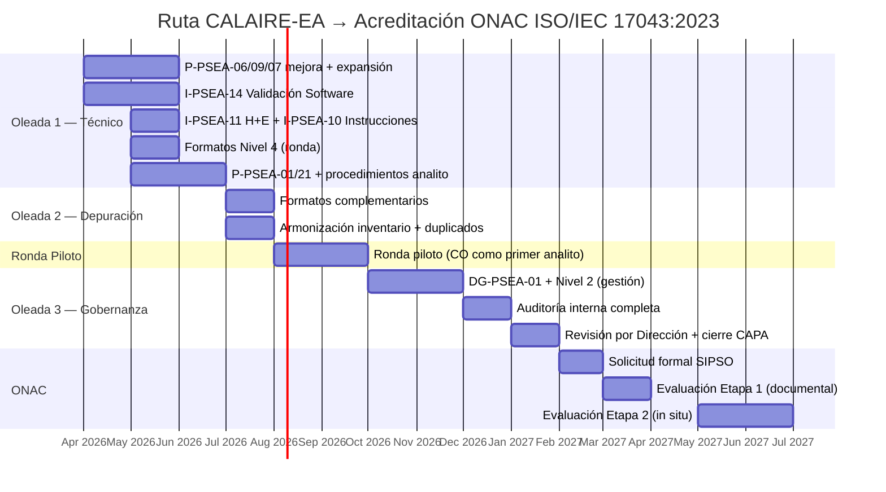

# Evaluación Cruzada y Plan de Planificación del SGC — CALAIRE-EA

**Fecha**: 2026-04-07  
**Estado**: Evaluación consolidada  
**Normas de referencia**: ISO/IEC 17043:2023 · ISO 13528:2022  
**Insumos evaluados**: `gem_sgc.md`, `gpt_finalsgc.md`, `gpt_sgc.md`, `z_sgc.md`, `claude_sgc.md`

---

## 1. Objetivo

Evaluar las cinco propuestas de SGC generadas por diferentes modelos, identificar sus fortalezas y debilidades relativas, y sintetizar una planificación consolidada del SGC para CALAIRE-EA que sea:

- técnicamente correcta frente a ISO/IEC 17043:2023 e ISO 13528:2022;
- implementable con los recursos existentes;
- compatible con el sistema ISO/IEC 17025 ya acreditado;
- priorizada por oleadas de implementación.

---

## 2. Evaluación Comparativa de las 5 Fuentes

### 2.1 Tabla de Fortalezas y Debilidades

| Fuente | Fortalezas Principales | Debilidades Principales |
|--------|----------------------|------------------------|
| **gem_sgc** | Tratamiento académico exhaustivo de ISO 17043:2023; tabla de evolución 2010→2023; análisis de imparcialidad por tipología de amenaza; cuestionario diagnóstico integral; contexto regulatorio ONAC detallado | Excesivamente teórico; no propone arquitectura documental concreta; no define códigos de documentos; no aterriza al caso específico de gases; lenguaje jurídico dificulta operatividad |
| **gpt_sgc** | Aterrizado al caso de gases in situ; modelo en 3 capas operativo; definición precisa de σ_pt por δ_E; adaptación de homogeneidad/estabilidad a atmósferas generadas; reglas documentadas concretas; 16 formatos detallados | Dos rondas de preguntas/respuestas (40% del documento es Q&A redundante); no define codificación P-PSEA; algunos niveles de detalle inconsistentes al mezclar bloques |
| **gpt_finalsgc** | Síntesis aterrizada; identifica correctamente que P-PSEA-09 y P-PSEA-06 ya cubren el núcleo técnico; priorizacion por oleadas; lista de 20 documentos pendientes con códigos; identifica desfases en codificación existente | Menos profundidad en ISO 13528; no detalla algoritmos ni fórmulas; no incluye matrices RACI ni de riesgos; algunos códigos (F-PSEA-01 a F-PSEA-22) colisionan con la codificación existente en `Inventario Documental` |
| **z_sgc** | Conciso y pragmático; checklist de validación de software R; adaptación clara a n bajo (~12); enfoque de "extensión de ISO 17025"; identificación del riesgo "juez y parte" | Muy corto; no cubre Sección 8 completa; no define codificación documental; no incluye diagramas de flujo ni cronograma; tratamiento superficial de quejas/apelaciones |
| **claude_sgc** | El más completo operativamente; manual con política, alcance, roles, riesgos; 10 procedimientos codificados (PRO-PT-01 a 10); 4 instructivos (IT-PT-01 a 04); diagramas de flujo detallados; matrices RACI, de riesgos, documental y de trazabilidad normativa; plan de implementación en 7 fases; checklist pre-acreditación; código R del Algoritmo A; contexto Colombia (Res. 2254, INM, ONAC, SVCA) | Usa codificación PRO-PT distinta a la P-PSEA adoptada en el inventario existente; asume 15 participantes (el caso real tiene ~2–12); modelo Horwitz/Thompson puede no ser el más adecuado para gases a nivel de ppm/ppb; no integra P-PSEA-06 ni P-PSEA-09 existentes |

---

### 2.2 Convergencia entre fuentes

Todos los documentos **coinciden** en los siguientes puntos fundamentales:

1. **El valor asignado debe ser independiente de los participantes** (CRM + laboratorio de referencia), especialmente con n bajo.
2. **σ_pt debe ser externo y predefinido**, no basado en la dispersión de la ronda.
3. **El scoring principal debe ser z o z'**, con ζ como complementario.
4. **La validación del software (Shiny/R) es un requisito crítico** tanto para ISO 17043:2023 §7.5 como para ISO 13528:2022 §4.1/5.5.
5. **El SGC del PEA debe ser independiente del SGC 17025.** Cada procedimiento es autónomo para ensayos de aptitud, aun cuando trate temas que también existan en 17025.
6. **Las brechas principales están en gobernanza del SGC** (Secciones 4, 5, 6.2, 6.4, 8), no en la metodología estadística.
7. **Quejas y apelaciones deben separarse en procedimientos distintos** (cambio de 2023).
8. **Homogeneidad y estabilidad requieren adaptación** al contexto de atmósferas generadas in situ.

---

### 2.3 Divergencias relevantes

| Tema | Posiciones | Resolución recomendada |
|------|-----------|----------------------|
| **Codificación documental** | `claude_sgc` usa PRO-PT-##; `gpt_finalsgc` e inventario usan P-PSEA-##; `gpt_sgc` no codifica | **Adoptar P-PSEA-##** que ya está en el inventario operativo del PEA. |
| **Número mínimo de participantes** | `claude_sgc` propone mín. 15; `z_sgc` dice ~12; `gpt_sgc` reconoce que puede ser 2 | **Diseñar para n variable (2–15+)**: valor asignado siempre por CRM (independiente de n); σ_pt externo; Algoritmo B preferible si n < 15 |
| **Manual de Calidad** | `gem_sgc` dice que ya no es obligatorio un "manual" literal; otros lo incluyen | **Crear DG-PSEA-01** como documento marco propio del PEA (no un "manual de calidad" ISO 9001 clásico), independiente del manual 17025, compatible con el lenguaje de "información documentada" de 17043:2023 |
| **P-PSEA-06** | `gpt_finalsgc` lo identifica como procedimiento de diseño estadístico existente; `Inventario` lo clasifica como "Elaboración de Informe de Resultados" | **Resolver el conflicto de identidad de P-PSEA-06**: si el contenido actual es estadístico, renombrarlo a "Procedimiento de Diseño Estadístico" y asignar P-PSEA-07 al informe de resultados |
| **Modelo para σ_pt** | `claude_sgc` propone Horwitz/Thompson; `gpt_sgc` propone δ_E = max(a%·x_pt, b%·span); `z_sgc` propone σ_R del método | **Para gases criterio usar criterio de aptitud para el uso**: δ_E basado en % del valor asignado con piso por span, derivando σ_pt = δ_E/3. Documentar en P-PSEA-06. |

---

## 3. Estado Actual de la Documentación

### 3.1 Documentos con avance real (existentes en el directorio)

| Código | Documento | Estado | Formato |
|--------|----------|--------|---------|
| DG-PSEA-01 | Protocolo Participación EA Gases Contaminantes Criterio | draft | .docx |
| P-PSEA-01 | Protocolo General EA v2 | draft | .docx |
| P-PSEA-02 | Procedimiento NO-NO₂ v2 | draft | .docx |
| P-PSEA-03 | Procedimiento CO v2 | draft | .docx |
| P-PSEA-04 | Procedimiento O₃ v2 | draft | .docx |
| P-PSEA-05 | Procedimiento SO₂ v2 | draft | .docx |
| P-PSEA-06 | Procedimiento Diseño Estadístico v0 | draft | .docx |
| P-PSEA-07 | Procedimiento Informe Resultados v0 | draft | .docx |
| P-PSEA-08 | Proc Colusión Falsificación v0 | draft | .docx |
| P-PSEA-09 | Procedimiento Planificación Ronda EA | draft | .docx (2 versiones) |
| I-PSEA-01 | Instructivo de Embalaje v1 | draft | .docx |
| F-PSEA-01 | Calendario Tipo v0 | draft | .xlsx |
| F-PSEA-02 | Cronograma Detallado v0 | draft | .xlsx |
| F-PSEA-03 | Registro Planificación Ronda EA | draft | .xlsx |
| F-PSEA-04 | Formato Informe Resultados v0 | draft | .docx |
| — | Informe Resultados (2 versiones) | ejemplo | .docx |
| — | Comunicación Detallada EA | plantilla | .docx |
| — | Inducción GREyD 2025 | referencia | .pptx |

### 3.2 Documentos de control generados (en .md)

- Inventario Documental del SGC
- Matriz Maestra de Cumplimiento Normativo
- Árbol Maestro PSEA
- Diccionario de Documentos SGC
- Backlog Priorizado de Documentos SGC
- Roadmap de Implementación por Oleadas

> [!IMPORTANT]
> Existen **2 versiones** de P-PSEA-09 en el directorio. Debe resolverse cuál es la versión vigente y eliminar la duplicada.

> [!WARNING]
> **Colisión de codificación detectada.** La evaluación anterior usaba códigos P-PSEA que colisionan con el Diccionario de Documentos SGC. A continuación se muestra la tabla de resolución. **El Diccionario es la fuente canónica.**
>
> | Diccionario (canónico) | Evaluación anterior (incorrecto) | Tema |
> |---|---|---|
> | P-PSEA-12 | P-PSEA-13 | Control Documental |
> | P-PSEA-13 | P-PSEA-14 | Control de Registros |
> | P-PSEA-14 | P-PSEA-15 | Gestión de Riesgos |
> | P-PSEA-16 | P-PSEA-17 | No Conformidades |
> | P-PSEA-17 | P-PSEA-18 | Auditorías Internas |
> | P-PSEA-18 | P-PSEA-19 | Revisión por Dirección |
> | P-PSEA-19 | P-PSEA-20 | Monitoreo de Imparcialidad |
> | P-PSEA-20 | P-PSEA-21 | Comunicación PT / Rev. Solicitudes |
> | P-PSEA-24 | P-PSEA-25 | Quejas |
> | P-PSEA-25 | P-PSEA-26 | Apelaciones |
>
> Códigos P-PSEA-26 a P-PSEA-30 estaban marcados como "duplicados a eliminar" en el Diccionario. Se reasignan con alcance exclusivo del PEA: **P-PSEA-26** Confidencialidad (§4.2), **P-PSEA-27** Competencia y Autorización (§6.2), **P-PSEA-28** Proveedores Externos (§6.4).

---

## 4. Cobertura Normativa Consolidada

### 4.1 ISO/IEC 17043:2023 — Evaluación de cobertura

| Sección | Requisito | Cobertura | Documento(s) | Brecha |
|---------|----------|-----------|-------------|--------|
| **4.1** | Imparcialidad | 🔴 Baja | P-PSEA-08 (colusión, parcial) | Falta P-PSEA-19: monitoreo de imparcialidad, declaraciones, riesgos |
| **4.2** | Confidencialidad | 🔴 Baja | — | Falta P-PSEA-26: política de codificación, contratos NDA, RBAC del aplicativo |
| **5** | Estructura | 🟡 Parcial | — | Falta organigrama PEA, separación de roles laboratorio vs PEA en DG-PSEA-01 |
| **6.2** | Competencia personal | 🔴 Baja | — | Falta P-PSEA-27: perfiles de cargo PEA, autorización formal, registros de formación |
| **6.3** | Ambiente / instalaciones | 🟡 Parcial | — | Falta documentar condiciones específicas del PEA para generación/almacenamiento de gases (procedimiento propio, no heredado de 17025) |
| **6.4** | Proveedores externos | 🔴 Baja | — | Falta P-PSEA-28: evaluación de proveedores de CRM, transporte, subcontratación |
| **7.1** | Revisión solicitudes/contratos | 🔴 Baja | — | Falta: integrar en P-PSEA-20 (Comunicación PT) |
| **7.2.1** | Planificación del esquema | 🟢 Avanzada | P-PSEA-09 | Requiere expansión para incluir todos los literales a)–u) de 7.2.1.3 |
| **7.2.2** | Diseño estadístico | 🟢 Avanzada | P-PSEA-06 | Requiere mejora editorial y formalización |
| **7.2.3** | Valor asignado | 🟢 Avanzada | P-PSEA-06 | OK conceptualmente; formalizar jerarquía y modelo de incertidumbre |
| **7.3.1–2** | Producción, H/E | 🟡 Parcial | P-PSEA-06 + P-PSEA-09 | Falta instructivo operativo adaptado a atmósferas generadas (I-PSEA-10) |
| **7.3.3–4** | Logística, despacho | 🟡 Parcial | P-PSEA-10 + I-PSEA-01 | Requiere ampliación con confirmación de entrega y control de recepción |
| **7.3.5** | Instrucciones a participantes | 🟡 Parcial | — | Falta I-PSEA-09: instrucciones formales pre-ronda |
| **7.4.1–2** | Análisis y evaluación | 🟢 Avanzada | P-PSEA-06 | Base metodológica sólida |
| **7.4.3** | Informe de resultados | 🟡 Parcial | P-PSEA-07 + F-PSEA-04 | Requiere contenido mínimo per §7.4.3, plazos, informes corregidos |
| **7.5.1** | Registros técnicos | 🔴 Baja | — | Falta P-PSEA-13: política de retención, respaldo, trazabilidad |
| **7.5.2** | Validación de software | 🔴 Baja | — | Falta I-PSEA-13: expediente de validación del aplicativo R/Shiny |
| **8.3** | Control documental | 🔴 Baja | — | Falta P-PSEA-12 |
| **8.5** | Riesgos y oportunidades | 🔴 Baja | — | Falta P-PSEA-14: pensamiento basado en riesgos |
| **8.6** | Mejora continua | 🔴 Baja | — | Falta P-PSEA-15 |
| **8.7** | No conformidades y CAPA | 🔴 Baja | — | Falta P-PSEA-16 |
| **8.8** | Auditorías internas | 🔴 Baja | — | Falta P-PSEA-17 |
| **8.9** | Revisión por la dirección | 🔴 Baja | — | Falta P-PSEA-18 |
| **8.10** | Quejas | 🔴 Baja | — | Falta P-PSEA-24 |
| **8.11** | Apelaciones | 🔴 Baja | — | Falta P-PSEA-25 |

### 4.2 ISO 13528:2022 — Evaluación de cobertura

| Capítulo | Tema | Cobertura | Soporte |
|----------|------|-----------|---------|
| 4 | Principios generales | 🟢 | P-PSEA-06 + aplicativo R |
| 5 | Diseño estadístico | 🟢 | P-PSEA-06 |
| 6 | Revisión inicial, H/E, outliers | 🟡 | P-PSEA-06 parcial; falta instructivo operativo de H/E para atmósferas |
| 7 | Valor asignado | 🟢 | P-PSEA-06 cubre jerarquía; falta modelo formal de u(x_pt) |
| 8–9 | Evaluación de desempeño, scores | 🟢 | P-PSEA-06 + aplicativo R: z, z', ζ implementados |
| 10 | Visualización | 🟡 | Aplicativo genera gráficos, pero falta documentación de especificaciones |
| Anexo C | Algoritmos A, B, C | 🟢 | Implementados y parcialmente validados en R |
| Anexo B | Homogeneidad/estabilidad | 🟡 | Criterios cubiertos; falta adaptación formal a atmósferas generadas |
| 4.1/5.5 | Validación de software | 🔴 | **Brecha crítica**: falta expediente formal de validación (I-PSEA-13) |

---

## 5. Planificación Consolidada del SGC

### 5.1 Principios de diseño adoptados

1. **No reconstruir desde cero.** P-PSEA-06 y P-PSEA-09 son el núcleo técnico. Conservar y mejorar.
2. **Codificación P-PSEA-##.** Mantener la nomenclatura existente del inventario.
3. **SGC del PEA totalmente independiente del SGC 17025.** Cada procedimiento del PEA es autónomo (control documental, CAPA, auditorías, competencia, etc.), aun cuando exista un homólogo en 17025. Lo que sea mutuo se deja separado: el PEA tiene su propio sistema completo.
4. **Diseño para n variable.** El sistema debe funcionar con 2 participantes (usando valor asignado independiente) y escalar cuando n crezca.
5. **Priorizar lo técnico-operativo (Nivel 3 y 4).** Los procedimientos técnicos del esquema y sus formatos son lo que define al PEA. DG-PSEA-01 y Nivel 2 se pueden generalizar con el SGC 17025 existente y bajan en prioridad.

### 5.2 Arquitectura documental definitiva

```
NIVEL 1 — DOCUMENTO MARCO
└── DG-PSEA-01  Manual del SGC para EA (independiente del manual 17025)
    ├── Política de calidad para EA
    ├── Política de imparcialidad  
    ├── Política de confidencialidad (§4.2)
    ├── Alcance del PEA (gases criterio)
    ├── Estructura organizacional del PEA (organigrama, roles, autoridad)
    ├── Mapa de procesos del PEA
    └── Referencia cruzada a todos los documentos del PEA

NIVEL 2 — PROCEDIMIENTOS DEL SISTEMA DE GESTIÓN (códigos del Diccionario)
├── P-PSEA-12  Control Documental del PEA                    (8.3)
├── P-PSEA-13  Control de Registros del PEA                   (7.5.1, 8.4)
├── P-PSEA-14  Gestión de Riesgos y Oportunidades del PEA     (8.5)
├── P-PSEA-15  Mejora Continua del PEA                        (8.6)
├── P-PSEA-16  No Conformidades y Acciones Correctivas del PEA (8.7)
├── P-PSEA-17  Auditorías Internas del PEA                    (8.8)
├── P-PSEA-18  Revisión por la Dirección del PEA              (8.9)
├── P-PSEA-19  Monitoreo de Imparcialidad (exclusivo EA)      (4.1)
├── P-PSEA-24  Quejas del PEA                                 (8.10)
├── P-PSEA-25  Apelaciones del PEA                            (8.11)
├── P-PSEA-26  Confidencialidad (exclusivo EA)                (4.2)
├── P-PSEA-27  Competencia y Autorización del Personal del PEA (6.2)
└── P-PSEA-28  Proveedores Externos del PEA                   (6.4)

NIVEL 3 — PROCEDIMIENTOS TÉCNICOS DEL ESQUEMA
├── P-PSEA-01  Protocolo General EA (marco, participante)
├── P-PSEA-02  Procedimiento NO-NO₂
├── P-PSEA-03  Procedimiento CO
├── P-PSEA-04  Procedimiento O₃
├── P-PSEA-05  Procedimiento SO₂
├── P-PSEA-06  Procedimiento de Diseño Estadístico (troncal ISO 13528)
├── P-PSEA-07  Procedimiento de Informe de Resultados
├── P-PSEA-08  Procedimiento de Colusión y Falsificación
├── P-PSEA-09  Procedimiento de Planificación de Ronda EA
├── P-PSEA-10  Procedimiento de Manejo de Items PT
├── P-PSEA-11  Reporte de Resultados (17025)
├── P-PSEA-20  Comunicación PT (revisión solicitudes, instrucciones, contratos)
├── P-PSEA-21  Divulgación de Valores
├── P-PSEA-22  Reportes PT (contenido mínimo §7.4.3)
└── P-PSEA-23  Gestión de Datos

NIVEL 3b — INSTRUCTIVOS TÉCNICOS (códigos del Diccionario)
├── I-PSEA-01  Caracterización
├── I-PSEA-02  Producción PT Items
├── I-PSEA-03  Control Ambiental
├── I-PSEA-04  Validación de Métodos
├── I-PSEA-05  Estimación de Incertidumbre
├── I-PSEA-06  Control de Calidad de Datos
├── I-PSEA-07  Diseño Estadístico
├── I-PSEA-08  Valor Asignado
├── I-PSEA-09  Instrucciones a Participantes
├── I-PSEA-10  Homogeneidad y Estabilidad
├── I-PSEA-11  Análisis de Datos
├── I-PSEA-12  Evaluación de Desempeño
├── I-PSEA-13  Validación de Software y Sistemas
└── I-PSEA-14  Visualización de Datos y Gráficos

NIVEL 4 — FORMATOS Y REGISTROS
├── F-PSEA-01  Calendario Tipo (existente)
├── F-PSEA-02  Cronograma Detallado (existente)
├── F-PSEA-03  Registro Planificación Ronda (existente)
├── F-PSEA-04  Formato Informe Resultados (existente)
├── F-PSEA-05  Confirmación de Participación
├── F-PSEA-06  Plan de Ronda EA
├── F-PSEA-07  Lista Maestra de Participantes
├── F-PSEA-08  Registro de Preparación del Ítem
├── F-PSEA-09  Registro de Homogeneidad
├── F-PSEA-10  Registro de Estabilidad
├── F-PSEA-11  Registro de Envío y Recepción
├── F-PSEA-12  Formato de Reporte del Participante
├── F-PSEA-13  Hoja de Revisión de Datos
├── F-PSEA-14  Hoja de Cálculo y Aprobación Estadística
├── F-PSEA-15  Registro de No Conformidad / CAPA
├── F-PSEA-16  Registro de Quejas
├── F-PSEA-17  Registro de Apelaciones
├── F-PSEA-18  Acta de Revisión por la Dirección
├── F-PSEA-19  Lista de Verificación Auditoría Interna
├── F-PSEA-20  Protocolo de Validación de Software
├── F-PSEA-21  Matriz de Competencia y Autorización
├── F-PSEA-22  Matriz de Riesgos de Imparcialidad
└── F-PSEA-23  Evaluación de Proveedores Externos
```

### 5.3 Implementación por oleadas

#### Oleada 1 — Procedimientos técnicos del esquema (Nivel 3 + Nivel 4)

**Plazo sugerido:** 6–8 semanas  
**Objetivo:** Completar y formalizar la cadena técnica-operativa completa del esquema de EA para poder ejecutar ronda piloto.

**Procedimientos técnicos (Nivel 3) — crear o mejorar:**

| # | Documento | Cláusula cubierta | Estado actual | Prioridad |
|---|----------|-------------------|---------------|-----------|
| 1 | **P-PSEA-06** Diseño Estadístico (mejora editorial + formalización) | 7.2.2, 7.2.3, ISO 13528 §5–9 | existente, mejorar | 🔴 Crítica |
| 2 | **P-PSEA-09** Planificación de Ronda (expandir literales a–u de 7.2.1.3) | 7.2.1 | existente, expandir | 🔴 Crítica |
| 3 | **P-PSEA-07** Informe de Resultados (actualizar contenido mínimo §7.4.3) | 7.4.3 | existente, actualizar | 🔴 Crítica |
| 4 | **P-PSEA-20** Comunicación PT (revisión solicitudes, instrucciones, contratos) | 7.1, 7.3.5 | nuevo | 🔴 Crítica |
| 5 | **P-PSEA-01** Protocolo General EA (realinear con 17043:2023) | 7.2, marco | existente, actualizar | 🟠 Alta |
| 6 | **P-PSEA-10** Manejo de Items PT | 7.3.3–4 | nuevo | 🟠 Alta |
| 7 | **P-PSEA-22** Reportes PT (contenido mínimo §7.4.3) | 7.4.3 | nuevo | 🟠 Alta |
| 8 | **P-PSEA-02** Procedimiento NO-NO₂ (revisar) | 7.3 | existente, revisar | 🟡 Media |
| 9 | **P-PSEA-03** Procedimiento CO (revisar) | 7.3 | existente, revisar | 🟡 Media |
| 10 | **P-PSEA-04** Procedimiento O₃ (revisar) | 7.3 | existente, revisar | 🟡 Media |
| 11 | **P-PSEA-05** Procedimiento SO₂ (revisar) | 7.3 | existente, revisar | 🟡 Media |
| 12 | **P-PSEA-08** Colusión y Falsificación (revisar) | 7.5.4 | existente, revisar | 🟡 Media |

**Instructivos técnicos (Nivel 3b) — crear:**

| # | Documento | Cláusula cubierta | Prioridad |
|---|----------|-------------------|-----------|
| 1 | **I-PSEA-13** Validación de Software y Sistemas | 7.5.2, ISO 13528 §4.1/5.5 | 🔴 Crítica |
| 2 | **I-PSEA-10** Homogeneidad y Estabilidad (adaptado a atmósferas generadas) | 7.3.2, ISO 13528 Anexo B | 🔴 Crítica |
| 3 | **I-PSEA-07** Diseño Estadístico | ISO 13528 §4–5, 17043 §7.2.2 | 🔴 Crítica |
| 4 | **I-PSEA-08** Valor Asignado | ISO 13528 §7, 17043 §7.2.3 | 🔴 Crítica |
| 5 | **I-PSEA-09** Instrucciones a Participantes | 7.3.5 | 🟠 Alta |
| 6 | **I-PSEA-11** Análisis de Datos | 7.4.1, ISO 13528 §6 | 🟠 Alta |
| 7 | **I-PSEA-12** Evaluación de Desempeño | ISO 13528 §8–11 | 🟠 Alta |
| 8 | **I-PSEA-02** Producción PT Items | 7.3.1 | 🟠 Alta |
| 9 | **I-PSEA-01** Caracterización | 6.1.2 | 🟡 Media |
| 10 | **I-PSEA-05** Estimación de Incertidumbre | 7.4 | 🟡 Media |
| 11 | **I-PSEA-06** Control de Calidad de Datos | 7.8 | 🟡 Media |
| 12 | **I-PSEA-14** Visualización de Datos y Gráficos | ISO 13528 §10 | 🟡 Media |

**Formatos y registros (Nivel 4) — Oleada 1:**

| Código | Formato | Prioridad |
|--------|---------|-----------|
| F-PSEA-06 | Plan de Ronda EA | 🔴 |
| F-PSEA-07 | Lista Maestra de Participantes | 🔴 |
| F-PSEA-08 | Registro de Preparación del Ítem | 🔴 |
| F-PSEA-09 | Registro de Homogeneidad | 🔴 |
| F-PSEA-10 | Registro de Estabilidad | 🔴 |
| F-PSEA-11 | Registro de Envío y Recepción | 🟠 |
| F-PSEA-12 | Formato de Reporte del Participante | 🔴 |
| F-PSEA-13 | Hoja de Revisión de Datos | 🔴 |
| F-PSEA-14 | Hoja de Cálculo y Aprobación Estadística | 🔴 |
| F-PSEA-05 | Confirmación de Participación | 🟠 |
| F-PSEA-20 | Protocolo de Validación de Software | 🔴 |

---

#### Oleada 2 — Formatos complementarios y depuración

**Plazo sugerido:** 4–6 semanas después de Oleada 1  
**Objetivo:** Completar formatos restantes, resolver duplicados, armonizar inventario. Preparar para ronda piloto.

- Resolución de duplicados (2 versiones P-PSEA-09; conflicto de identidad P-PSEA-06/07)
- Armonización del inventario documental, backlog y matriz maestra
- Unificación de nomenclatura entre documentos de control (.md) y documentos operativos (.docx/.xlsx)
- Consolidación de plantillas de comunicación y de informes históricos

**Formatos restantes Oleada 2:**
- F-PSEA-15 Registro de No Conformidad / CAPA
- F-PSEA-16 Registro de Quejas
- F-PSEA-17 Registro de Apelaciones
- F-PSEA-18 Acta de Revisión por la Dirección
- F-PSEA-19 Lista de Verificación Auditoría Interna
- F-PSEA-21 Matriz de Competencia y Autorización
- F-PSEA-22 Matriz de Riesgos de Imparcialidad
- F-PSEA-23 Evaluación de Proveedores Externos

---

#### Oleada 3 — Gobernanza y sistema de gestión (Nivel 1 + Nivel 2)

**Plazo sugerido:** después de Oleada 2, cuando sea necesario para ONAC  
**Objetivo:** Formalizar el marco de gestión. DG-PSEA-01 se puede generalizar con el SGC 17025 existente. Los procedimientos de Nivel 2 son necesarios para la acreditación pero no para operar el esquema.

> [!NOTE]
> Estos documentos bajan en prioridad porque su contenido puede generalizarse con el sistema 17025 existente. Se desarrollan cuando la operación técnica (Oleada 1) ya esté resuelta.

**Nivel 1:**

| # | Documento | Nota |
|---|----------|------|
| 1 | **DG-PSEA-01** Manual del SGC para EA | Puede generalizarse con el manual 17025 |

**Nivel 2 — Procedimientos del sistema de gestión del PEA:**

| # | Documento | Cláusula cubierta |
|---|----------|-------------------|
| 1 | **P-PSEA-12** Control Documental del PEA | 8.3 |
| 2 | **P-PSEA-13** Control de Registros del PEA | 7.5.1, 8.4 |
| 3 | **P-PSEA-14** Gestión de Riesgos y Oportunidades del PEA | 8.5 |
| 4 | **P-PSEA-15** Mejora Continua del PEA | 8.6 |
| 5 | **P-PSEA-16** No Conformidades y CAPA del PEA | 8.7 |
| 6 | **P-PSEA-17** Auditorías Internas del PEA | 8.8 |
| 7 | **P-PSEA-18** Revisión por la Dirección del PEA | 8.9 |
| 8 | **P-PSEA-19** Monitoreo de Imparcialidad | 4.1 |
| 9 | **P-PSEA-24** Quejas del PEA | 8.10 |
| 10 | **P-PSEA-25** Apelaciones del PEA | 8.11 |

---

## 6. Decisiones Estadísticas Clave (ISO 13528:2022)

Estas decisiones deben quedar documentadas en P-PSEA-06 antes de la primera ronda:

### 6.1 Valor asignado

| Jerarquía | Método | Aplicación CALAIRE-EA |
|-----------|--------|----------------------|
| 1 (preferido) | Cálculo metrológico de dilución dinámica + CRM | Esquema in situ: siempre |
| 2 | Confirmación por laboratorio de referencia interno (bajo 17025) | Verificación obligatoria |
| 3 | Valor de consenso robusto | Solo como verificación cruzada; nunca como base principal con n < 15 |

**Modelo de incertidumbre del valor asignado:**

```
u(x_pt) = √( u²_char + u²_hom + u²_stab )
```

> Para esquema in situ: u_trans ≈ 0 (no hay envío del ítem).

**Condición de validez:** u(x_pt) ≤ 0,3 × σ_pt

### 6.2 Criterio de aptitud (σ_pt)

**Fórmula recomendada para gases criterio:**

```
δ_E = max( a% × x_pt,  b% × span )
σ_pt = δ_E / 3
```

Donde:
- `a%` = criterio de error relativo (p.ej. 10% o 15% según analito)
- `b%` = piso mínimo de tolerancia (evita σ_pt irrazonablemente bajo en niveles bajos)
- `span` = rango de operación del analizador

> [!IMPORTANT]
> Nunca derivar σ_pt de la dispersión de la ronda cuando n < 15.

### 6.3 Scoring

| Score | Condición de uso | Interpretación |
|-------|-----------------|----------------|
| **z** | u(x_pt) ≤ 0,3 σ_pt | \|z\| ≤ 2: satisfactorio; 2 < \|z\| < 3: advertencia; \|z\| ≥ 3: acción |
| **z'** | u(x_pt) > 0,3 σ_pt y u_lab no disponible | σ'_pt = √(σ²_pt + u²_ref) |
| **ζ (zeta)** | u_lab disponible | Evalúa coherencia resultado–incertidumbre |
| **E_n** | Opcional, calibración | U expandida (k=2) |

### 6.4 Tratamiento de datos

1. Revisión de unidades, formato, cifras significativas
2. Gráfico exploratorio (boxplot, densidad kernel)
3. Detección de errores groseros (blunders) → exclusión solo con evidencia documentada
4. Algoritmo A (media/s robustas) si distribución simétrica razonable
5. Algoritmo B (mediana/NIQR) si n < 15 o asimetría alta
6. Prueba de Grubbs: solo para marcar, nunca para excluir automáticamente

### 6.5 Homogeneidad (adaptada a atmósferas generadas)

- Generar ≥ 10 atmósferas independientes bajo el mismo setpoint
- Medir con método de referencia (réplicas ≥ 2)
- Criterio: s_hom ≤ 0,3 × σ_pt

### 6.6 Estabilidad (adaptada a esquema in situ)

Tres modalidades:
1. **Estabilidad intrajornada** del sistema generador
2. **Estabilidad durante la ventana de medición** del esquema
3. **Estabilidad por transporte** (solo si aplica envío de cilindros)

- Criterio: |x̄_inicio − x̄_fin| ≤ 0,3 × σ_pt

---

## 7. Ruta Crítica hacia Acreditación ONAC



> [!WARNING]
> La fecha límite de transición ILAC para ISO/IEC 17043:2023 es **31 de mayo de 2026**. Nuevas acreditaciones y ampliaciones para PEA se evalúan con la edición 2023 desde septiembre 2024 (ONAC). Todo el desarrollo documental debe alinearse exclusivamente a la versión 2023.

---

## 8. Checklist Pre-Acreditación

- [ ] DG-PSEA-01 aprobado y firmado
- [ ] Todos los P-PSEA de Oleada 1 aprobados
- [ ] F-PSEA-20 (validación de software) ejecutado con evidencia
- [ ] Al menos una ronda piloto completa documentada
- [ ] Trazabilidad de CRM verificada contra INM
- [ ] Personal capacitado en ISO 17043:2023 e ISO 13528:2022 (registros en F-PSEA-21)
- [ ] Declaraciones de imparcialidad y confidencialidad firmadas
- [ ] Auditoría interna realizada con CAPA cerradas
- [ ] Revisión por la Dirección realizada con acta
- [ ] Inventario documental sincronizado y sin duplicados
- [ ] Aplicativo R/Shiny validado con datasets de referencia

---

## 9. Recomendación Final

El proyecto **no necesita reconstruir el SGC desde cero**. Ya existe un núcleo técnico utilizable:

- **P-PSEA-06** (diseño estadístico) y **P-PSEA-09** (planificación de ronda) cubren la mayor parte de la Sección 7 de ISO 17043:2023.
- **El aplicativo R/Shiny** implementa los algoritmos de ISO 13528:2022.
- **Los procedimientos por analito** (P-PSEA-02 a 05) existen como borradores.

La estrategia correcta es:

1. **Priorizar lo técnico-operativo** (P-PSEA-06, 09, 07, instructivos, formatos de ronda, validación de software).
2. **Ejecutar ronda piloto** con CO como primer analito, una vez Oleada 1 esté cerrada.
3. **Dejar la gobernanza (Nivel 1 + 2) para después**, ya que DG-PSEA-01 se puede generalizar con 17025 y los procedimientos de gestión bajan en prioridad.
4. **Sincronizar codificación e inventario** para que la documentación sea auditable y consistente.

> [!TIP]
> Cada documento de Oleada 1 puede tomar como plantilla la estructura de `claude_sgc.md` (la más completa operativamente), adaptando la codificación a P-PSEA-## y ajustando el contenido al contexto real de CALAIRE-EA.
