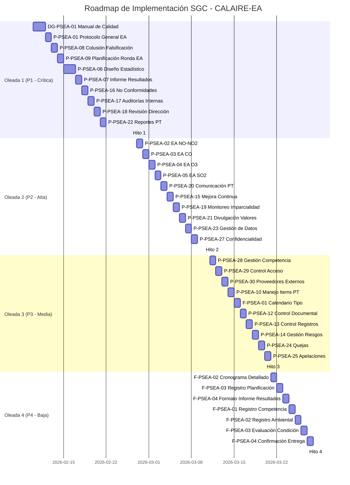

# Roadmap de Implementación por Oleadas - CALAIRE-EA

**Creado**: 2026-02-08
**Versión**: 1.0
**Estado**: draft
**Responsable**: Project Lead

---

## Objetivo

Este roadmap establece la secuencia de implementación de los 37 documentos del Sistema de Gestión de Calidad (SGC) en 4 oleadas priorizadas, con hitos, duración estimada y criterios de transición entre oleadas.

---

## Convenciones

| Elemento | Descripción |
|----------|-------------|
| **Oleada** | Grupo de documentos a implementar simultáneamente |
| **Duración** | Tiempo estimado para completar la oleada |
| **Hito** | Punto de control de calidad al final de cada oleada |
| **Prerequisitos** | Condiciones que deben cumplirse antes de iniciar la oleada |
| **Entregables** | Documentos y artefactos producidos en la oleada |

---

## Cronograma General

```
Oleada 1: P1 (Crítica)      ████████████░░░░░░░░░░░░░ 2-3 semanas
Oleada 2: P2 (Alta)         ░░░░░░░░░░░░████████████░░░ 2 semanas
Oleada 3: P3 (Media)        ░░░░░░░░░░░░░░░░░░░░░██████ 1-2 semanas
Oleada 4: P4 (Baja)         ░░░░░░░░░░░░░░░░░░░░░░░░░██ 1 semana

Tiempo total estimado: 6-8 semanas
```

---

## Oleada 1: Documentos Críticos (P1)

### Objetivo

Establecer la base del SGC con documentos de alta prioridad crítica para el cumplimiento normativo inmediato de ISO/IEC 17025:2017, ISO/IEC 17043:2023 e ISO 13528:2022.

### Prerequisitos

- [x] Fases 1-3 del plan completadas (Matriz, Inventario, Árbol Maestro, Diccionario)
- [x] Backlog priorizado aprobado por stakeholders
- [ ] DG-PSEA-01 Manual de Calidad iniciado (draft)
- [ ] Recursos humanos asignados a todos los responsables

### Duración Estimada

2-3 semanas (52 horas de esfuerzo total)

### Documentos Incluidos

| # | Código | Título | Responsable | Esfuerzo | Dependencias |
|---|--------|--------|-------------|----------|--------------|
| 1.1 | DG-PSEA-01 | Manual de Calidad | QMS Coordinator | 8h | Ninguna |
| 1.2 | P-PSEA-01 | Protocolo General EA (actualización) | PT Provider Lead | 6h | DG-PSEA-01 |
| 1.3 | P-PSEA-06 | Procedimiento Diseño Estadístico | Estadístico Principal | 8h | P-PSEA-01 |
| 1.4 | P-PSEA-07 | Procedimiento Informe Resultados | PT Coordinator | 6h | P-PSEA-06 |
| 1.5 | P-PSEA-08 | Procedimiento Colusión Falsificación | QMS Coordinator | 4h | P-PSEA-01 |
| 1.6 | P-PSEA-09 | Procedimiento Planificación Ronda EA | PT Coordinator | 6h | P-PSEA-01, P-PSEA-06 |
| 1.7 | P-PSEA-16 | Procedimiento No Conformidades | QMS Coordinator | 4h | DG-PSEA-01 |
| 1.8 | P-PSEA-17 | Procedimiento Auditorías Internas | Auditor Interno | 4h | DG-PSEA-01 |
| 1.9 | P-PSEA-18 | Procedimiento Revisión por Dirección | QMS Coordinator | 4h | P-PSEA-15, P-PSEA-16, P-PSEA-17 |
| 1.10 | P-PSEA-22 | Procedimiento Reportes PT | PT Coordinator | 6h | P-PSEA-07 |

### Cronograma Semanal

**Semana 1:**
- Lunes-Martes: DG-PSEA-01 Manual de Calidad (8h)
- Miércoles: P-PSEA-01 Protocolo General EA (actualización) (6h)
- Jueves: P-PSEA-08 Procedimiento Colusión Falsificación (4h)
- Viernes: P-PSEA-09 Procedimiento Planificación Ronda EA (6h)

**Semana 2:**
- Lunes-Martes: P-PSEA-06 Procedimiento Diseño Estadístico (8h)
- Miércoles: P-PSEA-07 Procedimiento Informe Resultados (6h)
- Jueves: P-PSEA-16 Procedimiento No Conformidades (4h)
- Viernes: P-PSEA-17 Procedimiento Auditorías Internas (4h)

**Semana 3 (si aplica):**
- Lunes: P-PSEA-18 Procedimiento Revisión por Dirección (4h)
- Martes-Miércoles: P-PSEA-22 Procedimiento Reportes PT (6h)
- Jueves: Hito 1 - Revisión y aprobación Oleada 1
- Viernes: Transición a Oleada 2

### Hitos

**Hito 1: Aprobación de Oleada 1**
- [ ] Todos los 10 documentos creados o actualizados
- [ ] Revisión técnica completada por responsables
- [ ] Aprobación de consultor ISO 17043 (P-PSEA-06, P-PSEA-07)
- [ ] Aprobación de Dirección (DG-PSEA-01)
- [ ] Matriz de cumplimiento actualizada con estado "cumple"
- [ ] Documentos subidos al repositorio controlado

### Criterios de Transición a Oleada 2

1. **Completitud:** Todos los 10 documentos de P1 deben estar en estado "approved"
2. **Calidad:** Aprobación de consultor ISO 17043 para documentos estadísticos
3. **Integración:** Referencias cruzadas entre documentos verificadas
4. **Validación:** P-PSEA-06 y P-PSEA-07 validados con CALAIRE-APP
5. **Matriz:** Actualización de Matriz Maestra con estado de cumplimiento "cumple"

### Riesgos y Mitigación

| Riesgo | Probabilidad | Impacto | Mitigación |
|--------|-------------|---------|------------|
| Falta de claridad en requisitos ISO 13528 | Media | Alta | Consultor ISO 17043 asignado a revisión de P-PSEA-06 |
| Cambios en estructura de CALAIRE-APP | Baja | Media | Validación paralela con equipo de desarrollo |
| Sobrecarga de recursos | Media | Media | Priorizar P1-1 y P1-3 primero, ajustar cronograma |

---

## Oleada 2: Documentos de Alta Prioridad (P2)

### Objetivo

Expandir el SGC con documentos de alta prioridad para soporte operativo y cumplimiento normativo ampliado.

### Prerequisitos

- [ ] Hito 1 aprobado
- [ ] DG-PSEA-01, P-PSEA-01, P-PSEA-06, P-PSEA-07 en estado "approved"
- [ ] Especialistas por gas asignados (NO-NO2, CO, O3, SO2)
- [ ] Recursos de infraestructura disponibles

### Duración Estimada

2 semanas (44 horas de esfuerzo total)

### Documentos Incluidos

| # | Código | Título | Responsable | Esfuerzo | Dependencias |
|---|--------|--------|-------------|----------|--------------|
| 2.1 | P-PSEA-02 | Procedimiento EA NO-NO2 | Especialista NO-NO2 | 6h | P-PSEA-01, P-PSEA-06 |
| 2.2 | P-PSEA-03 | Procedimiento EA CO | Especialista CO | 6h | P-PSEA-01, P-PSEA-06 |
| 2.3 | P-PSEA-04 | Procedimiento EA O3 | Especialista O3 | 6h | P-PSEA-01, P-PSEA-06 |
| 2.4 | P-PSEA-05 | Procedimiento EA SO2 | Especialista SO2 | 6h | P-PSEA-01, P-PSEA-06 |
| 2.5 | P-PSEA-15 | Procedimiento Mejora Continua | QMS Coordinator | 4h | P-PSEA-16, P-PSEA-17 |
| 2.6 | P-PSEA-19 | Procedimiento Monitoreo Imparcialidad | QMS Coordinator | 4h | DG-PSEA-01 |
| 2.7 | P-PSEA-20 | Procedimiento Comunicación PT | PT Coordinator | 4h | P-PSEA-01 |
| 2.8 | P-PSEA-21 | Procedimiento Divulgación Valores | PT Coordinator | 4h | P-PSEA-06 |
| 2.9 | P-PSEA-23 | Procedimiento Gestión de Datos | Administrador de Datos | 6h | P-PSEA-13 |
| 2.10 | P-PSEA-27 | Procedimiento Confidencialidad | QMS Coordinator | 4h | DG-PSEA-01 |

### Cronograma Semanal

**Semana 4:**
- Lunes: P-PSEA-02 Procedimiento EA NO-NO2 (6h)
- Martes: P-PSEA-03 Procedimiento EA CO (6h)
- Miércoles: P-PSEA-04 Procedimiento EA O3 (6h)
- Jueves: P-PSEA-05 Procedimiento EA SO2 (6h)
- Viernes: P-PSEA-20 Procedimiento Comunicación PT (4h)

**Semana 5:**
- Lunes: P-PSEA-15 Procedimiento Mejora Continua (4h)
- Martes: P-PSEA-19 Procedimiento Monitoreo Imparcialidad (4h)
- Miércoles: P-PSEA-21 Procedimiento Divulgación Valores (4h)
- Jueves: P-PSEA-23 Procedimiento Gestión de Datos (6h)
- Viernes: P-PSEA-27 Procedimiento Confidencialidad (4h) + Hito 2

### Hitos

**Hito 2: Aprobación de Oleada 2**
- [ ] Todos los 10 documentos de P2 creados
- [ ] Validación de procedimientos por gas (P-PSEA-02 al P-PSEA-05)
- [ ] Aprobación de Administrador de Datos (P-PSEA-23)
- [ ] Integración con CALAIRE-APP verificada (P-PSEA-21, P-PSEA-23)
- [ ] Matriz de cumplimiento actualizada con estado "cumple"

### Criterios de Transición a Oleada 3

1. **Completitud:** Todos los 10 documentos de P2 en estado "approved"
2. **Especialistas:** Procedimientos por gas aprobados por especialistas respectivos
3. **Sistemas:** P-PSEA-23 integrado con CALAIRE-APP
4. **Matriz:** Brechas de ISO 17043 cap. 7 cubiertas al 90%

### Riesgos y Mitigación

| Riesgo | Probabilidad | Impacto | Mitigación |
|--------|-------------|---------|------------|
| Falta de especialistas por gas | Media | Alta | Asignar especialistas técnicos con experiencia en gases |
| Incompatibilidad con CALAIRE-APP | Baja | Alta | Validación continua con equipo de desarrollo |
| Complejidad de P-PSEA-23 | Media | Media | Asignar Administrador de Datos con tiempo completo |

---

## Oleada 3: Documentos de Prioridad Media (P3)

### Objetivo

Completar la estructura del SGC con documentos de gestión operativa y soporte.

### Prerequisitos

- [ ] Hito 2 aprobado
- [ ] Procedimientos por gas (P-PSEA-02 al P-PSEA-05) en estado "approved"
- [ ] P-PSEA-23 en estado "approved"
- [ ] Recursos de calidad disponibles

### Duración Estimada

1-2 semanas (34 horas de esfuerzo total)

### Documentos Incluidos

| # | Código | Título | Responsable | Esfuerzo | Dependencias |
|---|--------|--------|-------------|----------|--------------|
| 3.1 | P-PSEA-28 | Procedimiento Gestión Competencia | QMS Coordinator | 4h | DG-PSEA-01 |
| 3.2 | P-PSEA-29 | Procedimiento Control Acceso | Coordinador Instalaciones | 3h | DG-PSEA-01 |
| 3.3 | P-PSEA-30 | Procedimiento Proveedores Externos | Compras | 4h | DG-PSEA-01 |
| 3.4 | P-PSEA-10 | Procedimiento Manejo Items PT | Coordinador Logística PT | 4h | P-PSEA-01 |
| 3.5 | P-PSEA-12 | Procedimiento Control Documental | QMS Coordinator | 4h | DG-PSEA-01 |
| 3.6 | P-PSEA-13 | Procedimiento Control Registros | QMS Coordinator | 4h | P-PSEA-12 |
| 3.7 | P-PSEA-14 | Procedimiento Gestión Riesgos | QMS Coordinator | 4h | DG-PSEA-01 |
| 3.8 | P-PSEA-24 | Procedimiento Quejas | QMS Coordinator | 3h | DG-PSEA-01 |
| 3.9 | P-PSEA-25 | Procedimiento Apelaciones | QMS Coordinator | 3h | DG-PSEA-01 |
| 3.10 | F-PSEA-01 | Calendario Tipo | PT Coordinator | 2h | P-PSEA-09 |

### Cronograma Semanal

**Semana 6:**
- Lunes: P-PSEA-28 Procedimiento Gestión Competencia (4h)
- Martes: P-PSEA-29 Procedimiento Control Acceso (3h)
- Miércoles: P-PSEA-30 Procedimiento Proveedores Externos (4h)
- Jueves: P-PSEA-10 Procedimiento Manejo Items PT (4h)
- Viernes: F-PSEA-01 Calendario Tipo (2h)

**Semana 7 (si aplica):**
- Lunes: P-PSEA-12 Procedimiento Control Documental (4h)
- Martes: P-PSEA-13 Procedimiento Control Registros (4h)
- Miércoles: P-PSEA-14 Procedimiento Gestión Riesgos (4h)
- Jueves: P-PSEA-24 Procedimiento Quejas (3h)
- Viernes: P-PSEA-25 Procedimiento Apelaciones (3h) + Hito 3

### Hitos

**Hito 3: Aprobación de Oleada 3**
- [ ] Todos los 10 documentos de P3 creados
- [ ] Aprobación de Coordinador de Instalaciones (P-PSEA-29)
- [ ] Aprobación de Coordinador de Logística PT (P-PSEA-10)
- [ ] Aprobación de Compras (P-PSEA-30)
- [ ] Matriz de cumplimiento actualizada con estado "cumple"

### Criterios de Transición a Oleada 4

1. **Completitud:** Todos los 10 documentos de P3 en estado "approved"
2. **Operaciones:** Procedimientos operativos aprobados por coordinadores funcionales
3. **Documentación:** Sistema de control documental operativo (P-PSEA-12, P-PSEA-13)
4. **Matriz:** Brechas de ISO 17025 cap. 8 cubiertas al 95%

### Riesgos y Mitigación

| Riesgo | Probabilidad | Impacto | Mitigación |
|--------|-------------|---------|------------|
| Disponibilidad de coordinadores funcionales | Media | Media | Coordinar fechas con antelación |
| Complejidad de P-PSEA-14 Gestión Riesgos | Baja | Media | Usar plantilla estándar de gestión de riesgos |
| P-PSEA-24 y P-PSEA-25 poco utilizados | Baja | Baja | Documentar con plantillas simples |

---

## Oleada 4: Documentos de Baja Prioridad (P4)

### Objetivo

Completar el SGC con formatos de registro y documentos complementarios.

### Prerequisitos

- [ ] Hito 3 aprobado
- [ ] P-PSEA-12 y P-PSEA-13 en estado "approved"
- [ ] Todos los procedimientos operativos aprobados

### Duración Estimada

1 semana (17 horas de esfuerzo total)

### Documentos Incluidos

| # | Código | Título | Responsable | Esfuerzo | Dependencias |
|---|--------|--------|-------------|----------|--------------|
| 4.1 | F-PSEA-02 | Cronograma Detallado | PT Coordinator | 2h | P-PSEA-09 |
| 4.2 | F-PSEA-03 | Registro Planificación Ronda EA | PT Coordinator | 2h | P-PSEA-09 |
| 4.3 | F-PSEA-04 | Formato Informe Resultados | PT Coordinator | 3h | P-PSEA-07 |
| 4.4 | F-PSEA-01 | Formato Registro Competencia | QMS Coordinator | 2h | P-PSEA-28 |
| 4.5 | F-PSEA-02 | Formato Registro Ambiental | Coordinador Instalaciones | 2h | P-PSEA-29 |
| 4.6 | F-PSEA-03 | Formato Evaluación Condición | Coordinador Logística PT | 2h | P-PSEA-10 |
| 4.7 | F-PSEA-04 | Formato Confirmación Entrega | Coordinador Logística PT | 2h | P-PSEA-10 |

### Cronograma Semanal

**Semana 8:**
- Lunes: F-PSEA-02 Cronograma Detallado (2h) + F-PSEA-03 Registro Planificación (2h)
- Martes: F-PSEA-04 Formato Informe Resultados (3h)
- Miércoles: F-PSEA-01 Formato Registro Competencia (2h)
- Jueves: F-PSEA-02 Formato Registro Ambiental (2h)
- Viernes: F-PSEA-03 Formato Evaluación Condición (2h) + F-PSEA-04 Formato Confirmación Entrega (2h) + Hito 4

### Hitos

**Hito 4: Cierre del Roadmap**
- [ ] Todos los 7 formatos de P4 creados
- [ ] Todos los 37 documentos del SGC completados
- [ ] Matriz de cumplimiento 100% actualizada
- [ ] Sistema de gestión documental operativo
- [ ] Revisión final de fase 6 iniciada

### Criterios de Transición a Fase 6 (Verificación)

1. **Completitud:** Todos los 37 documentos en estado "approved"
2. **Matriz:** 100% de requisitos normativos cubiertos
3. **Validación:** Todos los documentos integrados con operaciones
4. **Auditoría:** Preparación para auditoría interna del SGC

### Riesgos y Mitigación

| Riesgo | Probabilidad | Impacto | Mitigación |
|--------|-------------|---------|------------|
| Complejidad de F-PSEA-04 | Baja | Baja | Usar plantilla de informe de CALAIRE-APP |
| Disponibilidad de formatos Excel | Baja | Baja | Validar disponibilidad de plantillas |

---

## Resumen de Implementación

### Métricas por Oleada

| Oleada | Documentos | Horas | Duración | Prioridad | Cumplimiento Normativo |
|--------|-----------|-------|----------|-----------|----------------------|
| Oleada 1 | 10 | 52 | 2-3 semanas | P1 (Crítica) | 17043 cap. 7, 13528 cap. 5, 9 |
| Oleada 2 | 10 | 44 | 2 semanas | P2 (Alta) | 17043 cap. 7 completo, 17025 cap. 8 parcial |
| Oleada 3 | 10 | 34 | 1-2 semanas | P3 (Media) | 17025 cap. 6, 8 completo |
| Oleada 4 | 7 | 17 | 1 semana | P4 (Baja) | Formatos y registros |
| **Total** | **37** | **147** | **6-8 semanas** | **P1-P4** | **100%** |

### Hitos de Calidad

| Hito | Semana | Objetivo | Criterios de Éxito |
|------|--------|----------|-------------------|
| Hito 1 | Semana 3 | Aprobación Oleada 1 | 10 documentos P1 approved, validación ISO 17043 |
| Hito 2 | Semana 5 | Aprobación Oleada 2 | 10 documentos P2 approved, especialistas por gas validados |
| Hito 3 | Semana 7 | Aprobación Oleada 3 | 10 documentos P3 approved, coordinadores funcionales validados |
| Hito 4 | Semana 8 | Cierre Roadmap | 7 formatos P4 approved, 100% requisitos cubiertos |

### Recursos Asignados

| Rol | Responsabilidades | Documentos Asignados |
|-----|------------------|---------------------|
| QMS Coordinator | Coordinar SGC, revisión técnica | DG-PSEA-01, P-PSEA-08, P-PSEA-16, P-PSEA-18, P-PSEA-19, P-PSEA-27, P-PSEA-28, P-PSEA-30, P-PSEA-32, P-PSEA-33, P-PSEA-35, P-PSEA-36, P-PSEA-37, P3-F01 |
| PT Provider Lead | Coordinar operaciones PT | P-PSEA-01, P-PSEA-09, P-PSEA-20, P-PSEA-21, P-PSEA-22, P3-F02, P3-F03, P3-F04 |
| Estadístico Principal | Diseño estadístico | P-PSEA-06 |
| PT Coordinator | Coordinar rondas PT | P-PSEA-07, P-PSEA-22, P3-F01, P3-F02, P3-F03 |
| Especialista NO-NO2 | Procedimientos por gas | P-PSEA-02 |
| Especialista CO | Procedimientos por gas | P-PSEA-03 |
| Especialista O3 | Procedimientos por gas | P-PSEA-04 |
| Especialista SO2 | Procedimientos por gas | P-PSEA-05 |
| Auditor Interno | Auditorías del SGC | P-PSEA-17 |
| Coordinador Instalaciones | Infraestructura ambiental | P-PSEA-29, P3-F05 |
| Compras | Gestión de proveedores | P-PSEA-30 |
| Coordinador Logística PT | Manejo de items PT | P-PSEA-10, P3-F06, P3-F07 |
| Administrador de Datos | Gestión de datos | P-PSEA-23 |

---

## Cronograma de Hitos (Mermaid Gantt)



---

## Siguientes Pasos

### Inmediatos (Después de Aprobación del Roadmap)

1. **Asignación de Recursos:**
   - Confirmar disponibilidad de todos los responsables
   - Establecer calendario de reuniones de seguimiento
   - Configurar repositorio controlado para versiones

2. **Kick-off Oleada 1:**
   - Sesión de inicio con stakeholders
   - Distribuir backlog detallado de P1
   - Establecer canales de comunicación

3. **Configuración de Herramientas:**
   - Configurar sistema de control de cambios
   - Establecer plantillas de documentos
   - Configurar matrices de aprobación

### Post-Implementación (Fase 6)

1. **Verificación de Conformidad:**
   - Auditoría interna del SGC
   - Validación de trazabilidad normativa
   - Revisión por consultor ISO 17043

2. **Preparación para Acreditación:**
   - Simulación de auditoría de acreditación
   - Corrección de hallazgos
   - Documentación de evidencias

---

## Referencias

- `docs/docs_sgc/Backlog Priorizado de Documentos SGC.md` - Backlog detallado
- `docs/docs_sgc/Matriz Maestra de Cumplimiento Normativo.md` - Matriz de trazabilidad
- `logs/plans/260208_1932_plan_ajuste-sgc-17025-17043-13528.md` - Plan de ajuste del SGC
- `docs/referencias/iso 17025_2017.md` - ISO/IEC 17025:2017
- `docs/referencias/iso 17043_2023.md` - ISO/IEC 17043:2023
- `docs/referencias/iso 13528_2022.md` - ISO 13528:2022

---

**Fin del Roadmap de Implementación**
