# Árbol Maestro PSEA - Sistema de Gestión de Calidad CALAIRE-EA

**Creado**: 2026-02-08
**Versión**: 1.0
**Estado**: draft
**Responsable**: Documentation Manager

---

## Objetivo

Este documento presenta la estructura jerárquica del Sistema de Gestión de Calidad (SGC) del proyecto CALAIRE-EA, organizando las cláusulas normativas de ISO/IEC 17025:2017, ISO/IEC 17043:2023 e ISO 13528:2022 y asignándolas a documentos específicos tipo DG (Documento General), P (Procedimiento), I (Instructivo) y F (Formato).

---

## Convenciones

| Tipo | Descripción | Ejemplo |
|------|-------------|---------|
| DG | Documento General - Políticas, manuales, lineamientos marco | DG-PSEA-01 |
| P | Procedimiento - Qué, quién, cuándo, evidencia | P-PSEA-01 |
| I | Instructivo - Cómo se ejecuta una actividad | I-PSEA-01 |
| F | Formato - Registro/evidencia | F-PSEA-01 |

---

## Estructura Jerárquica del SGC

### Nivel 1: Documentos Generales (DG)

```mermaid
graph TD
    DG[DG-PSEA-01 Protocolo Participación EA Gases Contaminantes Criterio]
    DG --> DG1[Objetivo y Alcance]
    DG --> DG2[Estructura del Esquema EA]
    DG --> DG3[Descripción de Gases Contaminantes]
    DG --> DG4[Procedimientos del Esquema]
    DG --> DG5[Referencias Normativas]
    
    DG1 --> DG11[Objetivo del EA]
    DG1 --> DG12[Alcance del EA]
    DG1 --> DG13[Beneficios del EA]
    
    DG2 --> DG21[Estructura organizacional]
    DG2 --> DG22[Roles y responsabilidades]
    DG2 --> DG23[Proceso de participación]
    
    DG3 --> DG31[Gases criterio NO-NO2]
    DG3 --> DG32[Gas criterio CO]
    DG3 --> DG33[Gas criterio O3]
    DG3 --> DG34[Gas criterio SO2]
    
    DG4 --> DG41[Procedimientos específicos por gas]
    DG4 --> DG42[Procedimientos generales]
    DG4 --> DG43[Formatos y registros]
    
    DG5 --> DG51[ISO/IEC 17043:2023]
    DG5 --> DG52[ISO 13528:2022]
    DG5 --> DG53[Normativa colombiana]
```

---

### Nivel 2: Procedimientos (P)

#### P-PSEA-01: Protocolo General EA

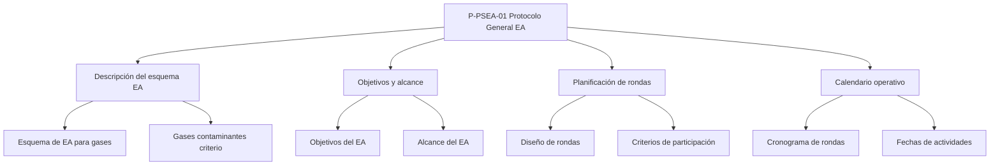

#### P-PSEA-02: Procedimiento de Ensayo de Aptitud para NO-NO2

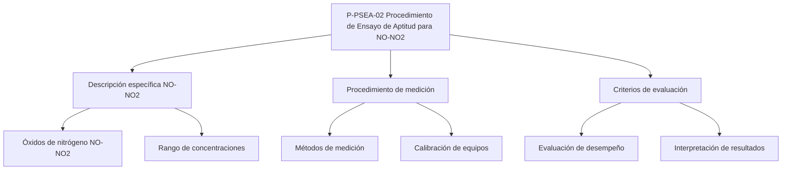

#### P-PSEA-03: Procedimiento de Ensayo de Aptitud para CO

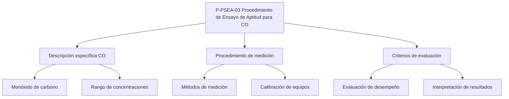

#### P-PSEA-04: Procedimiento de Ensayo de Aptitud para O3

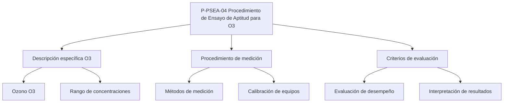

#### P-PSEA-05: Procedimiento de Ensayo de Aptitud para SO2

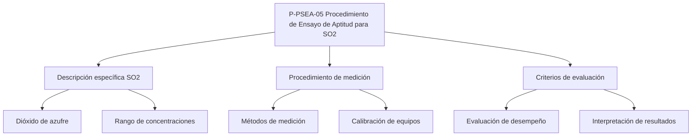

#### P-PSEA-06: Procedimiento Diseño Estadístico

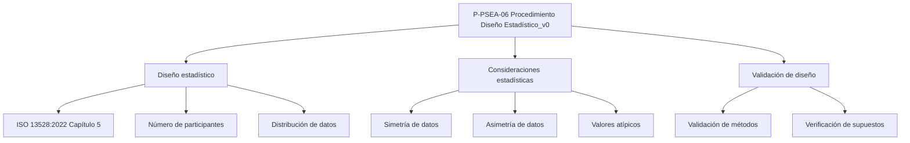

#### P-PSEA-07: Procedimiento Informe Resultados

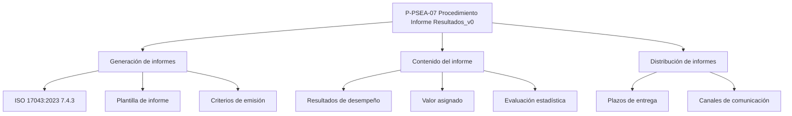

#### P-PSEA-08: Proc Colusión Falsificacion

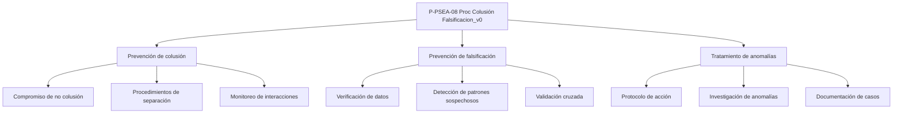

#### P-PSEA-09: Procedimiento de Planificación Ronda EA

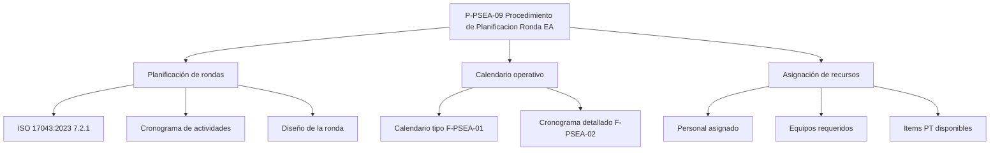

#### P-PSEA-10: Procedimiento de Manejo de Items PT

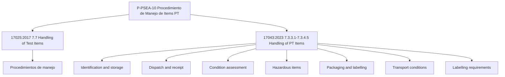

#### P-PSEA-11: Procedimiento de Reporte de Resultados

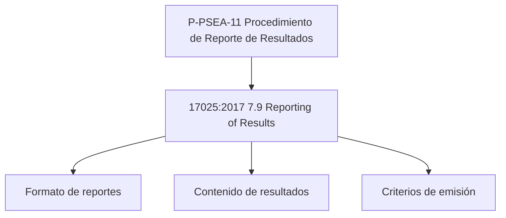

#### P-PSEA-12: Procedimiento de Control Documental

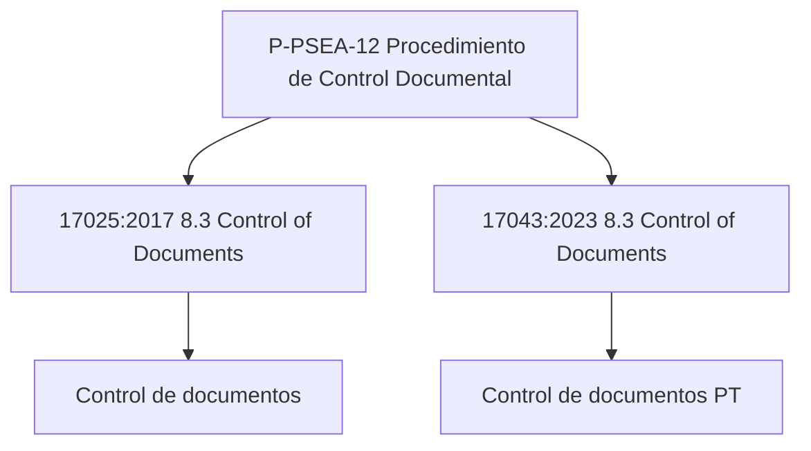

#### P-PSEA-13: Procedimiento de Control de Registros

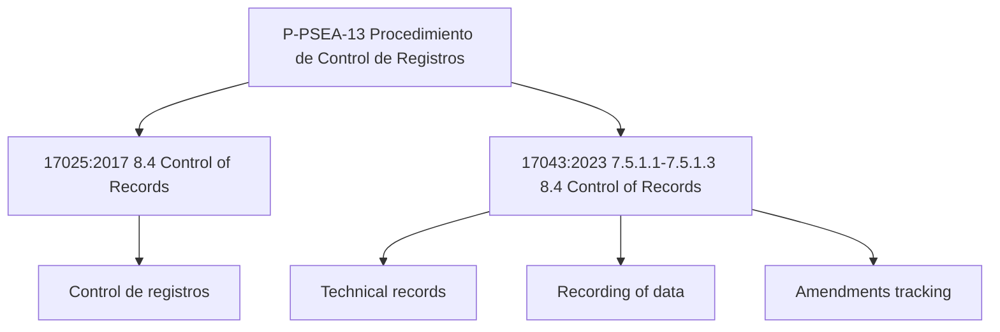

#### P-PSEA-14: Procedimiento de Gestión de Riesgos

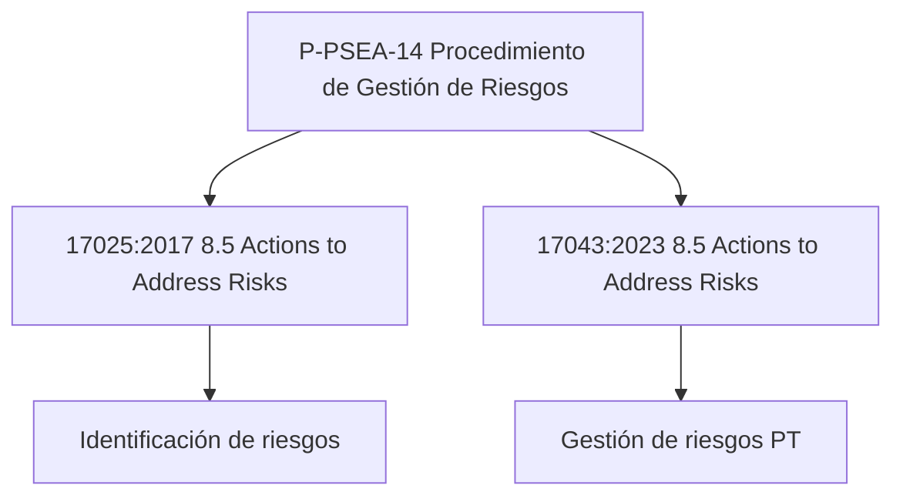

#### P-PSEA-15: Procedimiento de Mejora Continua

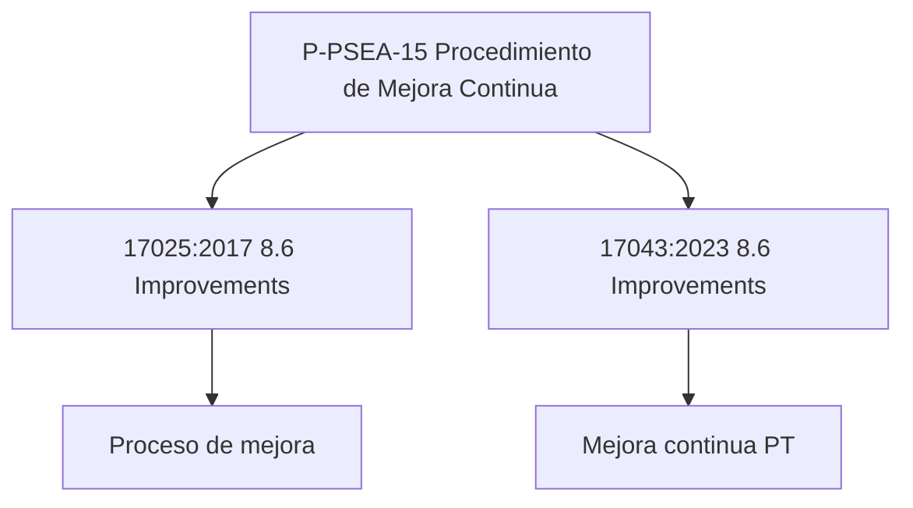

#### P-PSEA-16: Procedimiento de No Conformidades

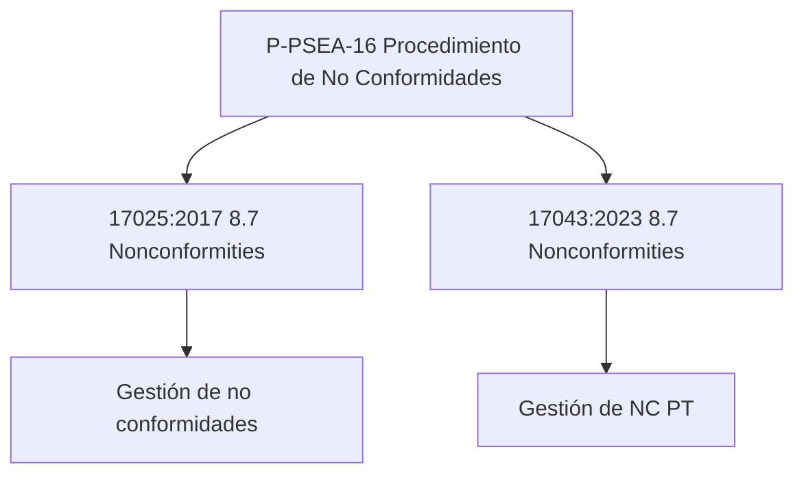

#### P-PSEA-17: Procedimiento de Auditorías Internas

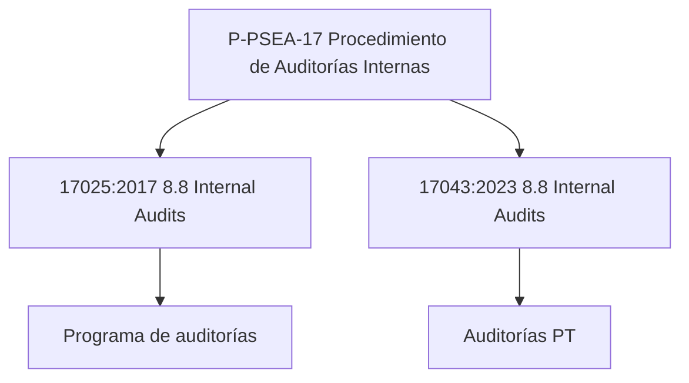

#### P-PSEA-18: Procedimiento de Revisión por Dirección

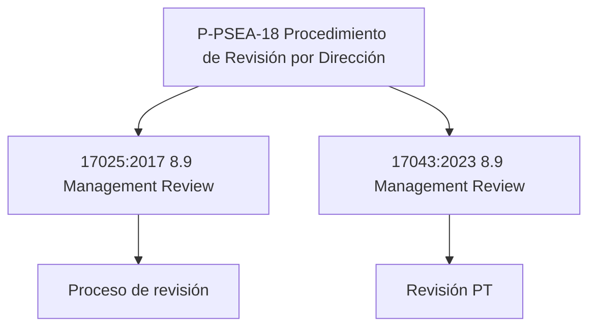

#### P-PSEA-19: Procedimiento de Monitoreo de Imparcialidad

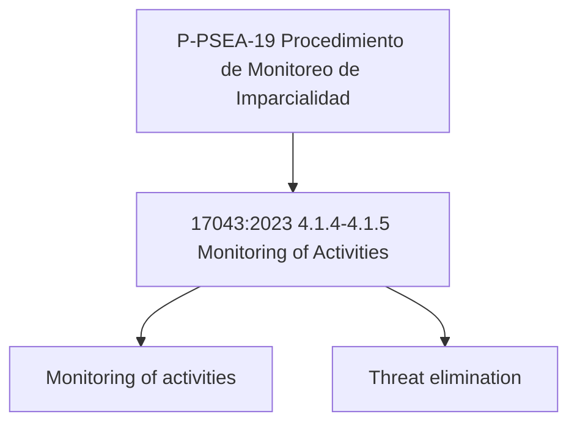

#### P-PSEA-20: Procedimiento de Comunicación PT

```mermaid
graph TD
    P20[P-PSEA-20 Procedimiento de Comunicación PT]
    
    P20 --> P201[17043:2023 7.1.2.1-7.1.2.3 PT Scheme Information]
    P20 --> P202[17043:2023 7.3.5.1-7.3.5.2 Advance Notice]
    
    P201 --> P2011[PT scheme information]
    P201 --> P2012[Change notification]
    P201 --> P2013[Communication records]
    P202 --> P2021[Advance notice]
    P202 --> P2022[Participant instructions]
```

#### P-PSEA-21: Procedimiento de Divulgación de Valores

```mermaid
graph TD
    P21[P-PSEA-21 Procedimiento de Divulgación de Valores]
    
    P21 --> P211[17043:2023 7.2.3.5 Disclosure Policy]
    
    P211 --> P2111[Política de divulgación]
    P211 --> P2112[Criterios de confidencialidad]
```

#### P-PSEA-22: Procedimiento de Reportes PT

```mermaid
graph TD
    P22[P-PSEA-22 Procedimiento de Reportes PT]
    
    P22 --> P221[17043:2023 7.4.3.1-7.4.3.7 Report Requirements]
    
    P221 --> P2211[Report requirements]
    P221 --> P2212[Report content]
    P221 --> P2213[Report timelines]
    P221 --> P2214[Report usage policy]
    P221 --> P2215[Amended reports]
    P221 --> P2216[Subset amended reports]
    P221 --> P2217[Statements of participation]
```

#### P-PSEA-23: Procedimiento de Gestión de Datos

```mermaid
graph TD
    P23[P-PSEA-23 Procedimiento de Gestión de Datos]
    
    P23 --> P231[17043:2023 7.5.2.1-7.5.2.4 Access to Data]
    
    P231 --> P2311[Access to data]
    P231 --> P2312[Off-site systems]
```

#### P-PSEA-24: Procedimiento de Quejas

```mermaid
graph TD
    P24[P-PSEA-24 Procedimiento de Quejas]
    
    P24 --> P241[17043:2023 8.10 Complaints]
    
    P241 --> P2411[Gestión de quejas]
    P241 --> P2412[Proceso documentado]
```

#### P-PSEA-25: Procedimiento de Apelaciones

```mermaid
graph TD
    P25[P-PSEA-25 Procedimiento de Apelaciones]
    
    P25 --> P251[17043:2023 8.11 Appeals]
    
    P251 --> P2511[Gestión de apelaciones]
    P251 --> P2512[Proceso documentado]
```

#### P-PSEA-26: Procedimiento de Confidencialidad (Copia)

```mermaid
graph TD
    P26[P-PSEA-26 Procedimiento de Confidencialidad]
    
    P26 --> P261[17025:2017 4.2 Confidentiality]
    P26 --> P262[17043:2023 4.2.1-4.2.5 Confidentiality Management]
    
    P261 --> P2611[Protección de información]
    P262 --> P2621[Legal release of information]
    P262 --> P2622[Third-party confidentiality]
    P262 --> P2623[Personnel confidentiality]
    P262 --> P2624[Participant identity confidentiality]
```

#### P-PSEA-27: Procedimiento de Gestión de Competencia (Copia)

```mermaid
graph TD
    P27[P-PSEA-27 Procedimiento de Gestión de Competencia]
    
    P27 --> P271[17025:2017 6.2.1-6.2.7 Personnel Competence]
    P27 --> P272[17043:2023 6.2.1-6.2.7 Personnel Competence]
    
    P271 --> P2711[Competent personnel]
    P271 --> P2712[Personnel competence management]
    P271 --> P2713[Impartial personnel]
    P271 --> P2714[Documented competence]
    P271 --> P2715[Personnel authorization]
    P271 --> P2716[Communication of duties]
    
    P272 --> P2721[Requisitos específicos PT]
    P272 --> P2722[Evaluación de competencia]
```

#### P-PSEA-28: Procedimiento de Control de Acceso (Copia)

```mermaid
graph TD
    P28[P-PSEA-28 Procedimiento de Control de Acceso]
    
    P28 --> P281[17025:2017 6.3.4-6.3.5 Access Control]
    P28 --> P282[17043:2023 6.3.4-6.3.5 Access Control]
    
    P281 --> P2811[Access control procedures]
    P281 --> P2812[Separation of areas]
    P282 --> P2821[Control de instalaciones PT]
    P282 --> P2822[Restricción de acceso]
```

#### P-PSEA-29: Procedimiento de Proveedores Externos (Copia)

```mermaid
graph TD
    P29[P-PSEA-29 Procedimiento de Proveedores Externos]
    
    P29 --> P291[17025:2017 6.4.1-6.4.6 External Providers]
    P29 --> P292[17043:2023 6.4.1-6.4.6 External Providers]
    
    P291 --> P2911[External provider limitations]
    P291 --> P2912[External provider competence]
    P291 --> P2913[External provider communication]
    P291 --> P2914[External provider records]
    P291 --> P2915[External provider requirements]
    P291 --> P2916[Responsibility for external providers]
```

#### P-PSEA-30: Procedimiento de Proveedores Externos (Copia 2)

```mermaid
graph TD
    P30[P-PSEA-30 Procedimiento de Proveedores Externos]
    
    P30 --> P301[17025:2017 6.4.1-6.4.6 External Providers]
    P30 --> P302[17043:2023 6.4.1-6.4.6 External Providers]
    
    P301 --> P3011[External provider limitations]
    P301 --> P3012[External provider competence]
    P301 --> P3013[External provider communication]
    P301 --> P3014[External provider records]
    P301 --> P3015[External provider requirements]
    P301 --> P3016[Responsibility for external providers]
```

---

### Nivel 3: Instructivos (I)

#### I-PSEA-01: Instructivo de Caracterización

```mermaid
graph TD
    I1[I-PSEA-01 Instructivo de Caracterización]
    
    I1 --> I11[17025:2017 6.1.2 Measurement/test requirements]
    I1 --> I12[17043:2023 6.1.2 Measurement/test requirements]
    
    I11 --> I111[Proceso de caracterización]
    I12 --> I121[Requisitos de medición PT]
```

#### I-PSEA-02: Instructivo de Producción PT Items

```mermaid
graph TD
    I2[I-PSEA-02 Instructivo de Producción PT Items]
    
    I2 --> I21[17025:2017 6.1.3 Reference Materials]
    I2 --> I22[17043:2023 6.1.3 Reference Materials 7.3.1.1-7.3.1.2 Production Procedures]
    
    I21 --> I211[Producción de items PT]
    I22 --> I221[Production procedures]
    I22 --> I222[Selection and handling]
```

#### I-PSEA-03: Instructivo de Control Ambiental

```mermaid
graph TD
    I3[I-PSEA-03 Instructivo de Control Ambiental]
    
    I3 --> I31[17025:2017 6.3.2 Environmental Conditions]
    I3 --> I32[17043:2023 6.3.2 Environmental Conditions]
    
    I31 --> I311[Control de condiciones ambientales]
    I32 --> I321[Ambiente PT]
```

#### I-PSEA-04: Instructivo de Validación de Métodos

```mermaid
graph TD
    I4[I-PSEA-04 Instructivo de Validación de Métodos]
    
    I4 --> I41[17025:2017 7.3 Validation of Methods]
    
    I41 --> I411[Proceso de validación]
    I41 --> I412[Criterios de aceptación]
```

#### I-PSEA-05: Instructivo de Estimación de Incertidumbre

```mermaid
graph TD
    I5[I-PSEA-05 Instructivo de Estimación de Incertidumbre]
    
    I5 --> I51[17025:2017 7.4 Estimation of Uncertainty]
    
    I51 --> I511[Proceso de estimación]
    I51 --> I512[Fuentes de incertidumbre]
```

#### I-PSEA-06: Instructivo de Control de Calidad de Datos

```mermaid
graph TD
    I6[I-PSEA-06 Instructivo de Control de Calidad de Datos]
    
    I6 --> I61[17025:2017 7.8 Quality Control of Data]
    
    I61 --> I611[Control de calidad]
    I61 --> I612[Verificación de datos]
```

#### I-PSEA-07: Instructivo de Diseño Estadístico

```mermaid
graph TD
    I7[I-PSEA-07 Instructivo de Diseño Estadístico]
    
    I7 --> I71[13528:2022 Capítulo 4 General Principles]
    I7 --> I72[13528:2022 Capítulo 5 Statistical Design]
    I7 --> I73[17043:2023 7.2.2.1-7.2.2.3 Statistical Design]
    
    I71 --> I711[Statistical validity]
    I71 --> I712[Consistency with objectives]
    I71 --> I713[Description of methods]
    I71 --> I714[Software validation]
    I71 --> I715[Basic model quantitative/qualitative]
    I71 --> I716[Evaluation approaches]
    I71 --> I717[Mixed approaches]
    
    I72 --> I721[Statistical design introduction]
    I72 --> I722[Design basis]
    I72 --> I723[Data types]
    I72 --> I724[Multiple purposes]
    I72 --> I725[Statistical distribution]
    I72 --> I726[Symmetry verification]
    I72 --> I727[Asymmetry handling]
    I72 --> I728[Specific distributions]
    I72 --> I729[Assumption demonstration]
    I72 --> I72A[Small number of participants]
    I72 --> I72B[Minimum participants]
    
    I73 --> I731[Statistical design]
    I73 --> I732[Documented statistical design]
    I73 --> I733[Statistical considerations]
```

#### I-PSEA-08: Instructivo de Valor Asignado

```mermaid
graph TD
    I8[I-PSEA-08 Instructivo de Valor Asignado]
    
    I8 --> I81[13528:2022 Capítulo 7 Assigned Values]
    I8 --> I82[17043:2023 7.2.3.1-7.2.3.4 Assigned Value Procedure]
    
    I81 --> I811[Introduction to assigned values]
    I81 --> I812[Independent value assignment]
    I81 --> I813[Consensus value assignment]
    I81 --> I814[Consensus value calculation]
    I81 --> I815[Uncertainty of consensus values]
    I81 --> I816[Uncertainty of independent values]
    I81 --> I817[Uncertainty from participants]
    I81 --> I818[Combined uncertainty]
    
    I82 --> I821[Assigned value procedure]
    I82 --> I822[Metrological traceability calibration]
    I82 --> I823[Metrological traceability general]
    I82 --> I824[Consensus value uncertainty]
```

#### I-PSEA-09: Instructivo de Instrucciones a Participantes

```mermaid
graph TD
    I9[I-PSEA-09 Instructivo de Instrucciones a Participantes]
    
    I9 --> I91[17043:2023 7.3.1.3 Participant Instructions]
    I9 --> I92[17043:2023 7.3.4.3 7.3.5.2 Transport Instructions]
    I9 --> I93[13528:2022 5.5.1.1-5.5.4.4 Reporting Format Requirements]
    
    I91 --> I911[Participant instructions]
    I92 --> I921[Transport instructions]
    I93 --> I931[Reporting format requirements]
    I93 --> I932[Consistent format]
    I93 --> I933[Replicate measurements]
    I93 --> I934[Censored data processing]
    I93 --> I935[Censored data options]
    I93 --> I936[Consensus statistics with censored data]
    I93 --> I937[Censored results provisions]
    I93 --> I938[Significant digits]
    I93 --> I939[Rounding error]
    I93 --> I93A[Specification of digits]
    I93 --> I93B[Varying significant digits]
```

#### I-PSEA-10: Instructivo de Homogeneidad y Estabilidad

```mermaid
graph TD
    I10[I-PSEA-10 Instructivo de Homogeneidad y Estabilidad]
    
    I10 --> I101[17043:2023 7.3.2.1-7.3.2.6 Homogeneity/Stability Criteria]
    I10 --> I102[13528:2022 Capítulo 6 Initial Review]
    
    I101 --> I1011[Homogeneity/stability criteria]
    I101 --> I1012[Homogeneity/stability procedures]
    I101 --> I1013[Timing of assessment]
    I101 --> I1014[Assessment methods]
    I101 --> I1015[Stability throughout round]
    I101 --> I1016[Retained items]
    
    I102 --> I1021[Homogeneity and stability assurance]
    I102 --> I1022[Stability in calibration]
    I102 --> I1023[Subset property checking]
```

#### I-PSEA-11: Instructivo de Análisis de Datos

```mermaid
graph TD
    I11[I-PSEA-11 Instructivo de Análisis de Datos]
    
    I11 --> I111[17043:2023 7.4.1.1-7.4.1.6 Data Recording and Analysis]
    I11 --> I112[13528:2022 6.2.1-6.6.2 Initial Review 5.5.3.3-5.5.4.4]
    
    I111 --> I1111[Data recording and analysis]
    I111 --> I1112[Summary and performance statistics]
    I111 --> I1113[Outlier influence minimization]
    I111 --> I1114[Different methods treatment]
    I111 --> I1115[Inappropriate results]
    I111 --> I1116[Unsuitable items]
    
    I112 --> I1121[Different measurement methods]
    I112 --> I1122[Different assigned values]
    I112 --> I1123[Blunder removal]
    I112 --> I1124[Blunder doubt handling]
    I112 --> I1125[Visual review]
    I112 --> I1126[Unexpected variability warning]
    I112 --> I1127[Robust statistical methods]
    I112 --> I1128[Choice of robust methods]
    I112 --> I1129[Robust method responsibility]
    I112 --> I112A[Outlier techniques]
    I112 --> I112B[Outlier rejection strategies]
    I112 --> I112C[Consensus statistics with censored data]
    I112 --> I112D[Censored results provisions]
    I112 --> I112E[Varying significant digits]
```

#### I-PSEA-12: Instructivo de Evaluación de Desempeño

```mermaid
graph TD
    I12[I-PSEA-12 Instructivo de Evaluación de Desempeño]
    
    I12 --> I121[17043:2023 7.4.2.1-7.4.2.2 Valid Evaluation Methods]
    I12 --> I122[13528:2022 Capítulo 8 Performance Evaluation Capítulo 9 Score Calculation Capítulo 11 Qualitative PT]
    I12 --> I123[13528:2022 4.3.1-4.3.2 Evaluation Approaches]
    
    I121 --> I1211[Valid evaluation methods]
    I121 --> I1212[Expert commentary]
    
    I122 --> I1221[Introduction to performance evaluation]
    I122 --> I1222[Z-score evaluation]
    I122 --> I1223[Zeta score evaluation]
    I122 --> I1224[Proportion of allowed limit]
    I122 --> I1225[Combined score evaluation]
    I122 --> I1226[Qualitative evaluation]
    I122 --> I1227[Z-score calculation]
    I122 --> I1228[Zeta score calculation]
    I122 --> I1229[Proportion of allowed limit]
    I122 --> I122A[Combined scores]
    I122 --> I122B[Interpretation of scores]
    I122 --> I122C[Introduction to qualitative PT]
    I122 --> I122D[Binary data analysis]
    I122 --> I122E[Nominal data analysis]
    I122 --> I122F[Ordinal data analysis]
    
    I123 --> I1231[Evaluation approaches]
    I123 --> I1232[Mixed approaches]
```

#### I-PSEA-13: Instructivo de Validación de Sistemas

```mermaid
graph TD
    I13[I-PSEA-13 Instructivo de Validación de Sistemas]
    
    I13 --> I131[17043:2023 7.5.2.1-7.5.2.4 System Validation]
    I13 --> I132[13528:2022 4.1.4 Software Validation]
    
    I131 --> I1311[System validation]
    I131 --> I1312[System requirements]
    
    I132 --> I1321[Software validation]
```

#### I-PSEA-14: Instructivo de Visualización de Datos

```mermaid
graph TD
    I14[I-PSEA-14 Instructivo de Visualización de Datos]
    
    I14 --> I141[13528:2022 Capítulo 10 Graphical Display]
    
    I141 --> I1411[Introduction to graphical display]
    I141 --> I1412[Histograms]
    I141 --> I1413[Kernel density plots]
    I141 --> I1414[Box plots]
    I141 --> I1415[Youden plots]
    I141 --> I1416[Other displays]
```

---

### Nivel 4: Formatos (F)

#### F-PSEA-01: Calendario Tipo

```mermaid
graph TD
    F1[F-PSEA-01 Calendario Tipo_v0]
    
    F1 --> F11[Plantilla de calendario]
    F1 --> F12[Estructura de rondas]
    
    F11 --> F111[Formato de calendario]
    F11 --> F112[Criterios de asignación]
    F12 --> F121[Semanas de ronda]
    F12 --> F122[Fechas límite]
```

#### F-PSEA-02: Cronograma Detallado

```mermaid
graph TD
    F2[F-PSEA-02 Cronograma Detallado_v0]
    
    F2 --> F21[Desglose de actividades]
    F2 --> F22[Asignación de tiempos]
    
    F21 --> F211[Actividades por fase]
    F21 --> F212[Responsables por actividad]
    F22 --> F221[Duración de cada actividad]
    F22 --> F222[Hitos críticos]
```

#### F-PSEA-03: Registro Planificación Ronda EA

```mermaid
graph TD
    F3[F-PSEA-03 Registro Planificacion Ronda EA]
    
    F3 --> F31[Registro de planificación]
    F3 --> F32[Control de cambios]
    
    F31 --> F311[Datos de la ronda]
    F31 --> F312[Decisiones de planificación]
    F32 --> F321[Versiones de planificación]
    F32 --> F322[Documentación de cambios]
```

#### F-PSEA-04: Formato Informe Resultados

```mermaid
graph TD
    F4[F-PSEA-04 Formato Informe Resultados_v0]
    
    F4 --> F41[Plantilla de informe]
    F4 --> F42[Secciones del informe]
    
    F41 --> F411[Formato de informe]
    F41 --> F412[Requisitos de contenido]
    F42 --> F421[Resumen ejecutivo]
    F42 --> F422[Resultados de desempeño]
    F42 --> F423[Valor asignado]
    F42 --> F424[Evaluación estadística]
```

---

## Resumen de Documentos del SGC

### Documentos Generales (DG)

| Código | Título | Versión | Estado | Normas Asociadas |
|--------|--------|---------|--------|-------------------|
| DG-PSEA-01 | Protocolo Participación EA Gases Contaminantes Criterio | TBD | TBD | 17043:2023, 13528:2022 |

### Procedimientos (P)

| Código | Título | Versión | Estado | Normas Asociadas |
|--------|--------|---------|--------|-------------------|
| P-PSEA-01 | Protocolo General EA | v1.0 | in_review | 17025:2017 5.3-5.4, 17043:2023 5.3-5.4 |
| P-PSEA-02 | Procedimiento de Ensayo de Aptitud para NO-NO2 | TBD | TBD | 17043:2023 |
| P-PSEA-03 | Procedimiento de Ensayo de Aptitud para CO | TBD | TBD | 17043:2023 |
| P-PSEA-04 | Procedimiento de Ensayo de Aptitud para O3 | TBD | TBD | 17043:2023 |
| P-PSEA-05 | Procedimiento de Ensayo de Aptitud para SO2 | TBD | TBD | 17043:2023 |
| P-PSEA-06 | Procedimiento Diseño Estadístico | v0 | TBD | 13528:2022 cap. 5, 17043:2023 7.2.2 |
| P-PSEA-07 | Procedimiento Informe Resultados | v0 | TBD | 17043:2023 7.4.3 |
| P-PSEA-08 | Proc Colusión Falsificacion | v0 | TBD | 17043:2023 4.1 |
| P-PSEA-09 | Procedimiento de Planificacion Ronda EA | v1.0 | draft | 17043:2023 7.2.1 |

### Formatos (F)

| Código | Título | Versión | Estado | Normas Asociadas |
|--------|--------|---------|--------|-------------------|
| F-PSEA-01 | Calendario Tipo | v0 | TBD | 17043:2023 7.2.1 |
| F-PSEA-02 | Cronograma Detallado | v0 | TBD | 17043:2023 7.2.1 |
| F-PSEA-03 | Registro Planificacion Ronda EA | TBD | TBD | 17043:2023 7.2.1 |
| F-PSEA-04 | Formato Informe Resultados | v0 | TBD | 17043:2023 7.4.3 |

---

## Referencias

- `docs/docs_sgc/Matriz Maestra de Cumplimiento Normativo.md` - Matriz de mapeo normativo
- `docs/docs_sgc/Inventario Documental del SGC.md` - Inventario de documentos existentes
- `logs/plans/260208_1932_plan_ajuste-sgc-17025-17043-13528.md` - Plan de trabajo

---

**Fin del Árbol Maestro PSEA**
