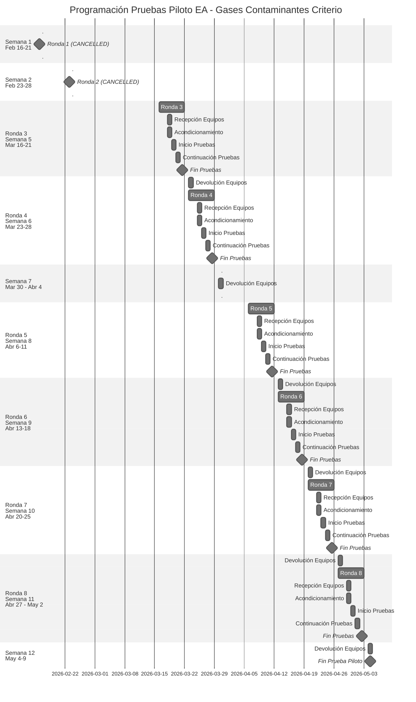

```mermaid
%%{init: {"theme": "neutral", "themeVariables": {"fontSize": "16px"}}}%%
gantt
    title Programación Pruebas Piloto EA - Gases Contaminantes Criterio
    dateFormat  YYYY-MM-DD

    section Semana 1 <br> Feb 16-21
    . : r1, 2026-02-16, 0d
    Ronda 1 (CANCELLED) :milestone, r1, 2026-02-16, 0d
    . : r1, 2026-02-16, 0d

    section Semana 2 <br> Feb 23-28
    . :  r2, 2026-02-23, 0d
    Ronda 2 (CANCELLED) :milestone, r2, 2026-02-23, 0d
    . :  r2, 2026-02-23, 0d

    section Semana 3 <br> Mar 2-7

    section Semana 4 <br> Mar 9-14

    section Ronda 3 <br> Semana 5 <br> Mar 16-21
    Ronda 3 :r3, 2026-03-16, 6d
    Recepción Equipos: r3_rec, 2026-03-18, 1d
    Acondicionamiento: r3_ac, 2026-03-18, 1d
    Inicio Pruebas: r3_ini, 2026-03-19, 1d
    Continuación Pruebas: r3_cont, 2026-03-20, 1d
    Fin Pruebas: milestone,r3_fin, 2026-03-21, 1d

    section Ronda 4 <br> Semana 6 <br> Mar 23-28
    Devolución Equipos: r3_dev, 2026-03-23, 1d
    Ronda 4 :r4, 2026-03-23, 6d
    Recepción Equipos: r4_rec, 2026-03-25, 1d
    Acondicionamiento: r4_ac, 2026-03-25, 1d
    Inicio Pruebas: r4_ini, 2026-03-26, 1d
    Continuación Pruebas: r4_cont, 2026-03-27, 1d
    Fin Pruebas: milestone,r4_fin, 2026-03-28, 1d
    
    section Semana 7 <br> Mar 30 - Abr 4
    .: r4_dev, 2026-03-30, 0d    
    Devolución Equipos: r4_dev, 2026-03-30, 1d
    .: r4_dev, 2026-03-30, 0d    

    section Ronda 5 <br> Semana 8 <br> Abr 6-11
    Ronda 5 :r5, 2026-04-06, 6d
    Recepción Equipos: r5_rec, 2026-04-08, 1d
    Acondicionamiento: r5_ac, 2026-04-08, 1d
    Inicio Pruebas: r5_ini, 2026-04-09, 1d
    Continuación Pruebas: r5_cont, 2026-04-10, 1d
    Fin Pruebas: milestone,r5_fin, 2026-04-11, 1d

    section Ronda 6 <br> Semana 9 <br> Abr 13-18
    Devolución Equipos: r5_dev, 2026-04-13, 1d
    Ronda 6 :r6, 2026-04-13, 6d
    Recepción Equipos: r6_rec, 2026-04-15, 1d
    Acondicionamiento: r6_ac, 2026-04-15, 1d
    Inicio Pruebas: r6_ini, 2026-04-16, 1d
    Continuación Pruebas: r6_cont, 2026-04-17, 1d
    Fin Pruebas: milestone,r6_fin, 2026-04-18, 1d

    section Ronda 7 <br> Semana 10 <br> Abr 20-25
    Devolución Equipos: r6_dev, 2026-04-20, 1d
    Ronda 7 :r7, 2026-04-20, 6d
    Recepción Equipos: r7_rec, 2026-04-22, 1d
    Acondicionamiento: r7_ac, 2026-04-22, 1d
    Inicio Pruebas: r7_ini, 2026-04-23, 1d
    Continuación Pruebas: r7_cont, 2026-04-24, 1d
    Fin Pruebas: milestone,r7_fin, 2026-04-25, 1d
    
    section Ronda 8 <br> Semana 11 <br> Abr 27 - May 2
    Devolución Equipos: r7_dev, 2026-04-27, 1d
    Ronda 8 :r8, 2026-04-27, 6d
    Recepción Equipos: r8_rec, 2026-04-29, 1d
    Acondicionamiento: r8_ac, 2026-04-29, 1d
    Inicio Pruebas: r8_ini, 2026-04-30, 1d
    Continuación Pruebas: r8_cont, 2026-05-01, 1d
    Fin Pruebas: milestone, r8_fin, 2026-05-02, 1d
    
    section Semana 12 <br> May 4-9
    Devolución Equipos: r8_dev, 2026-05-04, 1d
    Fin Prueba Piloto: milestone, m2, 2026-05-04, 1d
```
