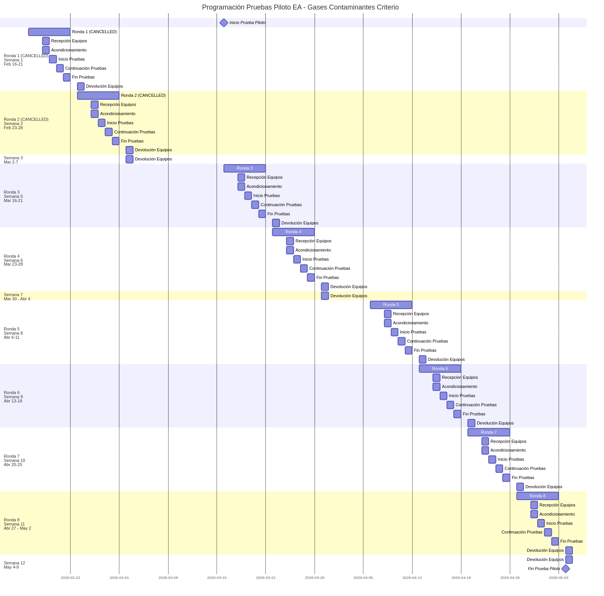
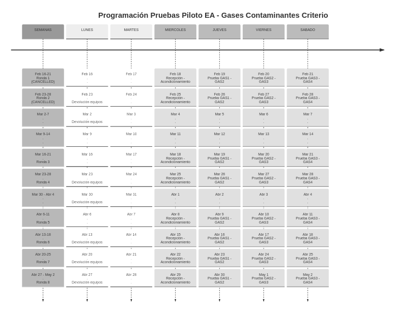

# Informe Ejecutivo - Proyecto CALAIRE-EA

**Periodo:** Enero 28 - Febrero 8, 2026  
**Proyecto:** Implementación de Ensayos de Aptitud para Gases Contaminantes Criterio (Proyecto 61134: INM + UNAL)  
**Fase Actual:** Fase II - Ejecución y Prueba Piloto  
**Fecha de Emisión:** 8 de febrero de 2026

---

## 1. Resumen Ejecutivo

El proyecto CALAIRE-EA avanza en la fase de preparación operativa para la ejecución de la Prueba Piloto de Ensayos de Aptitud (EA) para gases contaminantes criterio (CO, NOx, SO2, O3). Durante el periodo comprendido entre el 28 de enero y el 8 de febrero de 2026, se han concretado avances significativos en gestión de participantes, maduración técnica de CALAIRE-APP y reestructuración del cronograma operativo.

### Hitos Clave del Periodo

| Fecha | Hito | Impacto |
|-------|------|---------|
| Ene 28 | Demostración CALAIRE-APP: homogeneidad, estabilidad, nIQR y MADe a consultor ISO 17043 | Inicio validación técnica del núcleo estadístico |
| Ene 29 | Definición perfil contratista 2026 | Formalización de requerimientos de recursos humanos |
| Feb 2 | Reprogramación inicial cronograma | Ajuste por restricciones de auditoría CALAIRE |
| Feb 3 | Confirmación Universidad de Medellín (Rondas 3-4) | Primeras confirmaciones formales de participación |
| Feb 5 | Confirmación UPB (Ronda 5) | Segunda confirmación institucional recibida |
| Feb 7 | **Reestructuración mayor del cronograma** | Cancelación rondas febrero, extensión hasta mayo |

La decisión crítica del periodo corresponde a la reestructuración del cronograma de la Prueba Piloto, cancelando las rondas inicialmente programadas para febrero y extendiendo el calendario hasta mayo de 2026. Esta decisión responde a la preparación de las autoridades ambientales para las contingencias de marzo, durante el cual SIATA y autoridades como Corantioquia mantienen operaciones críticas de vigilancia ambiental.

---

## 2. Cronograma Prueba Piloto (Actualizado)

### 2.1 Tabla Resumen de Rondas

La Prueba Piloto ha sido reestructurada para ejecutarse en un total de **8 rondas**, con las dos primeras canceladas y el inicio real trasladado al 18 de marzo de 2026.

| Ronda | Periodo | Laboratorio Asignado | Estado |
|-------|---------|---------------------|--------|
| ~~Ronda 1~~ | ~~16-21 Feb 2026~~ | — | **Cancelada** |
| ~~Ronda 2~~ | ~~23-28 Feb 2026~~ | — | **Cancelada** |
| **Ronda 3** | 18-23 Mar 2026 | Universidad de Medellín | Confirmada |
| **Ronda 4** | 25-30 Mar 2026 | Universidad de Medellín | Confirmada |
| **Ronda 5** | 8-13 Abr 2026 | Universidad Pontificia Bolivariana | Confirmada |
| **Ronda 6** | 15-20 Abr 2026 | SIATA | Pendiente |
| **Ronda 7** | 22-27 Abr 2026 | Buffer / Politécnico JIC | Planificada |
| **Ronda 8** | 29 Abr - 4 May 2026 | Buffer | Planificada |

\*Buffer: ronda de contingencia para incorporar participantes adicionales o reprogramar ensayos si es necesario.

**Duración total:** 18 de marzo - 4 de mayo de 2026 (7 semanas efectivas de ensayos)

### 2.2 Diagrama Gantt de Programación

El siguiente diagrama presenta la secuencia completa de actividades por ronda, incluyendo recepción y acondicionamiento de equipos, ejecución de pruebas GAS1-GAS4, y devolución de equipos.

### 2.3 Timeline Semanal Detallado

El timeline muestra la distribución semanal de actividades operativas, destacando los periodos de recepción de equipos (miércoles), ejecución de pruebas (jueves-sábado), y devolución (lunes posterior).

### Fundamento de la Reestructuración

La decisión de cancelar las rondas de febrero y extender el calendario hasta mayo se fundamenta en el siguiente aprendizaje operativo documentado:

> **Evitar programar rondas en periodos cercanos a contingencias ambientales.** El periodo febrero-marzo constituye una temporada crítica para SIATA y autoridades ambientales como Corantioquia, dedicada a la preparación de las autoridades para las contingencias de marzo. Programar ensayos de aptitud durante este periodo comprometería la disponibilidad operativa de participantes clave y las autoridades de referencia.

---

## 3. Gestión de Participantes

### 3.1 Confirmaciones Recibidas

**Universidad de Medellín (UdeM)**  
- **Rondas asignadas:** 3 y 4 (marzo 2026)  
- **Fecha de confirmación:** 3 de febrero 2026  
- **Estado:** Confirmación formal recibida mediante Coordinación de Laboratorios 05  
- **Observaciones:** Validación exitosa del alcance, cronograma y metodología operativa. Contacto principal designado para coordinación técnica.

**Universidad Pontificia Bolivariana (UPB - Gelima)**  
- **Ronda asignada:** 5 (abril 2026)  
- **Fecha de confirmación:** 5 de febrero 2026  
- **Estado:** Confirmación positiva para segunda semana de abril  
- **Observaciones:** Participación validada, pendiente actualización documental de asignación de cupo.

### 3.2 Participantes Pendientes de Confirmación

**SIATA (Sistema de Alerta Temprana de Medellín)**
- **Ronda asignada:** 6 (15-20 abril 2026) — *reubicado desde Rondas 1-2*
- **Estado:** Confirmación pendiente
- **Acción requerida:** Comunicación telefónica directa para ratificar disponibilidad operativa en nueva fecha.
- **Responsable:** Coordinación Técnica (Wilson Salas)
- **Fecha límite:** 15 de febrero 2026

**Politécnico Colombiano Jaime Isaza Cadavid**
- **Ronda potencial:** 7 (buffer)
- **Estado:** En prospectación
- **Contacto identificado:** Profesora Myryam
- **Acción requerida:** Obtención de información de contacto (correo electrónico) para envío de carta de invitación formal.
- **Responsable:** Coordinación Técnica (Wilson Salas)
- **Fecha límite:** 15 de febrero 2026

### 3.3 Decisiones Clave sobre Participantes

1. **Reubicación SIATA:** Trasladado de febrero a abril para evitar conflictos con contingencias ambientales. Esta decisión prioriza la calidad de la participación sobre el cumplimiento estricto del cronograma inicial.

2. **Extensión de buffer operativo:** Creación de Rondas 7 y 8 como espacios de flexibilidad para incorporar al Politécnico JIC u otros laboratorios de referencia que confirmen participación durante el desarrollo de la prueba piloto.

---

## 4. Hallazgos CALAIRE-APP (Detalle Técnico)

### 4.1 Cronología de Validación

La validación del aplicativo estadístico CALAIRE-APP ha seguido la siguiente secuencia durante el periodo reportado:

| Fecha | Evento | Resultado |
|-------|--------|-----------|
| Ene 28 | Demostración funcional a César Yate (consultor ISO 17043) | Sesión grabada para referencia técnica |
| Feb 4 | Primer análisis comparativo César Yate | Identificación de discrepancias entre cálculos del aplicativo y verificación manual Excel |
| Feb 5 | Resultados iniciales de validación | Confirmación de discrepancias en homogeneidad, estabilidad, nIQR y MADe |
| Feb 7 | Análisis de causa raíz | Determinación de que el error de **imputación de datos fue de César Yate**, no del aplicativo |

### 4.2 Hallazgo Técnico: Validación Exitosa del Núcleo Estadístico

El análisis profundo de las discrepancias reportadas ha revelado que las diferencias entre los cálculos de CALAIRE-APP y la verificación manual se originan en un error de imputación de datos cometido por César Yate durante la verificación manual en Excel. El aplicativo CALAIRE-APP funciona correctamente.

**Estado Validado del Aplicativo:**

- **Preprocesamiento:** Funciona correctamente
- **Homogeneidad:** Funciona correctamente según ISO 13528
- **Estabilidad:** Funciona correctamente según ISO 13528
- **nIQR:** Funciona correctamente según ISO 13528
- **MADe:** Funciona correctamente según ISO 13528

**Implicaciones del hallazgo:**

- **Confirmación de funcionamiento:** El núcleo estadístico de CALAIRE-APP para homogeneidad, estabilidad, nIQR y MADe opera correctamente según ISO 13528:2017.
- **Error identificado:** Las discrepancias reportadas correspondieron a un error en la imputación de datos realizada por César Yate, no a errores en los algoritmos del aplicativo.
- **Componentes pendientes de revisión:** Incertidumbre de homogeneidad y estabilidad, Algoritmo A, Compatibilidad metrológica, Puntuaciones z, z', zeta, En.

### 4.3 Estado del Desarrollo Técnico

| Componente | Estado | Observaciones |
|------------|--------|---------------|
| Preprocesamiento de datos | Funciona correctamente | Manejo de datos según especificaciones |
| Homogeneidad de muestras | Funciona correctamente | Conforme a ISO 13528 |
| Estabilidad temporal | Funciona correctamente | Conforme a ISO 13528 |
| Estimadores robustos (nIQR, MADe) | Funciona correctamente | Conforme a ISO 13528 |
| Incertidumbre homogeneidad/estabilidad | Pendiente de revisión | Pendiente de verificar por César Yate |
| Algoritmo A | Pendiente de revisión | Pendiente de verificar por César Yate |
| Compatibilidad metrológica | Pendiente de revisión | Pendiente de verificar por César Yate |
| Puntuaciones z, z', zeta, En | Pendiente de revisión | Pendiente de verificar por César Yate |

### 4.4 Próximos Pasos Técnicos

1. **Comunicación de validación exitosa:** Informar a César Yate que el error en las discrepancias fue de imputación de datos en su verificación manual, confirmando que CALAIRE-APP funciona correctamente para preprocesamiento, homogeneidad, estabilidad, nIQR y MADe.
   - **Responsable:** Wilson Salas
   - **Fecha límite:** 12 de febrero 2026

2. **Solicitud de validación de componentes pendientes:** Solicitar a César Yate la validación de incertidumbre de homogeneidad y estabilidad, Algoritmo A, Compatibilidad metrológica, y Puntuaciones z, z', zeta, En.
   - **Responsable:** Wilson Salas
   - **Fecha límite:** 20 de febrero 2026

3. **Segunda ronda de validación:** Coordinar con César Yate la revisión de los componentes pendientes.
   - **Responsable:** Wilson Salas + César Yate
   - **Fecha estimada:** Semana del 1 de marzo 2026

---

## 5. Recursos Humanos y Contratación

### 5.1 Perfil Contractual 2026

Se ha formalizado el perfil profesional requerido para el contrato técnico del periodo 2026:

**Denominación del cargo:** Contratista Líder de Proyecto - Experto en Ensayos de Calidad del Aire (Gases Contaminantes)

**Requisitos técnicos:**
- Formación: Ingeniero Químico
- Especialización: Control Ambiental
- Experiencia: Sistemas de vigilancia de calidad del aire, implementación ISO/IEC 17025:2017

**Objetivo del contrato:** Establecer servicio profesional de comparaciones interlaboratorios y ensayos de aptitud que permita evaluación competente, imparcial e independiente del desempeño de laboratorios y redes de monitoreo en Colombia y la región.

### 5.2 Postergación de Contratación

El proceso de contratación del técnico principal ha sido **postergado de febrero a marzo-abril de 2026**, alineado con el nuevo cronograma de la prueba piloto. Esta postergación responde a:

1. Sincronización con el inicio real de operaciones (18 de marzo)
2. Necesidad de completar requerimientos administrativos de la licitación pública
3. Optimización de recursos: evitar período de contratación inactivo durante febrero

### 5.3 Modalidad de Contratación

La contratación se ejecutará mediante **Licitación Pública**, conforme a las restricciones administrativas de la entidad (régimen de garantías). Pendiente consolidación de requerimientos administrativos por parte de la coordinación de contratación.
- **Responsable:** Área Administrativa
- **Fecha límite:** 28 de febrero 2026

---

## 6. Próximos Pasos

### 6.1 Acciones Inmediatas (Próximos 7 días)

| # | Acción | Responsable | Fecha Límite | Criterio de Completitud |
|---|--------|-------------|--------------|------------------------|
| 1 | **Confirmación SIATA:** Realizar contacto telefónico directo para ratificar participación en Ronda 6 (abril 15-20) tras la reubicación desde febrero. | Coordinación Técnica (Wilson Salas) | 2026-02-15 | Confirmación formal recibida por correo |
| 2 | **Contacto Politécnico JIC:** Obtener información de contacto de la profesora Myryam para invitación formal a participación en Ronda 7. | Coordinación Técnica (Wilson Salas) | 2026-02-15 | Información de contacto obtenida y carta enviada |
| 3 | **Informe de Hallazgos CALAIRE-APP:** Generar y remitir documento técnico al equipo de desarrollo con especificaciones de ajuste en criterios de imputación de datos. | Wilson Salas | 2026-02-12 | Informe técnico remitido a equipo desarrollo |

### 6.2 Acciones Corto Plazo (Próximas 2-4 semanas)

| # | Acción | Responsable | Fecha Límite | Criterio de Completitud |
|---|--------|-------------|--------------|------------------------|
| 4 | **Alistamiento operativo y metrológico:** Preparar protocolos de encendido y estabilización de analizadores, calibración multipunto por gas objetivo, y validación funcional del calibrador dinámico T700U. | Wilson Salas | 2026-03-10 | Protocolos validados y equipos calibrados |
| 5 | **Socialización técnica para participantes:** Diseñar sesión de capacitación sobre metodología operativa de la prueba piloto y mecanismos de resolución de consultas técnicas durante las rondas. | Coordinación Técnica (Wilson Salas) | 2026-03-15 | Sesión de capacitación ejecutada |
| 6 | **Gestión de contratación:** Consolidar requerimientos administrativos para publicación de licitación pública del perfil técnico 2026. | Área Administrativa | 2026-02-28 | Requisitos consolidados y licitación publicada |

### 6.3 Acciones Mediano Plazo (Marzo-Abril)

| # | Acción | Responsable | Fecha Límite | Criterio de Completitud |
|---|--------|-------------|--------------|------------------------|
| 7 | **Auditoría interna SGC:** Ejecutar revisión documental del Sistema de Gestión de Calidad previo al inicio de operaciones. | Jeniffer Ochoa + Wilson Salas | 2026-03-15 | Informe de auditoría emitido |
| 8 | **Segunda validación CALAIRE-APP:** Coordinar con César Yate nueva ronda de análisis comparativo tras implementación de ajustes de imputación. | Wilson Salas + César Yate | 2026-03-25 | Validación exitosa documentada |
| 9 | **Preparación logística de equipos:** Verificar disponibilidad de analizadores certificados, gases de referencia, y consumibles para las 8 rondas programadas. | Wilson Salas | 2026-03-10 | Equipos certificados y disponibles para uso |

---

## Anexos

### A. Documentos de Referencia

- Diagrama Gantt: `docs/informes/gantt_piloto.png`
- Timeline Semanal: `docs/informes/timeline_piloto.png`
- Plan de Reestructuración: `logs/plans/260207_1741_plan_reestructuracion-cronograma-piloto.md`
- Journals del periodo: `journals/2026_01_28.md` a `journals/2026_02_07.md`

### B. Glosario de Abreviaturas

| Abreviatura | Significado |
|-------------|-------------|
| CALAIRE | Laboratorio de Calibración de Gases del IDEAM |
| EA | Ensayo de Aptitud |
| ISO 13528 | Norma para Ensayos de Aptitud por Comparación Interlaboratorios |
| ISO/IEC 17025 | Requisitos generales para laboratorios de ensayo y calibración |
| ISO 17043 | Requisitos para organismos que realizan EA |
| MADe | Mediana de las Desviaciones Absolutas (estimador robusto) |
| SIATA | Sistema de Alerta Temprana de Medellín |
| UdeM | Universidad de Medellín |
| UPB | Universidad Pontificia Bolivariana |
| JIC | Politécnico Colombiano Jaime Isaza Cadavid |

---

**Elaborado por:** Sistema de Gestión de Conocimiento CALAIRE-EA  
**Fecha de generación:** 8 de febrero de 2026  
**Próxima actualización:** 22 de febrero de 2026
