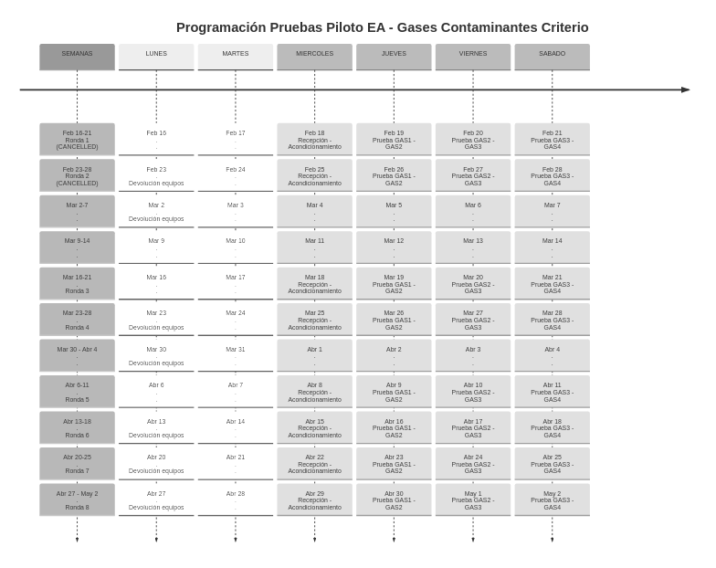
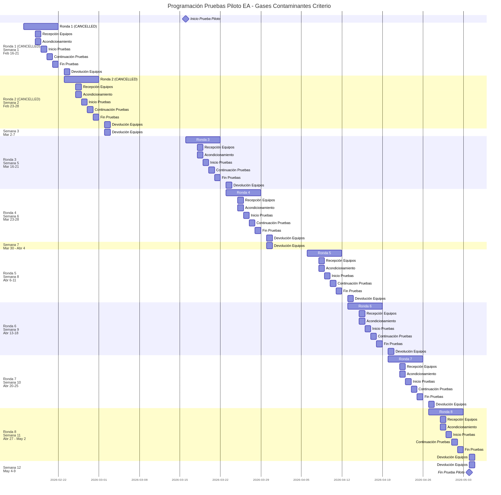

# Contexto

## Marco del encuentro

- Convenio 005-2023 INM–UNAL: fortalecimiento de capacidades metrológicas y de innovación de los laboratorios UNAL.
- Proyecto 61134 (Sede Medellín, Facultad de Minas): *Implementación de ensayos de aptitud en la matriz aire. Caso gases contaminantes criterio*.
- Intercambio técnico: espacio de cooperación entre expertos, no de control — orientado a identificar riesgos y oportunidades de articulación.

::: notes
Encuadre según guía metodológica del INM (§3.1): carácter de intercambio de conocimiento. Presentación ~35 min, resto para preguntas técnicas y matriz de riesgos.
:::

# Objetivo del proyecto

## Objetivo y alcance

**Objetivo:** establecer un servicio de comparaciones interlaboratorios y/o ensayos de aptitud (EA) para la evaluación competente, imparcial e independiente del desempeño de laboratorios y redes de monitoreo de calidad del aire del país y la región.

- **Alcance:** gases contaminantes criterio — **CO, NOx, SO₂, O₃**.
- **Base normativa:** ISO/IEC 17043:2023 (proveedores de ensayos de aptitud) e ISO 13528:2017 (métodos estadísticos).
- **Articulación:** sistema de gestión del Laboratorio CALAIRE bajo NTC ISO/IEC 17025.

## Productos comprometidos

- Informe de estado del arte de comparaciones interlaboratorios y EA.
- Protocolos de EA por gas contaminante criterio.
- Instructivo de embalaje y transporte de instrumentos de medición.
- Informe de la prueba piloto interna realizada en CALAIRE.
- Integración documental de los protocolos al sistema de gestión.
- Aplicativo de software libre para la evaluación estadística de los EA, con registro de pruebas y hallazgos.
- Insumos técnicos para el costeo del servicio.

# Avances técnicos

## Estado del arte y protocolos

- Informe de estado del arte **terminado**: procedimientos internacionales de EA, requisitos de trazabilidad metrológica y criterios de aceptación de las mediciones.
- **Cinco protocolos y procedimientos de medición en versión final**, remitidos para revisión e integración al sistema de gestión (control de cambios en curso).
- Estructura documental del servicio bajo el proceso PSEA: formatos (F-PSEA), instructivos (I-PSEA) y documentos guía (DG-PSEA).

## Marco estadístico definido

- Metodología de comparación conforme a ISO 13528: estimadores robustos — **Algoritmo A, NIQR, MADe** — implementados y verificados en el aplicativo estadístico.
- **Puntajes Z y Z' adoptados como métricas iniciales de desempeño**: ISO 17043 permite avanzar sin exigir la incertidumbre reportada por el participante.
- Homogeneidad y estabilidad de los ítems de ensayo evaluadas con ANOVA y pruebas t.
- Estrategia para consolidar la desviación estándar del ensayo: **réplicas internas del proceso de medición + rondas adicionales** (meta: >12 datos por analito); revisión comparativa de normas europeas y handbook EPA para métricas complementarias.

## Prueba piloto — rondas ejecutadas

| Ronda | Analitos | Modalidad | Fecha |
|---|---|---|---|
| EA-PP2026-R1 | CO / SO₂ | Ronda simple, 1 participante | Semana 20-abr-2026 |
| EA-PP2026-R2 | O₃ / NO / NO₂ | Ejecutada con participante único | Semana 27-abr-2026 |
| EA-PP2026-R3 | O₃ / NO / NO₂ | Ronda simple, participante Corantioquia | 15 al 17-jul-2026 |

- Secuencia operativa validada: instalación, calibración multipunto, medición por niveles (cero + 4 niveles descendentes), devolución y cierre logístico.
- R3 replicó el flujo con un **segundo laboratorio participante** y parque instrumental distinto: corridas de O₃, NO y NO₂ (esta última por titulación en fase gaseosa, GPT), con operación nocturna continua de 13–15 h por contaminante.
- **Próximas rondas:** ronda con participantes con conjunto completo de analizadores; réplica de CO/SO₂ con participante que disponga de esos analizadores; réplicas internas; ronda con 4–5 participantes para habilitar estimación robusta (MADe).

---

## Balance del piloto — highlights

- Generación de ítems de ensayo, logística en sitio y secuencias de medición **validadas operativamente** en tres rondas, con dos laboratorios participantes distintos.
- Repetibilidad del flujo del esquema demostrada en R3 (instalación, calibración, medición continua día/noche, desmontaje y cierre de registros), incluida generación de NO₂ por GPT.
- Instructivo de cálculo y reporte de resultados entregado a participantes desde R3 (ventanas horarias, promedios, incertidumbre expandida).
- Evaluación de desempeño viable con puntajes Z/Z' pese a ausencia de incertidumbres reportadas por participantes.
- Lecciones incorporadas al sistema de gestión (registro F-PSEA-15):
  - Verificación pre-ronda de repuestos y del sistema GPT con criterio de aceptación (checklist F-PSEA-08).
  - Criterio de temperatura ambiental para O₃ y aire cero exclusivo para calibración y generación de ítems.
  - Requisitos al participante: llegada de equipos el día anterior, presencia ≤ 8:00 y disponibilidad en sitio durante el ensayo.
- Restricciones confirmadas en R3: manifold de una sola salida limita participantes simultáneos; se requiere control térmico del área de prueba para ventanas de medición prolongadas.

## Integración al sistema de gestión

- Mapeo de requisitos de ISO/IEC 17043:2023 sobre la estructura documental del laboratorio.
- Módulo de gestión centralizado del esquema: rondas, participantes, requisitos documentales y registros.
- Documentos del servicio en flujo de revisión y control de cambios para su incorporación formal al SGC (NTC ISO/IEC 17025).

# Aplicativos desarrollados

## pt_app — evaluación estadística

Aplicativo estadístico en **software libre (R/Shiny)** para la evaluación de resultados y elaboración de informes de los EA (DG-PSEA-03), desplegado en shinyapps.io:

- Carga y validación de datos de participantes.
- Homogeneidad y estabilidad de ítems (ANOVA, t-test).
- Núcleo robusto: Algoritmo A, NIQR, MADe.
- Puntajes de desempeño e informe automatizado (R Markdown).
- Dashboards interactivos: boxplots, histogramas, gráficos de puntajes.

**Estado:** entregado en su totalidad con documentación e informe de validación de cálculos y procesos; pendiente únicamente la prueba como usuario final en la última ronda del piloto.

## calaire-app — gestión de rondas

Aplicativo de gestión de rondas del esquema de ensayos de aptitud (DG-PSEA-02), versión actual en desarrollo (calaire-app2):

- Administración de rondas, participantes e inscripciones.
- Trazabilidad de requisitos documentales de ISO/IEC 17043.
- Soporte a la operación del piloto y a la formalización del servicio.

**Mejoras derivadas del piloto:** asignación de identificadores aleatorios a participantes (confidencialidad) y ajuste del flujo de descarga y almacenamiento de datos crudos.

**Estado:** entregado; pendiente únicamente la prueba operativa en la última ronda del piloto.

# Resultados, cronograma y finalización

## Resultados a la fecha

| Producto | Estado |
|---|---|
| Informe de estado del arte | Terminado |
| Protocolos de EA por analito (5) | Versión final, en integración al SGC |
| Instructivo embalaje y transporte | Terminado |
| Prueba piloto interna (R1, R2, R3) | Ejecutada; informes operativos emitidos (v3-1 para R1/R2; R3 Corantioquia v1) |
| Marco estadístico (Z/Z', robustos) | Definido y formalizado |
| pt_app | Entregado; pendiente prueba en última ronda |
| calaire-app | Entregado; pendiente prueba en última ronda |
| Costeo del servicio | Insumos técnicos en elaboración |

## Cronograma de actividades pendientes

- Rondas adicionales: réplicas internas sin participantes externos, réplica de CO/SO₂ con participante habilitado y ronda multiparticipante (4–5) para muestra intercomparativa.
- Mejoras de infraestructura: manifold multi-salida y control térmico del área de prueba, previas al escalamiento multi-participante.
- Consolidación de la desviación estándar del ensayo y de la reproducibilidad intermedia.
- Cierre del ciclo de validación del aplicativo estadístico como usuario final.
- Integración final de protocolos y procedimientos al SGC con control de cambios.
- Costeo y análisis de viabilidad del servicio postpiloto.

---

## Fecha de finalización proyectada

- Ejecución contractual del rol técnico líder proyectada a **diciembre de 2026**.
- La reprogramación de rondas por la indisponibilidad temporal del calibrador dinámico motivó la **gestión de prórroga ante la instancia de seguimiento institucional**, para asegurar el cierre completo de rondas pendientes y validación estadística.
- Hitos de cierre: rondas restantes → consolidación estadística → informe final del piloto → protocolos integrados al SGC → servicio listo para etapa comercial.

# Dificultades

## Dificultades técnicas

- **Daño del calibrador dinámico Teledyne API T700U** — principal dificultad del periodo.
  - Equipo **en garantía con el proveedor; actualmente en pruebas** de verificación técnica.
  - Impacto: disponibilidad para las rondas siguientes del piloto.
  - Mitigación: reprogramación de rondas, gestión de prórroga y seguimiento formal del caso de garantía.
- Ausencia de estimaciones de incertidumbre de los participantes: mitigada con puntajes Z/Z' (conformes a ISO 17043) y asesoría experta en metrología para el modelo de incertidumbre.
- Infraestructura limita participantes simultáneos por ronda: manifold de una entrada/una salida, generación de aire cero y ausencia de control térmico del área de prueba (oscilaciones 18–23 °C observadas en R3, relevantes para O₃).

## Dificultades administrativas y sostenibilidad

- Coordinación de la participación externa: inasistencias institucionales obligaron a reprogramar la ronda multiparticipante.
- Continuidad de la capacidad técnica del equipo del proyecto entre etapas contractuales.
- Sostenibilidad: transición del piloto a un servicio comercializable exige finalizar protocolos, consolidar el modelo de costos y asegurar la infraestructura de generación de ítems.

# Cierre

## Insumos para la matriz de riesgos y articulación

| Categoría (formato INM) | Riesgo preliminar identificado |
|---|---|
| Objetivos y alcance | Retraso en rondas por disponibilidad del calibrador T700U |
| Entregables | Desviación estándar del ensayo con muestra aún insuficiente |
| Técnicas | Incertidumbre de participantes no reportada; límite de infraestructura |
| Administrativas | Tiempos de garantía del proveedor; continuidad contractual |

**Oportunidades de articulación con el INM:** trazabilidad metrológica de las mezclas de gases, materiales de referencia, asesoría en modelos de incertidumbre del valor asignado y experiencia como proveedor acreditado de EA.

::: notes
Cierre alineado con las 4 categorías del Formato – Guía para la Reunión técnica, para diligenciamiento directo durante la sesión.
:::
