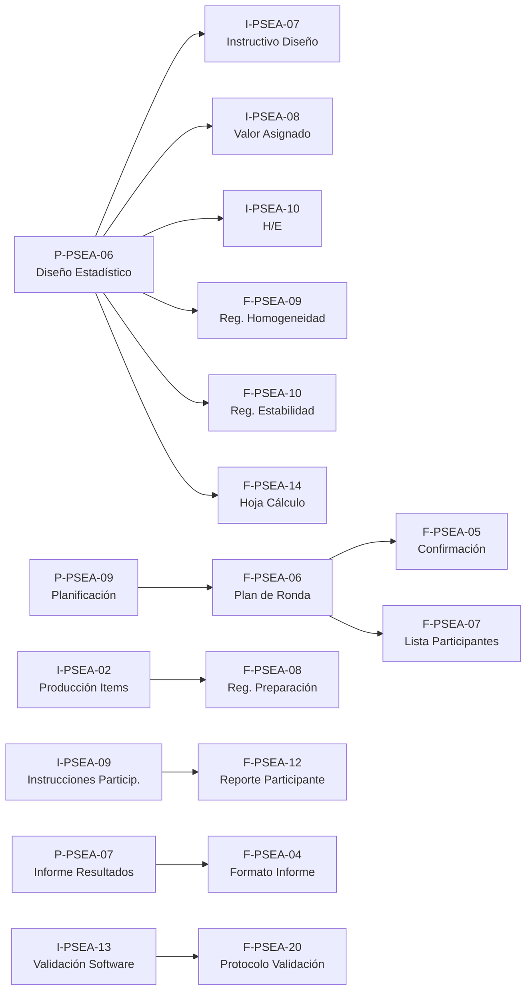

# Plan de Creación de Procedimientos y Formatos Técnicos — Prueba Piloto PSEA

## Contexto

La prueba piloto del PSEA requiere documentación técnica-operativa para ser ejecutable, trazable y consistente con ISO/IEC 17043:2023 e ISO 13528:2022. Existen **52 placeholders** (ya segregados en operativos y gestión). Los documentos de **gestión** (16) ya fueron movidos a `gestion/`. Este plan se enfoca exclusivamente en los **procedimientos, instructivos y formatos técnicos** requeridos para operar las rondas piloto.

### Estado actual

| Categoría | Existentes (draft .docx/.xlsx) | Placeholders (por crear) |
|---|---|---|
| Procedimientos técnicos (P-PSEA) | 9 existentes (01–09) | 3 nuevos (10, 20, 22) |
| Instructivos técnicos (I-PSEA) | 1 existente (01 Embalaje) | 14 nuevos (02–15) |
| Formatos/Registros (F-PSEA) | 4 existentes (01–04) | 19 nuevos (05–23) |

### Rondas planeadas

| | Ronda Simple | Ronda Compleja F1 | Ronda Compleja F2 |
|---|---|---|---|
| Analitos | CO, SO₂ | O₃, NO, NO₂ | CO, SO₂ |
| Participantes | P1 (SIATA) | P1 + P2 (UPB) | P2 (UPB) |

---

## Benchmarking: referencias internacionales de esquemas PT

Se revisaron 3 esquemas de referencia para identificar buenas prácticas de comunicación pre-ronda y recolección de datos de participantes:

| Aspecto | Barbiere / JRC 2023 | ERLAP (JRC) | UBA |
|---|---|---|---|
| **Registro** | 3 formularios: Participant Data, Technical Info, Results | Web app (PT-DAP / REM) | Online |
| **Datos personales** | Nombre, email, laboratorio | Nombre, email, idioma, pasaporte (no-EU, T-40d) | Nombre, lab |
| **Equipos** | Fabricante + modelo en tabla | Fabricante, modelo, serial, método de medición | N/A (muestras) |
| **Logística acceso** | — | Pro-forma invoice, lista de bienes, máx 2 personas/lab, zapatos y guantes de seguridad | — |
| **Confidencialidad** | Formulario LAB-REC-2000 firmado | Código anónimo de laboratorio | Código anónimo |
| **Cronograma** | Lun install → Mar calib → Mar-Jue medición → Jue cierre | Similar, con runs específicos por analito | N/A |
| **Pre-ronda** | Protocolo + cuestionario técnico web | Anuncio (T-3m) → Protocolo → Confirmación → Registro evento (T-2sem) | Anuncio |
| **Reporte resultados** | 3 promedios de 30 min por nivel | CSV template con reglas de redondeo (≥10: entero, 1–10: 1 decimal) | Formulario |
| **Post-ronda** | — | Formulario feedback/apelación/queja (Annex 1) | — |

> [!IMPORTANT]
> **Hallazgo clave para CALAIRE-EA:** ERLAP requiere una **lista detallada de equipos** (para aduanas y asignación de puesto de trabajo) y datos de identificación para **permiso de ingreso a instalaciones**. Esto se alinea directamente con la necesidad del usuario de un formato para recoger datos y equipos de los participantes para el ingreso a la U.

---

## Nuevo formato: F-PSEA-05A «Hoja de Registro del Participante»

> Este formato se convierte en formulario para enviar a participantes. Recopila toda la información administrativa, técnica y logística necesaria antes de la ronda.

### Campos propuestos

#### Sección 1 — Datos del participante
| Campo | Tipo | Obligatorio |
|---|---|---|
| Nombre completo | Texto | ✅ |
| Cédula / Documento de identidad | Texto | ✅ |
| Teléfono | Texto | ✅ |
| Correo electrónico | Texto | ✅ |
| Laboratorio / Entidad | Texto | ✅ |
| Cargo | Texto | ✅ |
| Nombre del acompañante (si aplica, máx 2 personas/laboratorio) | Texto | ⬜ |
| Cédula del acompañante | Texto | ⬜ |

#### Sección 2 — Analizadores (1 fila por equipo)
| Campo | Tipo | Obligatorio |
|---|---|---|
| Analito (CO, SO₂, O₃, NO, NO₂) | Selección | ✅ |
| Fabricante | Texto | ✅ |
| Modelo / Referencia | Texto | ✅ |
| Número de serie | Texto | ✅ |
| Principio de medición | Texto | ✅ |
| Fecha última calibración | Fecha | ✅ |
| Certificado de calibración vigente (Sí/No) | Selección | ✅ |

#### Sección 3 — Instrumentos auxiliares para ingreso a instalaciones
| Campo | Tipo | Obligatorio |
|---|---|---|
| Descripción del instrumento/equipo auxiliar | Texto | ✅ |
| Marca / Modelo | Texto | ✅ |
| Número de serie (si aplica) | Texto | ⬜ |
| Cantidad | Número | ✅ |
| Valor estimado (para seguro) | Número | ⬜ |

> Ejemplo de auxiliares: computador portátil, cables de conexión, herramientas, cilindros de calibración propios, reguladores, etc.

#### Sección 4 — Logística
| Campo | Tipo | Obligatorio |
|---|---|---|
| Medio de transporte al sitio | Selección | ✅ |
| Fecha estimada de llegada con equipos | Fecha | ✅ |
| Requiere ayuda para montaje (Sí/No) | Selección | ✅ |
| Observaciones | Texto largo | ⬜ |

#### Sección 5 — Declaraciones
- [ ] Acepto las condiciones de participación descritas en el protocolo
- [ ] Acepto la política de confidencialidad y anonimización de resultados
- [ ] Confirmo que los equipos declarados estarán disponibles en las fechas indicadas

**Firma:** _________________ **Fecha:** _________________

> [!TIP]
> Este formato puede implementarse como **formulario de Google Forms** para facilitar la recolección y luego consolidarse en F-PSEA-07 (Lista Maestra de Participantes).

---

## Paquete de información pre-ronda para enviar a participantes

Basado en los 3 esquemas de referencia y considerando que ya se tiene el **calendario** y el **cronograma detallado**, la información adicional que se debe enviar a participantes AHORA es:

### Lo que ya tienes ✅
- Calendario tipo (F-PSEA-01)
- Cronograma detallado (F-PSEA-02)

### Lo que falta enviar 📋

| # | Documento / Info | Referencia | Prioridad | Notas |
|---|---|---|---|---|
| 1 | **F-PSEA-05A — Hoja de Registro del Participante** | ERLAP §3, Barbiere Annex G | 🔴 Inmediata | Formulario para recoger datos personales, equipos y auxiliares |
| 2 | **Protocolo de participación** (resumen del DG-PSEA-01) | ERLAP §1-2, Barbiere §2 | 🔴 Inmediata | Qué es, quién organiza, alcance, analitos, niveles esperados, código anónimo |
| 3 | **Instrucciones de medición y reporte** (extracto de I-PSEA-09) | ERLAP §4, Barbiere §4 | 🟠 Antes de la ronda | Qué reportar, cuántas réplicas, promedios de cuántos minutos, cifras significativas, reglas de redondeo, formato de entrega |
| 4 | **Requisitos de ingreso a la Universidad** | ERLAP §6 Logistics | 🔴 Inmediata | Horario, punto de encuentro, documentos requeridos (cédula), normas de seguridad, EPP si aplica |
| 5 | **Declaración de confidencialidad** | ERLAP §2.2, Barbiere Annex D | 🟠 Antes de la ronda | Compromiso de no divulgar resultados de otros participantes |
| 6 | **Agenda operativa de la jornada** | Barbiere §3, ERLAP Table 1 | 🟠 Antes de la ronda | Hora llegada, hora montaje, hora calibración, hora inicio medición, hora desmontaje |
| 7 | **Datos técnicos del sistema de generación** (info referencia) | ERLAP §5 | 🟡 Opcional | Descripción del sistema de dilución dinámica, gases disponibles, conexiones, líneas de muestreo |
| 8 | **Contacto de emergencia / soporte** | ERLAP §6 | 🔴 Inmediata | Nombre y teléfono del coordinador PT, contacto de seguridad de la U |

### Propuesta de comunicación por etapas

```
AHORA (T-2 semanas):
├── Enviar F-PSEA-05A (formulario de registro)
├── Enviar protocolo resumido (1-2 páginas)
├── Enviar requisitos de ingreso a la U
└── Enviar contacto del coordinador

T-1 semana:
├── Enviar instrucciones de medición y reporte
├── Enviar agenda operativa detallada por jornada
├── Enviar declaración de confidencialidad para firma
└── Confirmar recepción de F-PSEA-05A

Día -1 (verificación):
├── Confirmar asistencia y equipos
├── Verificar ingreso autorizado
└── Enviar recordatorio de punto de encuentro y horario
```

---

## Diagnóstico: ¿Qué se necesita para ejecutar la prueba piloto?

### Bloque A — Procedimientos e instructivos que deben existir ANTES de arrancar

> Sin estos documentos no se puede planificar, ni operar, ni calcular resultados.

#### A1. Procedimientos existentes que requieren mejora

| Código | Documento | Qué falta | Est. horas |
|---|---|---|---|
| P-PSEA-09 | Planificación Ronda EA | Expandir literales a)–u) de §7.2.1.3; resolver duplicidad 2 versiones | 4h |
| P-PSEA-06 | Diseño Estadístico | Fijar σ_pt, modelo u(x_pt), scoring para n bajo; editorial | 6h |
| P-PSEA-07 | Informe de Resultados | Contenido mínimo §7.4.3, plazos, informes corregidos | 3h |
| P-PSEA-02–05 | Procedimientos por analito | Verificar coherencia con secuencia piloto, niveles, CRM | 2h c/u (8h) |

#### A2. Procedimientos nuevos (placeholders → drafts)

| Código | Documento | Contenido clave | Est. horas |
|---|---|---|---|
| P-PSEA-10 | Manejo de Items PT | Identificación, almacenamiento, despacho/recepción de cilindros y equipos in situ | 3h |
| P-PSEA-20 | Comunicación PT | Revisión de solicitudes, instrucciones pre-ronda, acuerdos con participantes | 3h |
| P-PSEA-22 | Reportes PT | Contenido mínimo de reportes §7.4.3, plazos, distribución | 3h |

#### A3. Instructivos técnicos nuevos (placeholder → draft)

Estos son las "recetas" operativas paso a paso — son los que el personal del PEA sigue durante la ronda.

| Código | Documento | Contenido clave | Prioridad | Est. horas |
|---|---|---|---|---|
| **I-PSEA-10** | Homogeneidad y Estabilidad | ≥10 atmósferas, réplicas, s_hom ≤ 0,3×σ_pt, 3 modalidades estabilidad | 🔴 Crítica | 4h |
| **I-PSEA-02** | Producción PT Items | Generación de atmósferas, CRM, dilución dinámica, setpoints | 🔴 Crítica | 4h |
| **I-PSEA-08** | Valor Asignado | Jerarquía (CRM → referencia → consenso), modelo u(x_pt) | 🔴 Crítica | 3h |
| **I-PSEA-07** | Diseño Estadístico | Procedimiento ISO 13528, Algoritmo A/B, revisión inicial | 🔴 Crítica | 3h |
| **I-PSEA-09** | Instrucciones a Participantes | Qué medir, cómo reportar, plazos, formato, cifras significativas | 🟠 Alta | 3h |
| **I-PSEA-11** | Análisis de Datos | Revisión, outliers, selección de algoritmo, documentación | 🟠 Alta | 3h |
| **I-PSEA-12** | Evaluación de Desempeño | Cálculo z, z', ζ, interpretación, clasificación | 🟠 Alta | 3h |
| **I-PSEA-13** | Validación de Software | Expediente aplicativo R/Shiny, datasets referencia, tolerancia 1e-9 | 🔴 Crítica | 5h |
| **I-PSEA-15** | Caracterización | Caracterización CRM y atmósferas generadas | 🟡 Media | 2h |
| **I-PSEA-03** | Control Ambiental | Condiciones T, P, HR durante generación | 🟡 Media | 2h |
| **I-PSEA-04** | Validación de Métodos | Validación métodos de ensayo | 🟡 Media | 2h |
| **I-PSEA-05** | Estimación de Incertidumbre | Modelo u(x_pt) = √(u²_char + u²_hom + u²_stab) | 🟡 Media | 2h |
| **I-PSEA-06** | Control de Calidad de Datos | QC de datos, consistencia, revisión de unidades | 🟡 Media | 2h |
| **I-PSEA-14** | Visualización de Datos y Gráficos | Especificaciones de gráficos del informe | 🟡 Media | 2h |

---

### Bloque B — Formatos de ejecución (registros de la ronda)

> Estos son los formularios que se llenan durante la ejecución de cada ronda. Requieren una plantilla maestra y luego copias adaptadas por ronda.

| Código | Formato | Contenido clave | Tipo archivo | Est. horas |
|---|---|---|---|---|
| **F-PSEA-05** | Confirmación de Participación | Acuerdo formal del participante con condiciones | .docx | 1h |
| **F-PSEA-05A** | Hoja de Registro del Participante | Datos personales, equipos, auxiliares, logística (→ formulario) | .xlsx / Google Form | 3h |
| **F-PSEA-06** | Plan de Ronda EA | Participantes, analitos, niveles, CRM, responsables, fechas | .xlsx | 3h |
| **F-PSEA-07** | Lista Maestra de Participantes | Código anónimo, contacto, estado confirmación | .xlsx | 1h |
| **F-PSEA-08** | Registro de Preparación del Ítem | CRM, certificado, dilución, caudales, concentración, T/P/HR | .xlsx | 3h |
| **F-PSEA-09** | Registro de Homogeneidad | ≥10 mediciones, método referencia, réplicas, s_hom, criterio | .xlsx | 2h |
| **F-PSEA-10** | Registro de Estabilidad | Mediciones inicio/fin, criterio |x̄_i − x̄_f| ≤ 0,3×σ_pt | .xlsx | 2h |
| **F-PSEA-11** | Registro de Envío y Recepción | Equipos instalados, confirmación, condiciones | .xlsx | 2h |
| **F-PSEA-12** | Reporte del Participante | Resultado, incertidumbre, método, equipo, observaciones | .xlsx | 3h |
| **F-PSEA-13** | Hoja de Revisión de Datos | Checklist: unidades, plausibilidad, cifras, exclusiones | .xlsx | 2h |
| **F-PSEA-14** | Hoja de Cálculo y Aprobación | x_pt, σ_pt, z-score, aprobación, firma | .xlsx | 3h |

### Bloque C — Formatos de cierre/soporte

> No bloquean el arranque pero son necesarios para el cierre documental.

| Código | Formato | Est. horas |
|---|---|---|
| F-PSEA-15 | Registro NC/CAPA | 1h |
| F-PSEA-16 | Registro Quejas | 1h |
| F-PSEA-17 | Registro Apelaciones | 1h |
| F-PSEA-18 | Acta Revisión Dirección | 1h |
| F-PSEA-19 | Lista Verificación Auditoría | 2h |
| F-PSEA-20 | Protocolo Validación Software | 3h |
| F-PSEA-21 | Matriz Competencia | 2h |
| F-PSEA-22 | Matriz Riesgos Imparcialidad | 2h |
| F-PSEA-23 | Evaluación Proveedores | 1h |

---

## Plan de creación por sprints

### Sprint 1 — Núcleo estadístico y planificación (semana 1)

> **Objetivo:** tener los procedimientos troncales listos para definir la ronda.

| # | Documento | Tipo | Acción |
|---|---|---|---|
| 1 | P-PSEA-09 | Procedimiento | Consolidar versión única + expandir |
| 2 | P-PSEA-06 | Procedimiento | Mejora editorial + fijar σ_pt para piloto |
| 3 | I-PSEA-07 | Instructivo | Crear: diseño estadístico paso a paso |
| 4 | I-PSEA-08 | Instructivo | Crear: cálculo de valor asignado |
| 5 | I-PSEA-10 | Instructivo | Crear: homogeneidad y estabilidad |

**Horas estimadas:** ~20h  
**Entregable:** Criterios técnicos fijados; se puede diseñar F-PSEA-06 (plan de ronda).

---

### Sprint 2 — Producción e instrucciones (semana 2)

> **Objetivo:** tener la cadena operativa de generación + instrucciones a participantes.

| # | Documento | Tipo | Acción |
|---|---|---|---|
| 1 | **F-PSEA-05A** | Formato | Crear: hoja de registro del participante (formulario) |
| 2 | I-PSEA-02 | Instructivo | Crear: producción de atmósferas |
| 3 | I-PSEA-09 | Instructivo | Crear: instrucciones a participantes |
| 4 | P-PSEA-20 | Procedimiento | Crear: comunicación con participantes |
| 5 | P-PSEA-10 | Procedimiento | Crear: manejo de items PT |
| 6 | I-PSEA-13 | Instructivo | Crear: validación de software (fase 1) |
| 7 | P-PSEA-02–05 | Procedimiento | Verificar coherencia con rondas |
| 8 | — | Paquete pre-ronda | Protocolo resumido + requisitos ingreso + contacto coordinador |

**Horas estimadas:** ~25h  
**Entregable:** F-PSEA-05A listo para enviar a participantes + paquete de invitación formal.

---

### Sprint 3 — Formatos de ejecución (semana 3)

> **Objetivo:** tener todos los formularios listos para llenar durante la ronda.

| # | Documento | Tipo | Acción |
|---|---|---|---|
| 1 | F-PSEA-06 | Formato | Crear: plan de ronda |
| 2 | F-PSEA-05 | Formato | Crear: confirmación participación |
| 3 | F-PSEA-07 | Formato | Crear: lista participantes |
| 4 | F-PSEA-08 | Formato | Crear: registro preparación ítem |
| 5 | F-PSEA-09 | Formato | Crear: registro homogeneidad |
| 6 | F-PSEA-10 | Formato | Crear: registro estabilidad |
| 7 | F-PSEA-11 | Formato | Crear: registro envío/recepción |
| 8 | F-PSEA-12 | Formato | Crear: reporte del participante |
| 9 | F-PSEA-13 | Formato | Crear: hoja revisión datos |
| 10 | F-PSEA-14 | Formato | Crear: hoja cálculo estadística |

**Horas estimadas:** ~23h  
**Entregable:** Paquete completo de formatos listo para copiar a carpetas por ronda.

---

### Sprint 4 — Informe, análisis y cierre (semana 4)

> **Objetivo:** cerrar la cadena desde análisis hasta informe + formatos de soporte.

| # | Documento | Tipo | Acción |
|---|---|---|---|
| 1 | P-PSEA-07 | Procedimiento | Actualizar informe de resultados |
| 2 | P-PSEA-22 | Procedimiento | Crear: reportes PT |
| 3 | I-PSEA-11 | Instructivo | Crear: análisis de datos |
| 4 | I-PSEA-12 | Instructivo | Crear: evaluación de desempeño |
| 5 | I-PSEA-14 | Instructivo | Crear: visualización de datos |
| 6 | F-PSEA-20 | Formato | Crear: protocolo validación software |
| 7 | F-PSEA-15–19 | Formatos | Crear: formatos cierre (NC, quejas, apelaciones, acta, auditoría) |

**Horas estimadas:** ~18h  

---

### Sprint 5 — Instructivos complementarios + copias por ronda (semana 5)

> **Objetivo:** completar instructivos de prioridad media y poblar carpetas por ronda.

| # | Documento | Tipo | Acción |
|---|---|---|---|
| 1 | I-PSEA-15 | Instructivo | Crear: caracterización |
| 2 | I-PSEA-03 | Instructivo | Crear: control ambiental |
| 3 | I-PSEA-04 | Instructivo | Crear: validación de métodos |
| 4 | I-PSEA-05 | Instructivo | Crear: estimación incertidumbre |
| 5 | I-PSEA-06 | Instructivo | Crear: control calidad de datos |
| 6 | F-PSEA-21–23 | Formatos | Crear: matrices y evaluación proveedores |
| 7 | — | Copias | Poblar `ronda_simple/`, `ronda_compleja_fase1/`, `ronda_compleja_fase2/` con F-PSEA-05 a F-PSEA-14 adaptados |

**Horas estimadas:** ~16h  

---

## Resumen de esfuerzo

| Sprint | Foco | Horas | Docs |
|---|---|---|---|
| 1 | Núcleo estadístico | ~20h | 5 |
| 2 | Producción e instrucciones | ~22h | 6+ |
| 3 | Formatos de ejecución | ~23h | 10 |
| 4 | Informe, análisis, cierre | ~18h | 7+ |
| 5 | Complementarios + rondas | ~16h | 6+ copias |
| **Total** | | **~99h** | **~36 docs nuevos + 9 mejoras** |

---

## Dependencias clave



## Verificación

### Al final de cada sprint
- [ ] Cada documento tiene: código, versión, fecha, cláusulas ISO cubiertas, responsable
- [ ] Formato consistente con la codificación P-PSEA/I-PSEA/F-PSEA del Diccionario
- [ ] Trazabilidad normativa verificable contra [trazabilidad_normativa_sgc.md](file:///home/w182/w421/calaire-ea/docs/docs_sgc/202510%20Documentacion%20SGC/trazabilidad_normativa_sgc.md)

### Al final del plan completo
- [ ] 36 documentos operativos existentes en [docs/prueba_piloto/](file:///home/w182/w421/calaire-ea/docs/prueba_piloto)
- [ ] Carpetas `ronda_simple/`, `ronda_compleja_fase1/`, `ronda_compleja_fase2/` pobladas con F-PSEA-05 a F-PSEA-14 adaptados
- [ ] Revisión cruzada procedimiento ↔ instructivo ↔ formato (cada formato soporta un instructivo que ejecuta un procedimiento)
- [ ] Simulacro documental: recorrer la cadena con un analito ficticio desde planificación hasta informe
