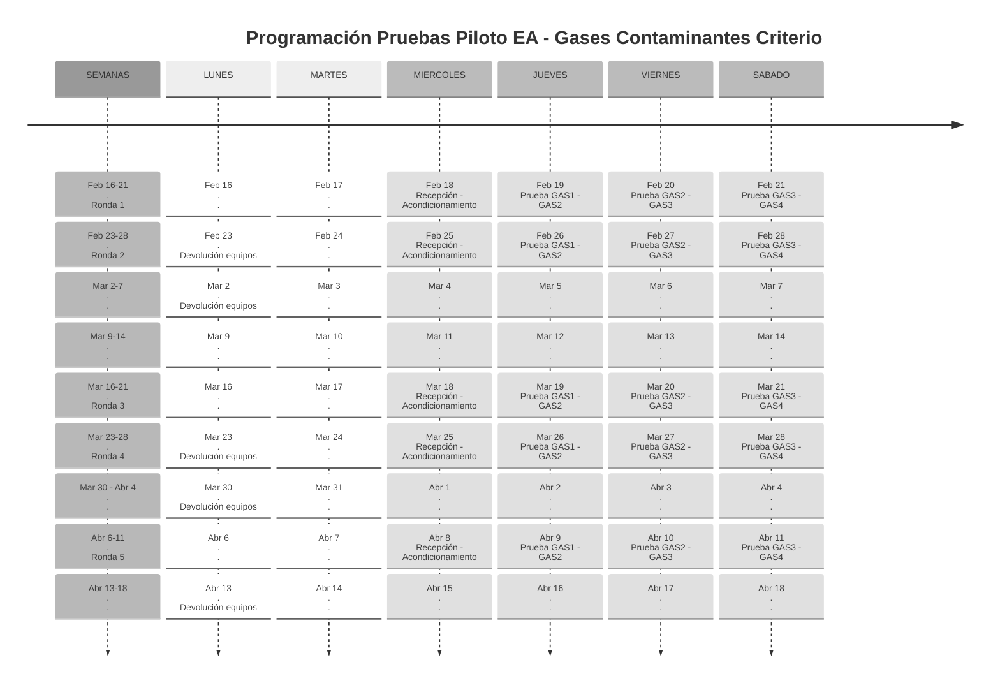

```mermaid
%%{init: {"theme": "base", "themeVariables": {"cScale0": "#999999", "cScale1": "#eeeeee", "cScale2": "#eeeeee", "cScale3": "#bbbbbb", "cScale4": "#bbbbbb", "cScale5": "#bbbbbb", "cScale6": "#bbbbbb"}}}%%
timeline
    title Programación Pruebas Piloto EA - Gases Contaminantes Criterio
    SEMANAS: Feb 16-21 <br>.<br> Ronda 1
           :  Feb 23-28 <br>.<br> Ronda 2
           :  Mar 2-7 <br>.<br> .
           :  Mar 9-14 <br>.<br> .
           :  Mar 16-21 <br>.<br> Ronda 3
           :  Mar 23-28 <br>.<br> Ronda 4
           :  Mar 30 - Abr 4 <br>.<br> .
           :  Abr 6-11 <br>.<br> Ronda 5
           :  Abr 13-18 <br>.<br> .
    LUNES : Feb 16 <br> .<br> .
           : Feb 23 <br> . <br>Devolución equipos
           : Mar 2 <br> . <br>Devolución equipos
           : Mar 9 <br> .<br> .
           : Mar 16 <br> .<br> .
           : Mar 23 <br> . <br>Devolución equipos
           : Mar 30 <br> . <br>Devolución equipos
           : Abr 6 <br> .<br> .
           : Abr 13 <br> . <br>Devolución equipos
    MARTES : Feb 17 <br> .<br> .
           : Feb 24 <br> .<br> .
           : Mar 3 <br> .<br> .
           : Mar 10 <br> .<br> .
           : Mar 17 <br> .<br> .
           : Mar 24 <br> . <br> .
           : Mar 31 <br> . <br> .
           : Abr 7 <br> . <br> .
           : Abr 14 <br> . <br> .
    MIERCOLES : Feb 18 <br> Recepción - Acondicionamiento
           : Feb 25 <br> Recepción - Acondicionamiento
           : Mar 4 <br> .<br> .
           : Mar 11 <br> .<br> .
           : Mar 18 <br> Recepción - Acondicionamiento
           : Mar 25 <br> Recepción - Acondicionamiento
           : Abr 1 <br> .<br> .
           : Abr 8 <br> Recepción - Acondicionamiento
           : Abr 15 <br> .<br> .
    JUEVES : Feb 19 <br> Prueba GAS1 - GAS2
     : Feb 26 <br> Prueba GAS1 - GAS2
     : Mar 5 <br> .<br> .
     : Mar 12 <br> .<br> .
     : Mar 19 <br> Prueba GAS1 - GAS2
     : Mar 26 <br> Prueba GAS1 - GAS2
     : Abr 2 <br> .<br> .
     : Abr 9 <br> Prueba GAS1 - GAS2
     : Abr 16 <br> .<br> .
    VIERNES : Feb 20 <br> Prueba GAS2 - GAS3
       : Feb 27 <br> Prueba GAS2 - GAS3
       : Mar 6 <br> .<br> .
       : Mar 13 <br> .<br> .
       : Mar 20 <br> Prueba GAS2 - GAS3
       : Mar 27 <br> Prueba GAS2 - GAS3
       : Abr 3 <br> .<br> .
       : Abr 10 <br> Prueba GAS2 - GAS3
       : Abr 17 <br> .<br> .
    SABADO : Feb 21 <br> Prueba GAS3 - GAS4
     : Feb 28 <br> Prueba GAS3 - GAS4
     : Mar 7 <br> .<br> .
     : Mar 14 <br> .<br> .
     : Mar 21 <br> Prueba GAS3 - GAS4
     : Mar 28 <br> Prueba GAS3 - GAS4
     : Abr 4 <br> .<br> .
     : Abr 11 <br> Prueba GAS3 - GAS4
     : Abr 18 <br> .<br> .
```
