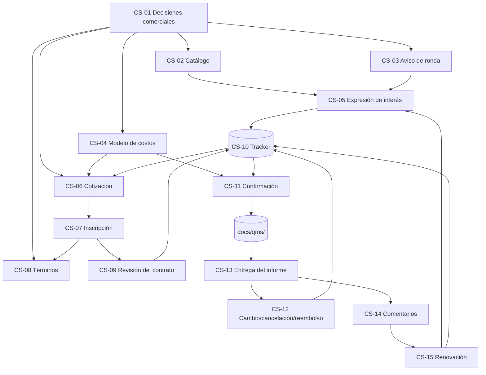

# Mapa de viaje: 15 artefactos comerciales

**Propósito:** visualización de un extremo a otro de cómo se conectan los 15 artefactos de CS a lo largo del recorrido del cliente, desde el primer contacto hasta la renovación. Úselo para incorporar nuevos miembros al equipo, encontrar qué artefacto pertenece a un paso determinado e identificar brechas.

**Estado:** documento vivo. Se actualiza cada vez que se agrega, elimina un artefacto o cambia su alcance.

---

## Recorrido del cliente frente a cadena de artefactos

El recorrido del cliente (según la sección 1 del plan) es:

```text
Descubrir el servicio
      ↓
Comprender el alcance y las condiciones
      ↓
Seleccionar uno o más de los cuatro bloques de gases
      ↓
Recibir una cotización controlada
      ↓
Inscribirse y aceptar los términos
      ↓
Recibir la confirmación comercial
      ↓
Recibir las instrucciones técnicas existentes del SGC
      ↓
Participar en la ronda
      ↓
Recibir el informe y la declaración de participación
      ↓
Cerrar la facturación, los comentarios y la renovación
```

Los 15 artefactos CS se asignan a este viaje de la siguiente manera:

| Paso del viaje | Poseer artefacto(s) | Lo que ve el cliente | Cadena de artefactos internos |
|---|---|---|---|
| Descubra el servicio | Catálogo CS-02, aviso redondo CS-03 | Material de marketing, web/PDF | Referencias de catálogo CS-01 (decisiones) y CS-04 (lista de precios) |
| Comprender el alcance y las condiciones | Catálogo CS-02 (secciones 4, 5, 11) | Descripción del servicio | Lo mismo |
| Seleccionar uno o más de los cuatro bloques de gases | Formulario de expresión de interés CS-05 | Formulario de EoI (sin compromiso) | Etapa "Interés" del canal de oportunidades CS-10 |
| Reciba una cotización controlada | Plantilla de cotización CS-06 | Cotización PDF / correo electrónico | CS-09 (revisión de contrato) puertas CS-11 (confirmación) |
| Regístrate y acepta términos | Formulario de registro CS-07, términos CS-08 | Formulario de inscripción + términos firmados | CS-07 → CS-09 (revisión) |
| Recibir confirmación comercial | Mensaje de confirmación CS-11 (y mensajes de lista de espera/rechazo) | Correo electrónico de confirmación | CS-11 → Traspaso de QMS (P-PSEA-04, F-PSEA-04, F-PSEA-03, P-PSEA-05) |
| Recibir instrucciones técnicas del SGC | Paquete de incorporación CS-11 (enlaces a documentos de QMS) | DG-PSEA-01, I-PSEA-01, I-PSEA-02, calaire-app | CS-11 hace referencia al SGC, no comercial |
| Participa en la ronda | (Ejecución del SGC, no comercial) | n/a | n/a |
| Recibir informe y declaración de participación | Entrega de informe CS-13 | Borrador + informe final, declaración de participación | CS-13 → CS-12 si se necesitan cambios |
| Cerrar facturación, comentarios y renovación | Cambio/cancelación/reembolso de CS-12, comentarios de CS-14, renovación de CS-15 | Formulario de comentarios, correo electrónico de seguimiento | CS-12 (si hay cambios), CS-14 (comentarios), CS-15 (renovación) |

---

## Gráfico de dependencias de los artefactos (Mermaid)



---

## Gráfico de dependencias de los artefactos (alternativa ASCII)

```text
                       CS-01 (decisions)
                       /    |    |    \
                      /     |    |     \
                 CS-02  CS-03 CS-04  CS-06, CS-08
                  |       |    |       |
                  v       v    v       v
                 CS-05 ---> CS-10 <--- (capacity view)
                  |              ^
                  v              |
                 CS-06 ----------+
                  |
                  v
                 CS-07
                  |
                  v
                 CS-08  (terms)
                  |
                  v
                 CS-09  (contract review)
                  |
                  v
                 CS-10  (tracker) ---> Confirmed
                  |
                  v
                 CS-11  (confirmation / wait-list / rejection)
                  |
                  v
                 [QMS handoff: P-PSEA-04, F-PSEA-04, F-PSEA-03, P-PSEA-05]
                  |
                  v
              (QMS round execution)
                  |
                  v
                 CS-13  (report delivery)
                  |       \
                  |        --> CS-12 (if changes needed during draft review)
                  v
                 CS-14  (feedback)
                  |
                  v
                 CS-15  (renewal)
                  |       \
                  |        --> CS-10 (new pipeline entry for next round)
                  |        --> CS-05 (for new prospects, not for renewals)
                  v
              (back to top of journey for next round)
```

---

## Flujo de estado dentro de CS-10 (el sistema nervioso central)

El rastreador CS-10 es el núcleo operativo; casi todos los artefactos escriben o leen en él.

```text
[CS-05 EoI]   ──>  status = Interest
                       │
                       v
[CS-06 Quote]  ──>  status = Quoted
                       │
                       v
[CS-07 Registration] ──>  status = Registered
                       │
                       v
[CS-09 Contract Review] ──>  status = Under review
                       │
        ┌──────────────┼──────────────┐
        v              v              v
  Quote-revision   Accepted       Rejected
  in progress      pending        (terminal)
        │          payment/PO          │
        v              │               v
   (back to         status =           (CS-11
    Quoted,         Confirmed          rejection
    new rev)        (terminal          message)
        │              │               │
        v              v               v
   (CS-12)         [CS-11            (CS-10
                    confirmation]     closure)

        On capacity exhaustion (CS-09 check 4 or 6):
        status = Wait-listed
            │
            ├──> Confirmed (if slot opens)  ──> [CS-11 confirmation]
            │
            └──> Withdrawn (customer gives up)

        On customer withdrawal (any time after Registered):
        status = Withdrawn
            │
            └──> CS-12 (refund / credit)
```

---

## Mapa de puertas de aprobación (según la sección 21 del plan)

| Puerta | Artefactos requeridos antes de la puerta | Propietario de la aprobación |
|---|---|---|
| Lanzamiento al mercado | CS-01, CS-02, CS-03, CS-04, CS-05 | Responsable de servicios + líder comercial |
| Lanzamiento de cotización | CS-04 (aprobado), CS-06, CS-08 | Lider comercial + finanzas |
| Aceptación del pedido | CS-07, CS-08 (firmado), CS-09 (aprobado), CS-10 (actualizado) | Líder comercial |
| Traspaso técnico | CS-11 (enviado) + admisión de planificación de la ronda QMS | Coordinador de ronda |
| Cambio/reembolso | CS-12 (abierto, con doble autorización) | Comercial + finanzas |
| Entrega de informes | CS-13 + Aprobación del informe QMS | Coordinador de ronda |
| Cierre comercial | CS-14 (recibido), CS-15 (enviado), CS-10 (final) | Gerente de servicio |

---

## Aspectos transversales (artefactos afectados)

| Aspecto | Artefactos afectados |
|---|---|
| QMS code renumbering (2026-06-14) | CS-09, CS-11, CS-13, CS-14 (those that cite PSEA codes) |
| Data protection (Ley 1581/2012) | CS-05 (consent), CS-06 (international cross-border), CS-08 (clause 19), CS-15 (marketing consent) |
| Capacity (4 individual / 3+6 simultaneous) | CS-01, CS-04, CS-09, CS-10, CS-11 |
| Redacción previa a la acreditación | CS-01, CS-02, CS-03, CS-06, CS-08, CS-13, CS-15 (en cualquier lugar de cara al cliente) |
| Currency / FX | CS-01, CS-04, CS-06, CS-10, CS-12 |
| Pago/evidencia de orden de compra | CS-07, CS-09, CS-10, CS-12 |
| Recordatorio estándar de uso de informes | CS-01, CS-08, CS-13 (debe coincidir exactamente) |

---

## Cómo usar este documento

- **Incorporación de un nuevo miembro del equipo:** recorra la tabla de recorrido del cliente y luego el gráfico Mermaid. Deberían poder localizar cualquier artefacto por paso del viaje.
- **Auditoría de una ronda:** comience en CS-13 (entrega), siga las flechas de regreso a CS-05 (interés). Verifique que la cadena esté intacta: cada participante confirmado tiene CS-09 (revisión) y CS-11 (confirmación) en su archivo.
- **Identificación de espacios:** el gráfico Mermaid resalta qué artefactos no tienen bordes entrantes o salientes. Si un artefacto está desconectado, es candidato a retirarse o una señal de falta de lógica.
- **Actualización del mapa:** cuando se agrega, elimina un artefacto o cambia su rol, actualizar la tabla de recorrido del cliente, el gráfico de dependencia y la tabla transversal.
